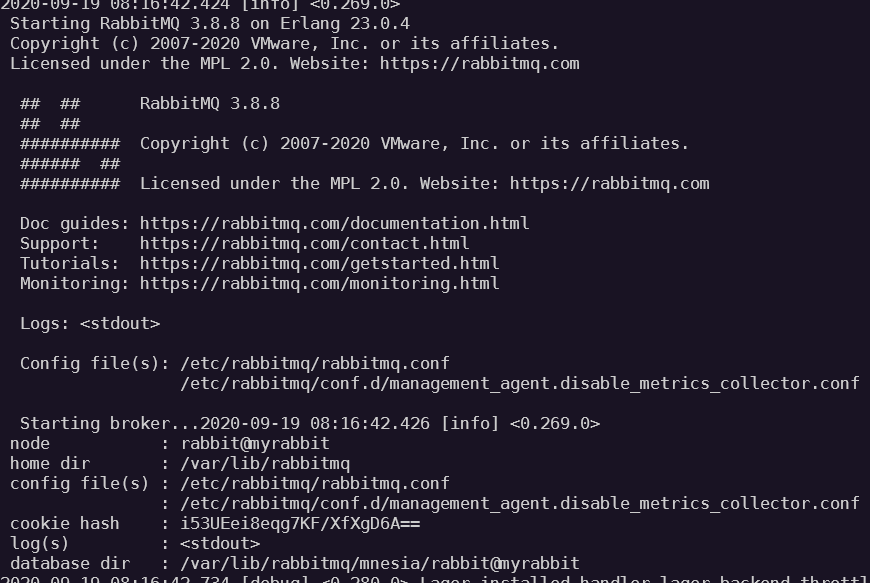
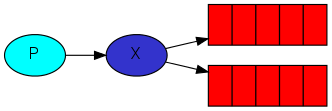

# RabbitMQ

> 基于AMQP协议，erlang语言开发，是部署最广泛的开源消息中间件，是最受欢迎的开源消息中间件之一

## 1 引言

- 官网：https://www.rabbitmq.com/

- 官方教程：https://www.rabbitmq.com/getstarted.html

- AMQP 协议

  AMQP（advanced message queuing protocol）在2003年时被提出，最早用于解决金融额不同平台之间的消息传递交互问题。顾名思义，AMQP是一种协议，更准确的说是一种*binary* *wire*-*level* *protocol*（链接协议）。这是其和JMS的本质区别，AMQP不从API进行限定，而是直接定义网络交换的数据格式。这使得实现了AMQP的provider天然性就是跨平台的。一下时AMQP协议类型

## 2 安装配置

linux 系统安装软件的方式

```markdown
# 1.安装
	https://www.rabbitmq.com/install-rpm.html#package-cloud

# 2.配置文件
	默认安装完成后配置文件模板在：/usr/share/doc/rabbitmq-server-3.x.x/rabbitmq.config.example 目录中，需要将配置文件复制到 /etc/rabbitmq/ 下，并修改名称为 rabbitmq.config
	cp /usr/share/doc/rabbitmq-server-3.x.x/rabbitmq.config.example /etc/rabbitmq/rabbitmq.config

# 3.修改配置（可以忽略）
	将配置文件中的：%% {loopback_users, []}, 改为 {loopback_users, []}
	作用是，将注释放开，开启权限管理

# 4.启用管理插件（这样就可以通过后台管理页面来管理RabbitMQ）
	rabbitmq-plugins enable rabbitmq_management
```

docker 方式

```markdown
# 1.安装（https://hub.docker.com/_/rabbitmq）
	docker run -d --hostname myrabbit --name rabbitmq -p 5672:5672 -p 15672:15672 rabbitmq:3
	- --hostname：和存储数据的目录名相关，否则默认会取一个随机名称
	- 5672 是默认的服务端口
	- 15672 是默认的管理插件提供的管理后台页面访问端口
	- rabbitmq:3.8.9, rabbitmq:3.9, rabbitmq:3, rabbitmq:latest, rabbitmq 都代表3.8.9版本

# 2.进入容器的 CLI 启用管理插件
	rabbitmq-plugins enable rabbitmq_management
	访问 http://locahost:15672/ 的账户名和密码默认都是 guest

# 2.5.实际上不推荐上面的安装方式，实际使用管理后台页面功能有缺陷
# 莫名报错，例如查看队列的消息数、删除交换机都做不到，令人窒息
	docker run -d --hostname myrabbit --name rabbitmq -p 5672:5672 -p 15672:15672 rabbitmq:3.8.9-management
```

通过 docker logs rabbitmq（容器名） 命令可以找到如下的核心日志



## 3 命令行

- 管理命令

  > 管理后台页面上的所有操作，都可以通过命令行来实现（同 git）

  查看帮助：rabbitmqctl [-help]

  查看用户：rabbitmyctl list_users

- 插件管理命令

  查看帮助：rabbitmq-plugins [-help]

  查看插件：rabbitmq-plugins list

## 4 实际概念

- 虚拟主机

  一个 RabbitMQ 服务可以建立多个虚拟主机（Virtual Host），一个虚拟主机对应一个应用，也就是一个具体的项目，这个可以类比关系型数据库中的库的概念去理解。并且一般会创建单独的用户，将用户和虚拟主机进行一对一的关联

- 交换机

  在 RabbitMQ 中，一般生产者生产消息并不是直接将消息发给消息队列，而是直接与交换机进行交互，交换机再将消息放置到消息队列中，为什么要这样做呢？一般情况下是这样，所以生产者也是可以直接和消息队列进行交互的

- 消息队列

  不用多说，这是各种消息中间件的核心。一个虚拟主机中可以建立多个消息队列，

## 5 消息模型

> 官网：https://www.rabbitmq.com/getstarted.html

RabbitMQ 3.5 版本只支持前5种

RabbitMQ 3.7 版本新增 RPC 模型

RabbitMQ 3.8 版本新增 Publisher Comfirms 模型

### 模型一


**自己**

单一生产者，单一消费者

**简介**

​	最简单的单生产者和单消费者的直连模型

**实际操作**

> 直接在管理后台页面上，进行操作

1. 创建一个虚拟主机

2. 创建一个用户并绑定创建的虚拟主机

3. 创建一个消息发送者（生产者）

   核心方法：发送消息到指定 RabbitMQ Server 的 虚拟主机 的 消息队列中，发送一次消息就创建一个新连接，并且在消息发送完毕后，断开连接

4. 创建一个消息接收者（消费者）

   核心方法：启动一个线程监听指定 RabbitMQ Server 的 虚拟主机 的 消息队列中，是否有消息，有就获取并进行消费（类似于 Socket 编程中 Server 等待接收新连接或者建立连接后任意一端等待消息）

**具体代码**

​	详见项目中的 `model1`

**缺点**

​	如果生产者生产的消息突然暴增，又或是消费者的消费能力下降，导致消息队列中的消息积压，最终可能导致依赖消息队列的业务、服务不可用

### 模型二


**自己**

一个生产者，多个消费者

**简介**

​	`Work queues`，也称 `Task queues` 任务模型。当消息处理比较耗时的时候，可能生产消息的速度会远远大于消息的消费速度。长此以往，消息就会越堆积越多，无法及时处理。此时就可以采用该模型：让多个消费者绑定到一个队列，共同消费队列中的消息。队列中的消息一旦消费，就会消失，因此任务是不会被重复执行的【这里说的很简略，不太行】

**关键点（问题）**

- 消息自动确认机制

  ```
  Message acknowledgment
  
  Doing a task can take a few seconds. You may wonder what happens if one of the consumers starts a long task and dies with it only partly done. With our current code, once RabbitMQ delivers a message to the consumer it immediately marks it for deletion. In this case, if you kill a worker we will lose the message it was just processing. We'll also lose all the messages that were dispatched to this particular worker but were not yet handled.
  
  But we don't want to lose any tasks. If a worker dies, we'd like the task to be delivered to another worker.
  
  ......
  ```

- 多个消费者之间是如何分配消息的？

  ```
  By default, RabbitMQ will send each message to the next consumer, in sequence. On average every consumer will get the same number of messages. This way of distributing messages is called round-robin. Try this out with three or more workers.
  ```

  关键字 `round-robin`，也就是轮询

**实际操作**

> 基于模型一操作的代码

1. 以面向对象的思想重构模型一不严谨的生产者和消费者，但是需要注意无论是生产者还是消费者，对于 RabbitMQ 来说，都是通过调用 Channel 对象的方法
2. 对消费者消费消息自动确认参数的 `autoAck` 进行介绍。将 `autoAck` 参数设置为 `false` 关闭消息消费的自动确认机制， 限制消费者一次只从消息队列中获取一条消息进行消费

**具体代码**

​	详见项目中的 `model2`

### 模型三



**自己**

交换机 - 广播

**简介**

​	`Publish/Subscribe`，即发布订阅模型，适合如用户注册成功后，需要发送邮件、添加积分、发送短信等的业务场景，注意通过该种方式，一定要先有相关的队列绑定到交换机上，否则生产的消息会丢失

**关键点**

- 每个消费者都有自己的队列
- 每个队列都要绑定到交换机上
- 生产者发送的消息，只能发送到交换机，交换机来决定要发给哪个队列，生产者无法决定
- 交换机把消息发送给绑定过的所有队列
- 队列的消费者都能拿到消息，实现一条消息被多个消费者消费

**实际操作**

​	介绍 `channel.exchangeDeclare` 方法及对应参数的作用，生产者和消费者都需要调用该方法来指定交换机，其中生产者在发送消息的时候还需要指定交换机

**具体代码**

​	详见项目中的 `model3`

### 模型四


**自己**

交换机 - 消息路由

**简介**

​	`Routing-Direct` 订阅模型之直连，其实就是模型一的`直连`（每个队列一个消费者）加模型三的`发布订阅`（通过交换机），然后加上路由的概念，其实就是本质上就是介绍路由概念。在发布订阅模型中一条消息会被所有订阅的消费者消费（交换机会把消息发送到绑定到自身的所有队列上），但是我们如果希望不同的消息被不同的队列上的消费者消费，就可以通过路由去实现

**关键点**

- 生产者指定 `RoutingKey` 向交换机发送消息
- 消费者在将队列与交换机绑定时，还需要指定 `RoutingKey`（可以指定多个）
- 交换机不再把消息交给每一个绑定的队列，而是根据消息的 `RoutingKey` 进行判断，队列的 `RoutingKey` 与消息的 `RoutingKey` 一致，才会接收到消息

**实际操作**

生产者：`channel.basicPublish(exchangeName, routingKey, null, message.getBytes());` 的 `routingKey`

消费者：`channel.queueBind(queueName, exchangeName, routingKey);` 的 `routingKey`

**具体代码**

​	详见项目中的 `model4`

### 模型五


**自己**

交换机 - 带有类正则的消息路由

**简介**

​	`Routing-Topic`，与模型四相比，区别在于交换机的类型，都可以根据 `RoutingKey` 把消息路由到不同的队列。只不过 `Topic` 类型的交换机可以让队列在绑定 `RoutingKey` 的时候使用通配符。这种模型的 `RoutingKey` 一般都是有一个或多个单词组成，多个单词之间以 `.` 分隔，例如：`item.insert`

**关键点**

```markdown
通配符
    * (star) can substitute for exactly one word.
    # (hash) can substitute for zero or more words.
```

**实际操作**

​	基于模型四，修改交换机类型为 `Topic`

​	消费者的 `RoutingKey` 使用通配符表达式

**具体代码**

​	详见项目中的 `model5`

### 模型六

​	[RPC](https://www.rabbitmq.com/tutorials/tutorial-six-python.html)

### 模型七

​	[Publisher Confirms](https://www.rabbitmq.com/tutorials/tutorial-seven-java.html)

## 6 集成 Springboot

**依赖**

```xml
<dependency>
    <groupId>org.springframework.boot</groupId>
    <artifactId>spring-boot-starter-amqp</artifactId>
</dependency>
```

**配置文件**

```yaml
spring:
  rabbitmq:
    host: localhost
    username: guest
    password: guest
    virtual-host: hello
```

**关键点**

​	必须先启动消费者，否则生产者生产的消息都没有指定到队列，就是生产了一个寂寞，其实同模型三中的消息丢失问题，springboot 的理念是由消费者端声明出队列，所以为生产者提供的 RabbitTemplate 的相关方法都没有 queue 的参数

**实际操作**

- 消息生产者核心 `RabbitTemplate`
- 消息消费者核心 `@RabbitListener`、`@RabbitHandler`  

**具体代码**

​	详见 `mine` 项目中的 `test` 目录下

## 7 集群架构

> 官方文档：文档 → 向下翻到 Distributed RabbitMQ

### 1. 普通集群（副本）

​	主要形式是主备，但是核心的队列数据只存储再主节点上的，所以很鸡肋，这里仅做介绍，为了引出高可用集群，因为高可用集群是基于该策略搭建的

**搭建过程**

> 官方文档：https://www.rabbitmq.com/clustering.html

> 这里把视频中的关键步骤命令记录下来

1. 启动三个虚拟机

2. 配置安装（以第一个为例）

```shell
# 编辑 ifcfg-ens37 文件 - 添加，自己的 centos 的该目录下是 ifcfg-eth0
vi /etc/sysconfig/network-scripts/ifcfg-ens37
IPADDR=10.15.0.1

# 编辑 hostname 文件 - 替换，自己的 centos 该文件的内容是“iZ2zeiq6ubukenz4lrejsxZ”
vi /etc/hostname
mq1

# 重启
reboot

# 修改 host 文件 - 添加
vi /etc/hosts
10.15.0.1 mq1
10.15.0.2 mq2
10.15.0.3 mq3

# 配置好的 host 文件可以直接同步到另外两台虚拟机中
scp /etc/hosts root@mq2:/etc/
scp /etc/hosts root@mq3:/etc/

# 安装 RabbitMQ，需要的相关文件如下
erlang-22.0.7-1.el7.x86_64.rpm
rabbitmq-server-3.7.18-el7.noarch.rpm
socat-1.7.3.2-2.el7.x86_64.rpm

# 修改 RabbitMQ 配置文件 - 修改
vi /etc/rabbitmq/rabbitmq.conf
将“%% {loopback_users, []},” → “{loopback_users, []}”

# 启用 管理后台插件

# 同步 .erlang.cookie 文件，参见 https://www.rabbitmq.com/clustering.html#cookie-file-locations
/var/lib/rabbitmq/.erlang.cookie

# 启动 RabbitMQ（这样启动是不会开启后台管理页面的）
#rabbitmq-server -detached

# 查看集群状态（此时还没有搭建集群，三台虚拟机上通过该指令，都只能查到各自的节点）
rabbitmqctl cluster_status

# 搭建集群
# 先停止
rabbitmqctl stop_app
# 在 虚拟机2 和 虚拟机3 上执行
# “rabbitmq@”是 amqp 协议规定的固定写法，后面跟的是要加入的主节点的主机名，不能是ip，所以之前要配置 主机名 和 ip 的映射
rabbitmqctl join_cluster rabbit@mq1
# 启动（应该通过该命令启动，这样就可以通过浏览器查看管理界面了）
rabbitmqctl start_app
# 查看状态(查看到如下内容，即搭建成功)
[{node,[{disc,[rabbit@mq1,rabbit@mq2,rabbit@mq3]}]},
  {running_nodes,[rabbit@mq1,rabbit@mq2,rabbit@mq3]},
  {cluster_name<<"rabbit@mq1">>},
  {partitions,[]},
  {alarms,[{rabbit@mq1,[]},{rabbit@mq2,[]},{rabbit@mq3,[]}]}]
```

**实际测试**

将消息发给主节点1，创建的交换机或是队列都可以在从节点1和2中看到

将主节点1停止，让消费者消费节点2中队列的消息，失败，因为实际存储的队列信息是在主节点1中的

### 2. 镜像集群（高可用）

> 官网：https://www.rabbitmq.com/ha.html

> 在上述基础集群的基础上，进行二次配置

**架构图**

生产者 - LVS - 多HaProxy - 镜像集群（节点之间进行同步，失败自动切换）

**配置**

```shell
# 策略说明
rabbitmqctl set_policy [-p <vhost>] [--priority <priority>] [--apply-to <apply-to>] <name> <pattern> <definition>
-p Vhost:   可选参数，针对 vshost 下的 queue 进行设置
Name:       Policy 的名称
Pattern:    queue 的匹配模式（正则表达式）
Definition: 镜像定义，包括三部分 ha-mode，ha-params，ha-sync-mode
	ha-mode: 指名镜像队列的模式，有效值为 all/exactly/nodes
		all: 表示在集群中所有的节点上进行镜像
		exactly: 表示在指定个数的节点上进行镜像，节点的个数由 ha-params 指定
		nodes: 表示在指定的节点上进行镜像，节点名称通过 ha-params 指定
    ha-params: ha-mode 模式需要用到的参数
    ha-sync-mode: 进行队列中消息的同步方式，有效值为 automatic/manual
    priority: 可选参数，policy 的优先级

# 查看当前策略
rabbitmqctl list_policies

# 添加策略（在任意一个节点执行都行）
rabbitmqctl set_policy ha-all '^hello' '{"ha-mode":"all","ha-sync-mode":"automatic"}'
说明：“^” 表示匹配所有，“^hello” 匹配hello开头队列

# 添加策略后，在管理后台上可以看到
Node 后边多了 +2
Features 后边多了 ha-all（策略名称）
并且通过任意一个节点查看管理后台，都能查看到相同的信息，Node 列下边只展示主节点的名称

# 删除策略
rabbitmqctl clean_policy ha-all
```

**实际测试**

 	向主节点发送一个消息，停止主节点，查看另外节点的管理后台，内容一样，且 Node 列显示的是 `rabbit@mq2  +1` 了。再让消费者消费节点2中队列的消息，成功，说明每个节点都持有完整的数据

​	并且如果此时再把节点1启动起来，他会成为节点2的从节点（节点2占了主节点，不会归还），那怎么恢复节点1为主节点呢，可以先删除策略，再重新设置策略