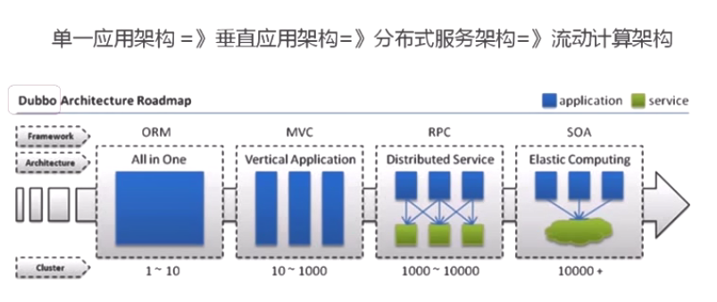
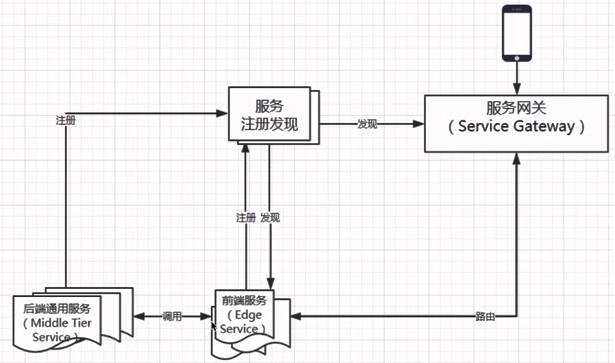
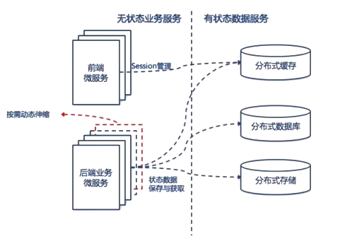

# Spring Cloud

## 说明

### 相关版本号

​	`Spring Cloud Hoxton.SR8`

尽管视频中说一定要保证自己搭建的版本要和视频中保持一致，但是自己为了多踩坑，使用的是 `Hoxton.SR1`

### 代码

​	相关代码见搭建用于学习的 `springcloud` 项目

## 架构



### 单体架构

**优点**

​	容易测试

​	容易部署

**缺点**

​	开发效率低：提交代码等待、冲突

​	代码维护难：所有业务代码都在一个项目中，新人懵逼

​	部署不灵活：构建时间长，任何小修改需要重新构建整个项目

​	稳定性不高：可能因为局部的一个小问题让整个系统崩溃

​	扩展性不够：无法满足高并发下的业务需求

### 分布式

```
定义：旨在支持应用程序和服务的开发，可以利用物理架构，由多个自治的处理元素，不共享主内存，但通过网络发送消息合作 -- Leslie Lamport
```

**CAP原则**

​	CAP原则又称CAP定理，指的是在一个分布式系统中，[一致性](https://baike.baidu.com/item/一致性/9840083)（Consistency）、[可用性](https://baike.baidu.com/item/可用性/109628)（Availability）、分区容错性（Partition tolerance）。CAP 原则指的是，这三个要素最多只能同时实现两点，不可能三者兼顾。

**强调**

​	微服务必然是分布式的，分布式是多节点的，集群是多节点的

## 微服务

### 简单架构图



### 概念

​	一系列微小的服务

​	跑在自己的进程里

​	每个服务为独立的业务开发

​	独立部署

​	分布式的管理

### 异构

​	异构是微服务的特点，不同服务之间可以使用不同语言开发，可以使用不同的数据库

### 康威定律

```
Organizations which design systems are constrained to produce desing which are copies of the communication structures of these organizations
任何组织在设计一套系统（广义概念上的系统）时，所交付的设计方案在结构上都与该组织的沟通结构保持一致
```

### 重点

**掌握如何使用，更要理解分布式、架构的特点**

## 体系

### Dubbo（阿里系）

​	RPC框架，相比其他RPC框架，在服务治理功能集成上可谓非常完善，不仅提供了服务注册发现、负载均衡、路由等面向分布式集群的基础能力，还设计了面向开发测试阶段的Mock、泛化调用等机制，同时也提供了服务治理和监控可视化的平台

​	Spring Cloud 没有出来之前，在国内应用非常广泛

​	重启维护后，Dubbo 官方表示积极寻求适配到 Spring Cloud 生态的方式，如，作为 Spring Cloud 的二进制通信方案，来发挥 Dubbo 的新能优势，或者通过模块化，以及对 http 的支持，适配到 Spring Cloud，当下还不是很兼容

### Spring Cloud

Spring Cloud 是一个开发工具集，包含了多个子项目，微服务架构下一站式解决方案

- 利用 Spring Boot 的开发便利
- 主要是基于对 Netflix 开源组件的进一步封装
- 简化了分布式开发

## 服务拆分

### 不适合拆分的场景

- 系统中包含很多强事务场景的
- 业务相对稳定，迭代周期长
- 访问压力不大，可用性要求不高

### 起点

​	如果系统架构已经是 SOA 服务化的话，有一个说法，微服务和 SOA 之间只差一个 ESB（企业服务总线），这个时候可以聚焦于怎么弄 ESB；这里边和单体架构升级到微服务聚焦的重点是不一样的

​	现在的系统架构，Java 语言占据多少部分，是否已经包含了服务发现、负载均衡的组件，是弃用还是保留，如果以最小的代价切换

### 终点

​	好的架构不是涉及出来的，而是进化而来的，并且一直在演进

### 方法论

> 遵从《可拓展的艺术》里的 扩展立方模型（Scale Cube）

​	X轴 水平复制，也就是同样的多实例

​	Z轴 数据分区，每个服务器负责一个数据子集，运行的代码是一样的

​	Y轴 功能解耦，不同职责的模块，分成不同的服务

**拆"功能"**

- 单一职责，高内聚、低耦合

  单一职责：每个服务只负责业务一个单独的部分

  高内聚：服务相关的行为只在一个服务内，而不是分散在不同的服务中

  低耦合：修改一个服务，不会导致别的服务也跟着修改

- 关注点分离

  职责：例如，订单、商品、网站的前端服务，app的服务接口可以划分成边缘服务

  通用性：一些基础组件，和业务无关的，例如，消息服务、用户服务，把公共的通用服务拆分成相对独立的原子服务层

  粒度：初始的订单服务，之后变大，拆分成订单服务和支付服务

- 服务和数据之间的关系

  先考虑业务功能，再考虑数据

  无状态服务，要将有状态的服务改变为无状态的服务，例如，在本地建立的内存缓存、session 缓存，到了微服务架构中，就应该把这些数据迁移到分布式缓存中，让业务服务变为一个无状态的计算节点，这样后端服务就可以做到按需动态伸缩，在运行时动态增删节点，无需考虑缓存数据的同步问题

**什么是无状态**



**拆”数据“**

- 每个微服务都有单独的数据存储
- 依据服务特点选择不同结构的数据库类型
- 难点在确定边界
- 针对边界设计API
- 依据边界权衡数据冗余

### 结论

​	好的架构是演进而来的，不要妄图一步到位，演进是一直持续的。应该快速出一个微服务，微服务应该做到低成本、低风险的渐进式演进，不应该一直看，一直设计，不要害怕失败，快速的放到生产环境中去面对真实的问题

​	应该，快速选定几个有联系的服务，确定场景要解决的问题，以及要达到的效果，快速开发，快速试错，不要企图一步将服务划分正确，这就是一个逐步权衡取舍的过程，例如，典型电商项目中的商品和订单

## 其他

微服务（Microservice）、容器化技术（Docker）、Devops

```
DevOps（Development和Operations的组合词）是一组过程、方法与系统的统称，用于促进开发（应用程序/软件工程）、技术运营和质量保障（QA）部门之间的沟通、协作与整合。

它是一种重视“软件开发人员（Dev）”和“IT运维技术人员（Ops）”之间沟通合作的文化、运动或惯例。透过自动化“软件交付”和“架构变更”的流程，来使得构建、测试、发布软件能够更加地快捷、频繁和可靠。

它的出现是由于软件行业日益清晰地认识到：为了按时交付软件产品和服务，开发和运维工作必须紧密合作。
```

- 微服务和容器化技术

  从系统环境开始，自底至上打包应用（连同软件环境一起作为软件交付的一部分）

  轻量级，对资源的有效隔离和管理（符合微服务理念，进程隔离，资源管理）

  可复用，版本化（版本化整个微服务环境，轻松实现水平扩展、副本克隆）

- 微服务和Devops

  每个服务都需要独立部署，频繁更新使得持续交付成为为必然，自动化运维提升交付速度是真正玩转微服务的重要环节

  统一配置中心就是 Devops 持续集成的一种体现

## 核心组件

### 1. 注册中心（Eureka）

**简介**

​	也可以叫做服务注册发现，这里以 Spring Cloud Eureka 为重点进行讲解，Spring Cloud Eureka 是基于 Netflix Eureka 做了二次封装

​	分布式系统中，服务注册中心是最重要的基础部分，时时刻刻都应该处于提供服务的状态。无论是否使用 Eureka，承担分布式该职责的组件都应该是高可用的，也都是基本采用集群的解决方案

#### Server

**简介**

​	 作为真正注册中心含义的组件，通过 Eureka Server 能够查看到所有可用的服务实例以及其他的注册中心

**实际操作**

1. 不手动引入依赖，通过 IntelliJ IDEA 的 Spring Initializr 创建项目，勾选上 `Spring Cloud Discovery` 分类下的中 `Eureka Server`

   ```markdown
   插曲：我们称注册中心组件、配置中心组件等为组件，正是凸显出作为一个单独的模块，同时他们也是可以替换的，IDEA 的 Spring Initializr 很好的体现了这个
   ```

2. 启动类上添加核心注解 `@EnableEurekaServer` 

   ```markdown
   插曲1：视频中解释一个服务端就是一个客户端只要从核心注解的源码中看到包含了 `@EnableDiscoveryClient` 的角度解释，就很清楚了，但是自己搭的 `Hoxton.SR1` 版本中的核心注解定义并不包含该注解
   
   插曲2：通过查看该注解的用法，查看到了为 Spring Cloud 提供的一个聚合注解 `@SpringCloudApplication`
   ```

#### 服务发现

​	根据客户端获取的服务地址，是具体服务地址还是代理的地址，也就是由客户端还是代理负责真正具体调用的服务地址，将服务发现的方式分为如下两种

 1. **客户端发现**

    描述：调用者主动从注册中心挑选一个可用的服务进行调用

    优点：简单、直接，同时客户端是知道所有可用的服务地址的

    缺点：每个调用者都需要实现挑选服务的逻辑

    举例：Eureka（没有代理嘛）

 2. **服务端发现**

    描述：调用者请求代理，由代理决定挑选一个可用的服务

    举例：Nginx（反向代理服务器、服务发现的负载均衡器）、Zookeeper（Dubbo + Zookeeper）、Kubernates（每个节点都运行一个代理）

    **拓展**

    客户端发现同服务代理概念中的正向代理，正向代理就是客户端集成的 Eureka Client。客户端知道要请求的目标服务的地址，只是叫正向代理服务器帮忙，间接去请求

    服务端发现同服务代理概念中的反向代理，反向代理就是为服务端配置反向代理服务器。客户端不知道真正请求的目标服务的地址，只是知道，交给反向代理服务器就行了，它会帮忙搞定

#### Client

**简介**

​	集成了 Eureka Client 的服务，会在启动后主动将自身信息汇报到配置好的注册中心中，并与注册中心之间维持一个心跳机制，用于确认服务是否可用；当超过若干个心跳周期，实例都没有与服务端之间发送有效的心跳包，就会被服务端认为不可用

​	重点关于 Eureka 是基于客户端发现这个角度进行澄清说明。并不是说，基于客户端发现，Eureka Client 就不需要将自身的相关信息汇报到注册中心（Eureka Server），这是两个不同的概念，客户端将自身信息汇报到服务端是必然的，不然哪来`注册中心`的概念。其次，在 Spring Cloud 体系中所有组件都应该集成 Eureka Client，这样才能做为 Spring Cloud 微服务体系的一部分

**实际操作**

1. 不手动引入依赖，通过 IntelliJ IDEA 的 Spring Initializr 创建项目，勾选上 `Spring Cloud Discovery` 分类下的中 `Eureka Discovery Client`

2. 启动类上添加核心注解 `@EnableEurekaClient` 或 `@EnableDiscoveryClient`

   ```markdown
   插曲：两个注解的区别，见作者在 Stack Overflow 上的回答https://stackoverflow.com/questions/31976236/whats-the-difference-between-enableeurekaclient-and-enablediscoveryclient
   ```

#### 高可用

​	Eureka Server 相互注册，他们的信息是共享的，在他们各自的页面都可以看到所有 Client，以及其他的 Server

​	在多个机器上，启动多个 Eureka Server 节点（一般来说，至少3个）

#### 同行

​	Zookeeper、Nacos

### 2. 服务调用

​	微服务特点：轻量级的通信。例如，REST 或 RPC。Spring Cloud 采取了前者，所以 Eureka Server 提供了完善的 Restful Api，Eureka 也支持将非 Java 语言实现的服务纳入到自己的服务治理体系中，其他语言只要实现了客户端程序即可，例如 NodeJS 的 eureka-js-client

#### 调用方式

- **RestTemplate**（spring-boot-starter-web spring-web 包中）

- **Feign**（spring-cloud-starter-openfeign）

  开启 Feign 功能的核心注解 `@EnableFeignClients`

  从业务角度说，相关服务的 FeignClient 应该由相关的服务提供，例如 A 服务调用 B 服务，即 A 应该通过 B 提供的相关 FeignClient 去调用 B 的相关服务接口，那么注意，A 服务的启动类上，一定要加上核心注解，且通过该注解的 basePackages 属性指定 B 服务定义的相关 FeignClient 所在包

  数据表等相关实体应该按照多模块规则放在 公共模块中

#### 负载均衡

​	主要通过客户端负载均衡器 Ribbon 来实现，`RestTemplate`、`Feign`、`Zuul` 的负载均衡的底层实现都是 Ribbon

​	Ribbon 实现负载均衡的核心几点：服务发现、服务选择规则、服务监听

​	Ribbon 核心组件：首先通过 ServerList 获取所有可用列表，再通过 ServerListFilter 筛选剔除一部分，最后交友 IRule 从众多实例挑选一个具体可用的

**源码定位**

​	LoadBalancerClient.choose → RibbonLoadBalancerClient.choose → ILoadBalancer → BaseLoadBalancer.getAllServers → BaseLoadBalancer.DEFAULT_RULE

**源码定位2**

​	多实例方法调用 → 控制台日志中 DynamicServerListLoadBalancer → 包含 IRule 类型形参的构造 断点 → RoundRobinRule

**自定义负载均衡策略**

​	Spring Cloud 官网 → LEARN → Reference Doc → spring-cloud-netflix → Customizing the Ribbon Client

#### 异步

**通知**

**请求/异步响应**

​	简单的说，就是通过回调的机制来实现异步响应，请求一个基于异步实现的接口，参数中除了调用接口的需要参数，还应该包含回调的地址，用于当耗时请求完成时，通知请求者接口的调用结果

**消息**

​	这里要举的业务场景例子是，订单服务和商品服务，在用户下单的过程中，订单服务需要调用商品服务的接口查询商品的库存，并在库存足够的情况下，调用扣减库存的接口。使用消息队列来解耦的话，订单服务维护一个商品库存缓存；同时，订单服务订阅由 商品服务发布 的商品库存扣减成功的消息，以及商品服务订阅 订单服务发布 的库存变动的消息，大致流程就是，订单服务启动时主动查询商品库存信息，收到下单请求，经过库存判断，发布一个扣库存消息，商品服务收到这个消息，扣减库存，并将扣减库存成功的消息发送到消息队列中，订单服务收到这个消息，就可以将维护的商品库存信息进行扣除。当然，如果还考虑到支付，还是要看具体业务，可以由订单服务和商品服务共同订阅支付结果的消息，支付服务能够立即得到支付结果，就可以立即发布一条对应的消息。如果没有，则可以设置一个超时时间，半个小时后，产生支付超时的消息，来保证最终一致性

### 3. 配置中心（Config）

**简介**

随着业务的发展、微服务架构的升级，服务的数量、程序的配置日益增多（各种微服务、各种服务器地址、各种参数），传统的配置文件方式和数据库的方式已无法满足开发人员对配置管理的要求

- 不方便维护：每个微服务都有相关的配置文件需要配置，繁琐冗余。所以需要一个统一的配置管理平台

- 配置内容安全与权限：主要是针对线上配置来说，一个公司里，线上的配置一般是不会对开发人员开放的，例如，数据库的账号和密码，都是运维人员才知道。配置跟随源代码保存在代码库中，容易造成配置泄漏，所以需要将配置文件进行隔离，不放入项目的代码中

- 更新配置项目需要重启：例如，短信验证码一天不能错多少次这种，线上配置一下就需要重启项目实在不合理。无法做到相关的功能开关、日志开关的动态配置，所以需要引入配置中心

**概念**

​	配置文件为了方便配置的版本管理，我们将其放到远端Git服务器上。由 Config Server 从远端拉取配置文件，放到本地Git仓库中，假如远端配置不可用了，Config Server 就会使用本地的配置。同 Eureka 的客户端模式，Spring Cloud Config 的体系中也需要客户端集成特定客户端（Spring Cloud Config Client）

#### Server

1. 手动引入依赖

2. 核心注解 @EnableConfigServer

  3. 配置文件配置应用名和 Eureka Server 地址

  4. spring cloud config 默认实现推荐使用Git后端，这对于管理升级和物理环境以及审核更改非常方便。在 Git 服务器上创建一个仓库，用于存储和通过请求访问配置文件，通过 GitLab 搭建的私人仓库或就单起一个服务用于通过连接获取配置文件，只要能达到效果就行，这里采用 GitHub（然后配置中心如何配置是重点）

  5. spring cloud config 支持的访问配置数据的 REST 接口

     ```markdown
     /{name}/{profiles:.*[^-].*}
     /{name}/{profiles}/{label:.*}
     /{name}-{profiles}.properties
     {name}-{profiles}.json
     /{label}/{name}-{profiles}.yml（properties、json、yaml）
     
     label：git 仓库分支名（spring cloud 默认分支名 master、github 默认分支名 main）
     name：配置文件的名称
     profiles：配置文件环境标识名称
     
     获取配置数据：
     假如作为配置中心配置数据源的 Git 仓库下有名为 order.yml 和 order-dev.yml 的配置文件，通过 Get 请求方式，/main/order-dev.yml 的请求路径，请求配置数据，得到的是整合上述两个配置文件的配置数据。这里的概念，就同 Spring Boot 项目的配置文件一样，符合一定命名规则的配置文件 application-dev.yml、application-test.yml、application-prod.yml，对应着不同运行环境的配置，同时 application.yml 配置文件的内容也会生效，且一般将不变的通用配置放到里边。接口按照该规则的返回的配置数据是非常合理的
     ```

**高可用**

​	作为提供配置的配置中心，这里也就是 Config Server，提供用于获取配置数据的 REST 接口，本质上就是一个微服务，保证高可用的基本策略，仍然是多启几个实例

#### Client

​	引入了配置中心，首先将所有配置集中放到配置中心管理，然后将多个配置的通用部分提取出来

1. 引入依赖
2. 依赖的核心注解同 Eureka Client
3. 配置文件配置，引出 bootstrap.yml

**误区**

​	有了配置中心什么配置都应该通过配置中心获取。这是有问题的，因为从配置中心获取，首先你得知道配置在哪，这是从注册中心获取的，所以说任何服务关于注册中心的配置是需要单独配置的，主要就是一个顺序问题

#### 动态刷新配置（Spring Cloud Bus）

**概念**

​	配置中心与各个微服务实现配置实时刷新同步，采用消息队列的通信方式，消息队列具体选型 RabbitMQ。核心是 Spring Cloud Bus，Config Server 使用 Spring Cloud Bus 来操作消息队列，会提供一个 http 接口 `/bus-refresh`，访问这个接口，Spring Cloud Bus 就会将配置更新的信息发送到消息队列中。回到这个接口，这个接口应该由谁来调用，没错，在整单机自动的自动部署相关软件环境搭建的时候就弄过，采用 `WebHook` 机制，当配置发生改动就会由该机制去请求配置好的接口路径

**实际操作**

1. 本地起一个 RabbitMQ 实例

2. Config Server 项目以及需要同步刷新配置的项目，都需要引入依赖 `spring-cloud-starter-bus-amqp`

   本地 RabbitMQ 没有修改端口和账户信息之类的，就需要在配置文件主动配置，采用默认的就好

3. 和 Spring Endponit 相关，默认 `/bus-refresh` 接口是不暴露的，Config Server 需要配置一下

   ```
   management:
     endpoints:
       web:
         exposure:
           include: bus-refresh
   ```

4. 依次启动 Eureka Server、Config Server、Client

   其中启动 Config Server 的时候，RabbitMQ 管理界面会生成一个队列

5. 测试（手动调用刷新配置接口）

   - 访问 Client 获取好的专门获取配置信息的接口

   - 修改 Github 上的配置

   - 通过 Postman 手动调用配置中心的 `/actuator/bus-refresh` 接口（Post 请求）

     IntelliJ IDEA 对 spring endpoint 这块支持的是非常好，可以直接在界面视图中选择 Endpoints → Mappings 查看所有的 Endpoint

   - 再访问 Client 获取好的专门获取配置信息的接口，发现配置没有更新

     实际还需要在该获取配置信息的接口上，添加 @RefreshScope

   - @ConfigurationProperties 的配置实体类上加上 @RegreshScope 的配置类，也可以达到配置动态刷新的效果，就是注意不要将被该注解修饰的配置类直接作为接口的返回值，会引起 Json 数据解析的死递归，因为经过该注解修饰的类，实际 Spring 为该类型注入的对象是经过动态代理的，就是这个代理做到了配置的刷新

6. **大坑**

   辣鸡 Maven、辣鸡 IDEA 对接 Maven 对接的也不行。引入了 bus -amqp 依赖的客户端启动，RabbitMQ 的管理后台界面没有像教程中那样会对应创建一个消息队列，当初自己就以为是因为相关类库版本不同造成的，所以没有特别在意；后来，在另外一台电脑上测试调用客户端的 /actuator/bus-refresh 看下能否刷新，发现是可以的，然后回到本机同样测试，发现配置文件中提示认不到 `management.endpoints.web.exposure.include`，这就是奇怪了，因为通过在 Config Server 的该配置找到实际对应的类，发现是 spring-boot-actuator-autoconfigure 包，而通过 spring-cloud-config-client 是能关联到这个包的，从而定位问题是导包问题，进一步测试，将所以依赖都删除了，居然发现 client 模块的代码还没报错。最终解决，删除再重新创建该模块。结论，因为手动重命名模块名和 pom.xml 中的 name、artifactId 标签，只要 IDEA 提示什么 Module has been removed 问你是否要删除该模块（不会物理删除），就代表 IDEA 不会再理会该模块的依赖了，此时因该选是 → Project Structure → ＋ → Import Module → 这样就可以将模块重新加入模块管理

7. 远程仓库配置 WeekHook

   需要配置内网穿透（端口映射）工具一起使用
   
   方式一：配置的访问路径不再是 /actuator/bus-refresh 而是 /monitor，并且需要在 Config-Server 里边添加依赖 spring-cloud-config-monitor（实际是 /monitor 接口调用成功了，Config Server 中有相关日志出现，但是 Client 没有相关日志。所以配置没有刷新）
   
   方式二：也确实没有那么多时间，一直耗在这里，所以简单做个转发，核心还是通过 /actuator/bus-refresh 接口实现配置动态刷新（引入的依赖就可以删除了）。注意这个转发，如果只是单纯的转发，实际和直接调用 /actuator/bus-refresh 接口无任何区别，所以由传统意义的转发改为需要主动发起请求的形式（又或者说手动调用 /actuator/bus-refresh 执行的核心逻辑 - RefreshBusEndpoint.busRefresh，有点复杂，放弃）
   
   1. 获取应用实际的 ip port
   
      ```java
      @Component
      public class ServerConfig  implements ApplicationListener<WebServerInitializedEvent> {
          private int serverPort;
       
          public String getUrl() {
              InetAddress address = null;
              try {
                  address = InetAddress.getLocalHost();
              } catch (UnknownHostException e) {
                  e.printStackTrace();
              }
              return "http://" + address.getHostAddress() + ":" + this.serverPort;
          }
       
          @Override
          public void onApplicationEvent(WebServerInitializedEvent event) {
              this.serverPort = event.getWebServer().getPort();
          }
       
      }
      ```
   
   2. 通过 FeignClient
   
      ```java
      /**
       * 调用自身实例（Config Server）的接口方法的 FeignClient
       *
       * @author Wang Mincong
       * @date 2020-10-17 23:56:31
       */
      @FeignClient("${spring.application.name}")
      public interface BusRefreshFeignClient {
      
          /**
           * 调用总线的配置刷新方法
           */
          @PostMapping("/actuator/bus-refresh")
          void busRefresh();
      
      }
      ```
   
      问题：超时，开始以为能够针对不同的 FeignClient 设置不同的超时时间，但是[了解](https://www.csdn.net/gather_25/MtjaIgxsNzMyMDUtYmxvZwO0O0OO0O0O.html)过相关的底层原理发现，实际上一个 FeignClient 的调用涉及 Ribbon 和 Hystrix，甚至说 FeignClient 就是一个单纯的门面，没有任何相关的具体概念（疑问，Feign 关于超时的相关框架组件的概念）

#### 同行

​	Nacos、Apollo

### 4. 服务网关 

**简介**

​	又叫 `Api Gateway`、`Service Gateway`

​	作为连接内部的大门，屏蔽内部细节，将外部请求反向路由到内部具体的服务

​	所有外部请求都会经过网关，所以可以做到：监控、日志、安全性（校验、授权、反爬虫）、流量限制等，隐藏在API网关后面的业务系统就可以专注于创建和管理服务，无需关心这些策略性的请求

​	一般公司系统好不好，只要看服务网关就可以了

**四大职能**

- 请求接入：作为所有 API 接口服务请求的接入点，管理所有接入请求
- 业务聚合：所有后端业务服务的聚合点，所有的业务服务都可以在这里被调用
- 中介策略：实现安全、验证、路由、过滤、流控、缓存等策略，进行一些必要的中介处理
- 统一管理：提供配置管理工具，对所有API服务的调用生命周期和相应的中介策略进行统一管理

#### 主流服务网关

|                      | 语言        | 限流                                                         | 鉴权                                   | 监控                                                         | 易用性                                           | 可维护性                               | 成熟度             |
| -------------------- | ----------- | ------------------------------------------------------------ | -------------------------------------- | ------------------------------------------------------------ | ------------------------------------------------ | -------------------------------------- | ------------------ |
| Spring Cloud Gateway | Java        | 可以通过IP，用户，集群限流，提供了响应的接口进行拓展         | 普通鉴权、OAuth2.0                     | Gateway、Mettries、Filter                                    | 简单易用                                         | Spring系列可拓展性强，易配置可维护性好 | Spring社区成熟     |
| Zuul 2               | Java        | 可以通过配置文件配置集群限流和服务限流，也可通过 Filter 实现限流拓展 | Filter 中实现                          | Filter中实现                                                 | 参考资料少                                       | 可维护性差                             | 开源不久，资源少   |
| OpenResty            | Nginx + Lua | 需要 Lua 开发                                                | 需要 Lua 开发                          | 需要开发                                                     | 简单易用，但是需要Lua开发                        | 可维护性差，需要大量lua脚本库          | 成熟，资料多       |
| Kong                 | Nginx + Lua | 根据秒、分、时、天、月、年，根据用户进行限流。可在源码的基础上进行开发 | 普通鉴权、Key Auth鉴权、HMAC、OAuth2.0 | Kong可以上报datalog记录请求数量、请求数据量、应答数据量、接收与发送的时间间隔、状态码数量、Kong内运行时间 | 简单易用，API转发通过管理员接口配置，开发需要Lua | 可维护性差，需要大量lua脚本库          | 相对成熟，插件开源 |

还是那句话，每种框架、技术选型，都应该向着适合业务的角度去考虑，没有绝对的好坏

### 5. 限流熔断

**Hystrix Dashboar**

**熔断**

### 6. 服务追踪

Sleuth + Zipkin

### 7. 后端通用服务（业务）

又叫，中间层服务（Middle Tier Service）

启动时，将服务信息注册到服务注册表中

### 8. 前端服务（业务）

又叫 边缘服务（Edge Service）

查询注册表，即可发现并调用后端服务

主要是对后端服务做必要的`聚合`和裁剪后`暴露`给外部不同的设备

**聚合**

例如，查询订单信息以及订单对应的用户信息，需要调用两个接口，前端服务就可以做一个聚合，将这两个接口的功能合二为一，作为一个接口暴露出去，这样客户端只要调用前端服务的一个接口就可以了

**裁剪**

和上面正好相反，例如根据不同的情况返回不同的数据，例如，都是查询商品信息的接口，如果是PC端的请求，就尽可能返回的详细一些，如果是手机端信息可能就没有那么详细；又例如，PC端需要返回的是html，而手机端需要返回的是json数据