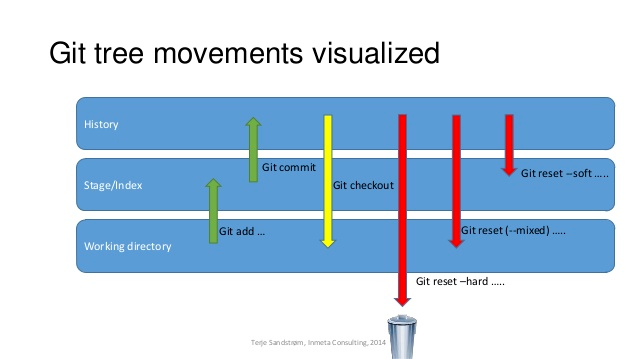

## 说明

**标记符**

关于文档中的一些标记符做一下说明，标识符定义是参照 MySQL、Git 的官方文档的特殊字符含义定义的

`""`、`<>`：参数，代表命令的动态参数

`[]`：可选参数，代表命令中，该内容可有可无

`()`：等效替代的意思

**名词**

仓库 = 版本库 = 代码库 = 项目目录

`git commit -m "提交注释"` 的 提交注释 = message

**分支**

在本文中，说到分支，会有将其类比为指向分支线最新提交的指针的说法

**分支名**

GitHub 在某个时间节点，因种族歧视的缘由，将默认的主分支名由 master 改为了 main，本文的内容都是采用 master

## 概念

### 基础

git 不会跟踪文件夹

### 区域

`工作区` ←→ `贮藏区`

`暂存区`

`版本库`

这张图能够很形象的将文件在不同区域内的转移说清楚



## 配置

### 级别

通过直接输入 `git config` 命令，可以了解到 git 针对配置项一共有 3 种级别：

`system`：所有用户、所有项目，对应到配置文件

```
Linux /etc/gitconfig
Win   C:\Program Files\Git\mingw64\etc\gitconfig
```

`global`：当前登录的用户，对应到配置文件

```
Linux ~/.gitconfig
Win   C:\Users\xxx\.gitconfig
```

`local`：本地级别，也就是具体的某个 git 仓库，对应到配置文件

```
仓库目录/.git（隐藏文件）/config
```

### 命令语法

查看所有配置：`git config [--local|--global|--system] -list(-l)`

增：`git config --add <name> <value>`
改：`git config <name> <value>`
删：`git config --unset <name>`
删：`git config --unset-all <name>`
查：`git config [--get] <name>`
查：`git config --get-all <name>`
查：`git config get-regexp <name-regex>`

### 常用配置

语法高亮：`git config --global color.ui true`

配置别名：`git config --global alias.别名 "原名"`（单个单词可以省略引号）

用户名邮箱：

```bash
git config --global user.name "Your Name"
git config --global user.email "email@example.com"

# 重点说明一下，这两个配置项相当重要，用于直接标识 commit 的创建者是谁；可能说你通过账号 A 的密钥、密码等权限提交代码，但是只要你这两个配置没有匹配，就会显示成别人提交的代码
```

### 忽略文件

> 常见的忽略文件模板，可参见 https://github.com/github/gitignore/branches/all

项目中有些文件，我们并不会将其提交到远程仓库，如无用的日志文件、开发工具的配置文件、项目重要的配置文件、体积较大的项目编译产物等等，但是每次通过 `git status` 命令查看仓库状态时，总是会显示 `Untracked files ...`，这时就需要指定一些忽略规则，让 git 放弃追踪这些文件

`.gitignore` 中配置的文件类型，是无法添加到暂存区的，但是可以通过 `-f` 参数来强行添加

`.gitignore` 文件本身要放到版本库里，并且可以对 `.gitignore` 做版本管理

**相关命令**

`git check-ignore`：提示你哪行配置的规则不允许添加该文件

### 文件脱离版本管理

`git rm --cached <file>`：想要删除版本库中的一个文件，但是不删除本地的文件

（已经被 git 管理的文件，在后边补上 `.gitignore` 的规则是没用的，这时就需要用到该命令）

## 基础命令

创建本地仓库：`git init`

查看本地仓库状态：`git status`

### 工作区 → 暂存区

`git add <file>...`
`git add -u`：文件的修改、删除，添加到暂存区
`git add .`：文件的修改、新建，添加到暂存区
`git add -A`：文件的修改、删除、新建，添加到暂存区

### 工作区 → 仓库

`git commit -am "提交说明"`

### 暂存区 → 工作区

`git restore --staged <file>...`

### 暂存区 → 仓库

`git commit -m "提交说明"`

### 比对工作区和暂存区

`git diff`
（会出现 a b 作为区分）

### 比对暂存区和HEAD

`git diff HEAD [--] <file1> ...`
（如果同时工作区也存在文件的改动，那么比对的将是工作区和HEAD）

### 丢弃工作区和暂存区

`git checkout HEAD [--] <file1> <file2> ...`

（还原工作区和暂存区）

### 丢弃工作区

`git checkout [--] <file1> <file2> ...`

（保留暂存区）

### 丢弃暂存区

`git reset <HEAD> [--] <file1> <file2> ...`

（保留工作区）

### 查看提交历史

`git log`

`git reflog`（删除的都可以看）

参数：
`--pretty=oneline（--oneline）`：查看简洁的提交
`-n数字`：查看近几次的提交
`--graph`：带上同 GUI 的提交分支之间的演进历史，分支信息
`-all`：查看所有分支，不限于当前分支，添加该参数，指定分支查看失效

## 远程仓库

### 概念

1. 仓库命令是针对仓库的，必须在 git 仓库下运行该命令
2. 无论是推送至远程库，还是克隆拉取远程库，都是要先有远程仓库的
3. 一个本地仓库可以对应多个远程仓库
4. 远程仓库的名称操作是本地的，局部定义的概念

### 常用命令

`git remote add <本地自定义的远程仓库名> https://github.com/xxx/xxx.git`：关联远程仓库
`git remote -v`：查看已关联的远程仓库（如果没有推送权限，那么肯定没有 push 的地址）
`git remote rename <oldName> <newName>`：重命名远程仓库
`git remote rm <name>`：删除已关联的远程仓库

**推(push)**

`git push -u <本地自定义的远程仓库名> <分支名>`

远程库是空的，第一次推送 master 分支时，需要加上-u 参数，这样，Git不但会把本地的 master 分支内容推送的远程新的 master 分支，还会把本地的 master 分支和远程的 master 分支关联起来

没有关联远程仓库，也不加 -u 参数就推送，会得到如下提示：

```
fatal: The current branch master has no upstream branch.
To push the current branch and set the remote as upstream, use

git push --set-upstream origin master
```

**拉(pull、clone)**

`git clone git@github.com:xxx/xxx.git`

当你从远程仓库克隆时，实际上 Git 自动把本地的 master 分支和远程的 master 分支对应起来了，并且远程仓库的默认名称是 origin

第一次使用 Git 的 clone 或者 push 命令连接 GitHub 时，会得到一个警告：

```markdown
The authenticity of host 'github.com (xx.xx.xx.xx)' can't be established.
RSA key fingerprint is xx.xx.xx.xx.xx.
Are you sure you want to continue connecting (yes/no)?

这是因为 Git 使用 SSH 连接，而SSH连接在第一次验证 GitHub 服务器的 Key 时，需要你确认 GitHub 的 Key 的指纹信息是否真的来自 GitHub 的服务器，输入 yes 回车即可
（校验可以通过查看：https://help.github.com/en/articles/githubs-ssh-key-fingerprints）
```

## 操作实例

### 删除文件

**方式一**

1. `git rm <file>`：物理删除文件，并将文件删除这个改动添加到暂存区

2. `git reset HEAD <file>`、`git checkout -- <file>` 取消删除

   `git commit -m ""` 确认删除

**方式二**

1. `rm <file>`：物理删除文件

2. `git checkout -- <file>`：取消删除

   `git add/rm <file>` → `git commit -m ""`：确认删除

   对于文件删除改动，是有工作区概念的

### 移动文件（重命名）

例如，将当前目录下所有文件移动到当前目录的上一级目录：`git mv * ../`

提交：`git commit -m "移动了文件"`

直接通过 mv 命令或者操作移动，工作区会提示文件删除和新文件的增加，但是提交到暂存区，git 会识别到重命名

### 解决冲突

如果在你提交并推送之前，已经有人提交了且推送了，就会推送失败，因为小伙伴最的新提交和你试图推送的提交有冲突，如何解决，其实 Git 都有提示：

1. 先用 `git pull` 把最新的代码从远程仓库 pull 下来
2. 如果失败了，原因是没有指定本地 dev 分支与远程 origin/dev 分支的关联，根据提示，设置 dev 和 origin/dev 的链接：
   `git branch --set-upstream-to=origin/dev dev`

3. 在本地解决冲突，再推送

### 版本回退

结合三大区域的概念图，这里重点说一下 `git reset` 命令

一次提交：`git reset --<model> HEAD^`
两次提交：`git reset --<model> HEAD^^`
n次提交：`git reset --<model> HEAD~n`
指定版本：`git reset --<model> <commitid>`

**model**

`soft`

指定的提交：撤销到暂存区
工作区：不变
暂存区：不变

`mix`

指定的提交：撤销到工作区
工作区：不变
暂存区：撤销到工作区

`hard`

指定的提交：丢弃
工作区：新增丢弃、改动丢弃
暂存区：新增保留、改动丢弃

### 撤销提交

`git revert <commitid>`

这个命令的原理很简单就是说假如记一次变动为 A → B，那么该命令就是产生一个还原变动 B → A，即会产生一个新的提交

使用该命令，提交时会产生一个默认 message，推荐使用，不要去修改

### 提交复制

`git cherry-pick <commitid> ...`

将分支 A（指定 commitid 对应的分支）上的提交，复制到分支 B（执行命令时的当前分支）上也提交一份

## 分支管理

### 分支概念

`master`：分支是主分支，dev 分支是开发分支，团队所有成员都需要在上面工作,因此都需要时刻与远程同步

`bug`：分支只用于在本地修复bug，就没必要推到远程了，除非老板要看看你每周到底修复了几个bug

`feature`：分支是否推到远程，取决于你是否和你的小伙伴合作在上面开发

**删除未合并的分支**
`git branch -d xxx`

```
error: The branch 'xxx' is not fully merged.
If you are sure you want to delete it, run 'git branch -D xxx'
```

一个分支做了修改（创建了结点），此时删除这个未合并的分支（指针），那修改就无法被访问到了，所以需要连同结点一起删除

`git branch -D xxx`

### 常用命令

`git checkout -b <branchname> <远程仓库名>/<branchname>`：拉取分支
`git pull <远程仓库名> <branchname>`：更新分支
`git branch <branchname>`：创建分支
`git checkout <branchname>`：切换分支
`git checkout -b <branchname>`：创建并切换分支

`git branch`：查看分支（当前分支前面会标一个*号）
-v：附上分支最近的提交注释
-a：远程分支也查看

`git branch -d <branchname>`：删除分支
`git push <远程仓库名> :<分支名>`：删除远程仓库的分支（将本地这个删除改动推送到远程）
注意1：不能删除当前所在的分支，需要切换到别的分支，再删除
注意2：不能删除远程仓库的默认分支

`git merge <branchname>`：将当前分支合并至指定分支
大多数 GUI 中，都是将右键点击合并的分支，合并到当前分支

`git log --graph --pretty=oneline --abbrev-commit`：查看分支的合并情况

`git push <远程仓库名> <branchname>`：推送分支
分支名是一一对应的，不存在本地仓库的分支名和远程仓库的分支名不相同的情况

**分支管理策略**

在使用合并分支指令时，还可以指定 `--no-ff` 参数，这样可以取消默认的快速合并模式，而使用普通的模式进行合并。快速合并模式不会留下合并的历史消息，但是普通模式可以，普通模式的合并能看出来曾经做过合并。总之，如果要强制禁用 Fast forward 模式，Git 就会在 merge 时生成一个新的 commit，这样，从分支历史上就可以看出分支信息，而生成提交就需要使用“-m”参数，指定提交说明：
`git merge --no-ff -m "merge with no-ff" <branchname>`

## 贮存区

### 概念

假如当前正在一个分支上工作，突然要解决bug（假定需要在master分支上修复），那么一般的操作流程如下：

1. git stash
2. 跳转到 master 分支
3. 创建临时分支用于修复bug
4. 修复后，跳转回 master 分支，合并修复 bug 分支
5. 删除修复 bug 分支
6. git stash pop

### 常用命令

`git stash`：将工作区的内容放到贮存区

`git stash apply`：应用储存区（将贮存区的内容还原到工作区）
`git stash apply stash@{0}`

`git stash drop`：删除贮存区
`git stash pop`：应用并删除贮存区
`git stash list`：查询贮存区文件

## 标签管理

### 概念

发布一个版本时，我们通常先在版本库中打一个标签（tag），这样，就唯一确定了打标签时刻的版本。将来无论什么时候，取某个标签的版本，就是把那个打标签的时刻的历史版本取出来。所以，标签也是版本库的一个快照

标签本质上就是指向某个 commit 的指针（跟分支很像，但是分支可以移动，标签不能移动），所以，创建和删除标签都是瞬间完成的

tag 正如其单词表示的含义，当我们想要表示 `commitid` 为 `9f897e...` 是某某功能完成的时候，就不如给该 commit 打一个 tag

创建的标签都默认存储在本地，不会自动推送到远程

### 常用命令

`git tag <tagname>`：为当前分支的最新 commit 添加标签
`git tag <ragename> <commitid>`：指定的 commit 添加标签
`git tag [-a] <tagname> [-m "说明文字"] [commitid]`

`git tag`：查看所有 tag（不是按照创建时间排序，而是按照名称排序）
`git show <tagname>`：查看详细信息
`git push <远程仓库名> <tagname>`：推送到远程仓库
`git push <远程仓库名> --tags`：将本地所有尚未推送的标签推送至远程
`git tag -d <tagname>`：删除
`git push <远程仓库名> :refs/tags/<tagname>`：删除远程仓库标签

## 修改提交（变基）

### 简介

变基的是什么，简单来说就是提供了一个可以修改历史提交的手段，例如，修改提交的 message，修改提交的作者信息（名称、邮箱）；还能删除提交、修改提交等等

**从规范角度来说**，有些公司对代码仓库的提交历史有严格的要求，希望主干分支清晰整洁，呈现出类似一条直线的效果。当然，公司不具有一定规模，或是公司没有自己的产品，又或是没有要求严格的技术负责人，需要通过变基来整改提交历史的寻求根本不存在

**从安全角度来说**，即使你可能真的有修改历史提交信息的小需求，你也会忍耐，而不是选择使用变基的方式去调整修改，因为无关大局。将变基的结果推送到远程仓库，需要加上 `--force`（否则远程仓库会进行 merge 或 rebase 处理，那么提交历史的分支节点展示 UI 就达不到预期的效果了），是类似覆盖的操作，假如同时有其他的开发人员提交了代码，那么提交会丢失，导致很严重的结果

**小结**：所以说，如果公司没有需求，而你自己不是 git 方面的专家，没有在变基之前做好备份还原的操作，没有充足的时间，就不要使用变基的功能。虽然，没法忍耐小错误和不规范，但是这个真的应该考虑成本和后果再做出行动

**官方**：只对尚未推送或分享给别人的本地修改执行变基操作清理历史，从不对已推送至别处的提交执行变基操作，这样，你才能享受到两种方式（rebase 和 merge）带来的便利

### 操作概念

> 在变基之前，git 要求你的工作区没有任何文件改动内容

1. **确定变基范围**

   ​	确定要修改哪几个 commit，可以通过给执行的 `git rebase` 命令加上特定参数执行来指定。指定好后，会进入一个类似 `linux` 中的 vim 查看文本的交互式模式，而文本的内容分两块，第一块是你通过特定参数筛选出的提交，然后是关于你要如何修改历史提交的操作提示，注意这一步对入门者来说有点难理解（但是理解之后，你会发现 git 设计的很妙），这一步的目的是希望你确定对一个 commit 做怎样的操作，如 修改、删除等，确认好后，进行命令模式的 `wq` 文件保存。回过头来说，你可以通过执行 `git rebase` 命令的同时指定参数来筛选 commit，你也完全可以不指定，在 vim 文本时，来指定

2. **进行具体修改**

   ​	根据第一步确认的 commit 范围和做怎样的修改，这里将进行具体的修改，当确认好后，你会进入到变基的交互命令模式。这时你会处于你确定的 commit 列表按时间逆序的第一个，即最早的那一个，你可以通过 `git commit --amend` 命令再进入一个 vim 的文本编辑，文本的内容就是该 commit 的详细信息，你可以对提交的信息进行修改

   ​	同时该 commit 的文件改动内容会出现在你的**暂存区**，此时可以将暂存区撤回进行修改，再提交到暂存区），此时，你就可以对历史提交的内容进行修改了

   ​	通过 `:wq` 修改保存 commit 信息的同时，会以该时刻暂存区内容以及注释替换掉该次提交。当你确认修改好后，可以输入 `git rebase --continue` 对下一个 commit 进行修改，当你在最后一个 commit 上执行该命令，就认为本次变基结束。当进行变基时，head 会脱离跑出去，当变基完成时，head 所在分支的指针就会移动到变基后的最新提交上

   PS：在进行具体修改时执行 `git commit --amend`  命令的 vim 修改提交者信息，也可以用命令的参数形式来替代 `git commit --amend --author="zhangsan <zhangsan@qq.com>" --no-edit`

### 命令

`git rebase --abort`：在变基过程中，想放弃本次变基所作的修改

`git rebase --skip`：在变基过程中，你临时有事，从变基过程中退出来

`git rebase -i <commitid>`：确定 commit 范围为从指定的 commit - 不包括 到当前分支最新的 commit

`git rebase -i HEAD~n `：确定 commit 范围为当前分支最新的 commit - 包括 向历史回溯 n 个
执行命令有可能得到 `fatal: invalid upstream 'HEAD~n'` 这样的提示，说明你的 n 超过范围了

### 待补充

HEAD 参数规则？

git rebase 命令的其他参数？

-i 参数有无的影响？

真正做到修改历史提交者的信息需要对 commit 的信息了如指掌，此时更推荐使用 `--no-edit` 参数的命令

### 批量修改 commit author

```shell
#!/bin/sh

git filter-branch --env-filter '

OLD_EMAIL="old@old.com"
NEW_NAME="new"
NEW_EMAIL="new@new.new"

if [ "$GIT_COMMITTER_EMAIL" = "$OLD_EMAIL" ]
then
	export GIT_COMMITTER_NAME="$NEW_NAME"
	export GIT_COMMITTER_EMAIL="$NEW_EMAIL"
fi
if [ "$GIT_AUTHOR_EMAIL" = "$OLD_EMAIL" ]
then
    export GIT_AUTHOR_NAME="$NEW_NAME"
    export GIT_AUTHOR_EMAIL="$NEW_EMAIL"
fi
' --tag-name-filter cat -- --branches --tags
```

## 搭建 Git 服务器

1. 安装 git

   `sudo apt-get install git`

2. 创建指定用户来运行 git 服务

   `useradd git`（创建名为 git 的用户）

   `passwd git`（为名为 git 的用户设置密码）

3. 创建证书登录

   收集所有需要登录的用户的公钥，就是他们自己的 `id_rsa.pub` 文件，把所有公钥导入到 `/home/git/.ssh/authorized_keys` 文件里，一行一个

4. 初始化 git 仓库

   先选定一个目录作为Git仓库，假定是 `/srv/sample.git`，搭建的命令如下：

   `mkdir /srv` → `cd /srv`

   `sudo git init --bare sample.git` → `sudo chown -R git:git sample.git`
   	Git 就会创建一个裸仓库，裸仓库没有工作区，因为服务器上的 Git 仓库纯粹是为了共享，所以不让用户直接登录到服务器上去改工作区，并且服务器上的Git仓库通常都以 .git 结尾

5. 用户禁用 shell 登录

   出于安全考虑，第二步创建的用户不允许登录shell，这可以通过编辑 `/etc/passwd` 文件完成。找到类似下面的一行：`git:x:1001:1001:,,,:/home/git:/bin/bash`
   改为：`git:x:1001:1001:,,,:/home/git:/usr/bin/git-shell`
   （这样操作，用户指定 git-shell 一登录就自动退出）

   这样，git用户可以正常通过 ssh 使用 git，但无法登录shell

6. 克隆远程仓库

   `git clone git@server:/srv/sample.git`

7. 权限管理

   有很多不但视源代码如生命，而且视员工为窃贼的公司，会在版本控制系统里设置一套完善的权限控制，每个人是否有读写权限会精确到每个分支甚至每个目录下。因为 Git 是为 Linux 源代码托管而开发的，所以 Git 也继承了开源社区的精神，不支持权限控制

   不过，因为 Git 支持钩子（hook），所以，可以在服务器端编写一系列脚本来控制提交等操作，达到权限控制的目的。`Gitolite` 就是这样的工具，像 SVN 那样变态地控制权限，这里也不介绍了，不把有限的生命浪费到权限斗争中

## 指针角度释义

1. head指针：head 指向的分支、提交的文件状态，就是 git 使用者能看到的文件状态
2. master分支：默认的分支，也是主分支，指针指向目前工作区的节点（指向节点的指针）
3. 创建分支：创建一个指向 当前head指向的分支指向的节点的 指针
4. 切换分支：将head指针指向指定的分支
5. 处于某一分支，修改文件 → 提交到暂存区 → 提交。相当于当前分支指向的节点又引出新的节点，并将分支指向新的节点
6. 合并：两个相邻的节点各有一个分支指向，将当前head指针指向的时间轴上早的版本库（节点）上的分支指向要合并的分支指向的节点上，head指针依旧指向原来的分支的指针
7. 解决冲突：例如，基于一个节点引出两个节点，这两个节点各有一个分支指向，解决冲突就是将两个节点合并成一个，具体合并细节和 git 无关，并删除一个分支
8. 删除分支：删除一个指针

