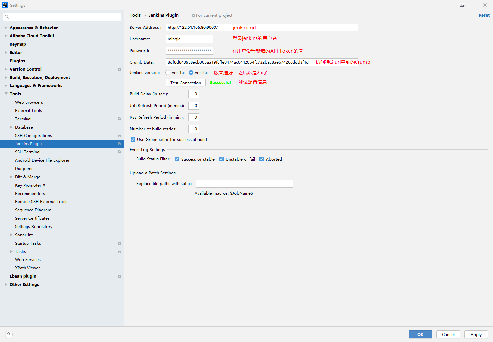

# JetBrains

## 快捷键

## 声明

​	以下快捷键 IntelliJ IDEA 和 Goland 通用

### 查找类（常用）

| 键                     | 作用                             |
| ---------------------- | -------------------------------- |
| F2                     | 高亮跳转                         |
| Shift + F2             | 快速定位到有问题（报红）的代码   |
| Ctrl + Alt + 左键      | 跳转到接口方法定义 或 方法的实现 |
| Ctrl + B<br />Ctrl + H | 查看类的继承层次                 |

### 查找类（特殊）

| 键                       | 作用                               |
| ------------------------ | ---------------------------------- |
| Ctrl + E                 | 查看最近修改的文件列表             |
| Ctrl + Shift + B         | 选中变量名，跳转到变量类型的定义处 |
| Ctrl + Shift + Backspace | 跳转到上次编辑的地方               |
| Ctrl + Alt + B           | 跳转到方法的实现处（同左键单击）   |
| Ctrl + Alt + ↑ / ↓       | 错误信息、查找操作结果跳转         |
| Ctrl + Alt + ← / →       | 跳转点回退前进（源码阅读必备）     |
| Shift + Shift            | 都找                               |

### 显示类

| 键               | 功能                                           |
| ---------------- | ---------------------------------------------- |
| Ctrl + Q         | 显示简洁文档                                   |
| Ctrl + N         | 查找源码文件                                   |
| Ctrl + Shift + N | 查找文件                                       |
| Ctrl + Numpad+/- | 括号折叠/展开                                  |
| Ctrl + Shift + I | 查看方法、常量、枚举的定义                     |
| Alt + 1          | 打开 ←→ 关闭 Project 视图                      |
| Alt + Q          | 查看当前代码所在的方法的方法声明               |
| Alt + ↑ / ↓      | 方法之间移动                                   |
| Alt + F1         | 在各种视图中查看文件（例如：打开文件所在位置） |

### 编辑类

| 键                                             | 作用                                                         |
| ---------------------------------------------- | ------------------------------------------------------------ |
| Ctrl + J                                       | 代码快捷提示、模板提示                                       |
| Ctrl + I                                       | 实现方法                                                     |
| Ctrl + W                                       | 扩选                                                         |
| Alt + J                                        | 扩选一个附近与当前光标相同的单词                             |
| Ctrl + Shift + Alt + J                         | 扩选当前文件所有与当前光标相同的单词                         |
| Ctrl + Shift + J                               | 将扩选的内容，合到一行                                       |
| Ctrl + Shift + W                               | 缩选                                                         |
| Alt + Enter                                    | 提示                                                         |
| Ctrl + Space                                   | 代码补全提示（默认和系统切换输入法冲突）                     |
| Ctrl + Shift + Space<br />Ctrl + Shift + Enter | 代码补全<br/>（进行代码提示选项时，Enter是直接插入，Tab是替换） |
| Ctrl + Shift + V<br />Ctrl + Shift + Insert    | 剪切板内容选择（系统还有个 Win + V）                         |
| Ctrl + Shift + O                               | 导包整理                                                     |
| Ctrl + Shift + U                               | 将扩选的字母文本，小写  ←→ 大写                              |
| Ctrl + Alt + V                                 | 为实例生成变量引用                                           |
| Ctrl + Alt + N                                 | 删除变量，将使用的地方替换为变量值                           |
| Ctrl + Alt + M                                 | 将代码块抽取成方法                                           |
| Ctrl + Alt + C                                 | 将魔法值抽取成静态常量                                       |
| Ctrl + Alt + P                                 | 将表达式抽取为方法参数                                       |
| Ctrl + Alt + I                                 | 自动缩进对齐                                                 |
| Ctrl + Alt +T                                  | Surround with try / catch、if、while...                      |
| Ctrl + Alt + L                                 | 格式化                                                       |
| Alt + Insert                                   | 生成                                                         |
| Shift + F6                                     | 变量、方法重命名                                             |
|                                                |                                                              |
| Alt + 单机圈选                                 | 方框圈选（默认圈选行为是圈选整行的代码）                     |
| Alt + 单机<br />鼠标中键                       | 多光标                                                       |
| Alt + Shift + G                                | 为选择的多行的行尾添加多光标                                 |

### 其他

- Shift + 左键单击 | 鼠标中键单击 文件头：关闭文件	

## 界面

- 要在编辑器里显示方法间的分隔线，打开 Editor | General | Appearance ，选中 `Show method separators`

## 插件

**IDE Features Trainer**

​	常用快捷键训练，见 Learn 视图

**Key Promoter X**

​	快捷键快速设置、提醒

**Extra Icons**

​	美化插件，为更多的文件类型提供图标

**Rainbow Brackets**

​	彩色的括号匹配

**Grep Console**

​	修改不同级别日志的颜色

**CamelCase**

​	切换命名风格（快捷键：Shift + Alt + U）

​	大蛇：SNAKE_CASE

​	小蛇：snake_case

​	大驼峰（又叫帕斯卡）：PascalCase

​	小驼峰：camelCase

​	大烤串：KEBAB-CASE

​	小烤串：kebab-case

**String Manipulation**

​	框选编辑区的代码 → 右键 → String Manipulation → ...（例如：去除空行、对齐）

**Translation**

​	翻译插件

**Alibaba Cloud Toolkit**

​	比拟 FinalShell

**Git Commit Template**

​	git  submit message template

**leetcode editor**

## 模块

### Changelist

> https://www.jetbrains.com/help/go/2020.2/work-on-several-features-simultaneously.html?utm_source=product&utm_medium=link&utm_campaign=GO&utm_content=2020.2#changelists
>
> - You can easily switch between different logical  sets of changes and commit them separately from each other.
> - Unlike using branches for the same purpose, you  have all your changes at hand without having to switch between branches which can take a while if your project is really  large.
> - It's convenient to test how different features work together.
> - You can remote-run a changelist on a build server.

​	假如说公司代码仓库包含有项目的配置文件，而本地拉下来，一般会修改配置文件的相关参数为本地参数；又或者说，想要自定义一个个人的习惯子类的；还或者说，某些配置在程序代码中写死，你希望修改。以上这些场景，你既希望本地修改，且不修改 `.gitignore` 文件，又不希望被 Git 版本管理检测到，那么你应该灵活的使用 `JetBrain` 的 `Changelist`。先简单介绍一下，首先在 `Git` 是视图中，查看 `Local Changes`（工作区），你会看到有一个 `Default Changelist` 的字段，没错，既然有 `Default`，那就肯定可以自定义。没错很简单的概念，你使用基于开发工具的 Git 版本管理工具，你就可以自定一个 `NO Commit`（只是举例子，名字任意定义） 概念的 `Changelist`，把所有本地想更改且不修改忽略文件配置，但不纳入 Git 管理的文件都放到这个 `No Commit`，以后就只关注 `Default Changelist` 中的改变内容就好。创建 `Changelist` 有一个 `Set active` 勾选项，这个就是是否要被管理的文件改动，默认的 `Default Changelist`，就是勾选上的，但是 `Set active` 的属性的 `Changelist`，全局只能有一个。总结一下，其实这就是 `JetBrain` 对 Git 工作区概念的增强，新增了工作区改动文件分组的概念

## 其他

### 搜索

明面上是可以设置的：File → Line Separators →

```
CRLF - Windows（\r\n）
LF - Unix adn OS X （\n）
CR - Classic Mac（\r）
```

实际上你搜索 `\r\n`、`\n`、`\r` 都是匹配不到的，只有使用正则匹配搜索 `\n` 才可以

**替换**

- 替换想引用通过正则匹配的捕获组引用通过 `$匹配组序号`

- 想替换换行符，敲字符是不行的，需要点击 UI 的回车小图标

### 学生身份使用

使用学生身份试用
	1、首先得知道学校邮箱的账号和密码
		2015101973@nit.edu.cn
		Wmc056810
	学校邮箱本质就是，以学校作为企业在腾讯企业邮箱注册的账号
	2、登录腾讯企业邮箱
		微信绑定
		绑定其他邮箱
			本质就为自己的企业邮箱添加企业
设置 → 其他邮箱 → 输入学校邮箱的账号和密码
	3、注册 JetBrains 的账号
	4、注意看，账号注册好后的页面，有一个通过教育机构申请免费使用，之后收到邮件，根据邮件来就行了
（他们知道你的毕业年限，瞎填没意义）

### Toolbar 关闭了怎么打开

双击 Shift，选择 `Action` 分类，键入 `menu`，`View | Appearance: Main Menu` 右边的 Switch 打开就可以了

# IntelliJ IDEA

## 快捷键

| 键             | 作用                                   |
| -------------- | -------------------------------------- |
| Ctrl + P       | 显示方法签名（参数信息）               |
| Ctrl + O       | 重载方法                               |
| Ctrl + F7      | 查看当前文件中的变量引用（F3可以选择） |
| Ctrl + Alt + B | 查看类的继承关系结构                   |
| Ctrl + Alt + U | 查看类的UML图                          |
|                |                                        |
|                |                                        |
|                |                                        |
|                |                                        |


## 插件

**JRebel**

**MybatisX**

​	For Mybatis - Code generate and Navigation between xml and mapper

**EasyCode**

​	For Mybatis - Big code generate

**MyBatis Log Plugin**

​	For Mybatis - Customize sql log format

**Alibaba Java Coding Guidelines**
	代码规范
**SonarLint**
	分析潜在bug、优化

**FindBugs-IDEA**

**Codota**

​	机器学习开发人员的编码风格、学习项目的编码风格

**RestfulToolkit**

​	Ctrl + \ 通过url定位接口方法（RestServices 视图）

**Lombok**

​	e...

**JUnitGenerator**

​	生成测试类，可以自定义模板

**Jenkins Control Plugin**



Crumb url：http://ip:port/crumbIssuer/api/xml?tree=crumb
（跨站请求伪造保护 → Crumb Issuer → 是否启用代理并不会起到任何影响）
连接jenkins，直接部署项目

## 其他

### 转移 C 盘核心配置文件

习惯的自定义快捷键、样式、配置、下载的插件等等，都在这个文件中（你用的idea = 该配置 + 任意版本的idea）
1、idea的配置、快捷键映射、插件等等所在的位置，默认在 `C:/Users/用户名/.IntelliJIdea<版本>`
2、在 `idea 根目录下/bin/idea.properties` 中定义
（还可以通过点击菜单 Help | Edit Custom Properties 修改 - 会创建一份配置文件副本在用户目录下，并且升级 Idea 的时候仍然保留配置）
3、参照下边修改
（尽管在 windows 下，也不要使用 `\` 文件分隔符 - 会被认为转译字符）

```
idea.home.path=D:/Learning-Program/IntelliJ IDEA 2018.2.4
#---------------------------------------------------------------------
# Uncomment this option if you want to customize path to IDE config folder. Make sure you're using forward slashes.
#---------------------------------------------------------------------
idea.config.path=${idea.home.path}/configuration/.IntelliJIdea2018.2/config

#---------------------------------------------------------------------
# Uncomment this option if you want to customize path to IDE system folder. Make sure you're using forward slashes.
#---------------------------------------------------------------------
idea.system.path=${idea.home.path}/configuration/.IntelliJIdea2018.2/system

#---------------------------------------------------------------------
# Uncomment this option if you want to customize path to user installed plugins folder. Make sure you're using forward slashes.
#---------------------------------------------------------------------
idea.plugins.path=${idea.config.path}/plugins

#---------------------------------------------------------------------
# Uncomment this option if you want to customize path to IDE logs folder. Make sure you're using forward slashes.
#---------------------------------------------------------------------
idea.log.path=${idea.system.path}/log
```

### 代码风格

> https://github.com/google/styleguide/blob/gh-pages/intellij-java-google-style.xml

为 IntelliJ IDEA 引入谷歌的 Java 代码风格：File → Setting → Code Style / Scheme 齿轮图标

### Mapper.xml 红

File → Setting → Language & Frameworks → SQL Resolution Scopes → “+”→ 指定项目目录 → Resolution Scope指定数据库

### Maven 父子工程更名

右键Module → Refactor → Rename

修改该Module下pom.xml的name和artifactId标签的值

修改父Module下pom.xml的modules中module标签的值

做完上面的一步，IDEA会弹窗提示 `These modules have been removed from Maven structure`

​	Project Structure,,, → Modules → ＋ → Import Module → Import Module from external model

如果项目没有进行特殊的参数设置，更方便的是直接删除 .idea 文件，然后重新构建项目（删除 .idea 会删除程序入口的相关参数配置）

### 注释风格

Code Style → Line comment at first column

​				    → Block comment at first column

通过 Ctrl + / 快捷键注掉的代码，默认就是在行首加两个 /，我们希望能够和其他行的代码对齐，且在 // 后边紧跟一个空格

### 搭建源码阅读工程

**开头**

​	搭建源码工程，其他的方便管理啊，有仪式感啊（什么鬼）的优点都不说了，最重要的一点，可以在源码上添加自己的注释

**准备**

1、解压准备好JDK源码：根目录下
2、在IntelliJ IDEA中创建一个最基础的工程，还是推荐maven工程
3、将源码拷贝到，maven工程的java目录下
	1、源码不要放到自定义包下，这样与源码中类的包名不同，编译会报错
	2、不要在Idea界面复制粘贴源码包，卡死，推荐在文件系统上拷贝
4、创建一个包，存放自己用于调试源码的测试代码“priv.com.test”，创建一个带主函数的类，打好断点，开始调试（第一次编译会有点慢）

**问题**

- 参考博客：https://blog.csdn.net/IT_Migrant_worker/article/details/104743218

- 编译时提示jdk版本的问题
  	File → Project Structure... → Project → Project SDK、Project language level
  	File → Project Structure... → Modules → Sources → Language level

- 编译失败，提示系统资源不足
  File → Setting → Build, Execution, Deployment → Compiler → Build process heap size (Mbytes)：默认700 → 1700

- 程序包com.sun.tools.javac.api不存在
  	File → Project Structure → Project Settings → Libraries → "+" → ${JAVA_HOME}/lib/tools.jar

- 找不到sun.awt.UNIXToolkit

1. http://openjdk.java.net/

2. 左边导航栏：Source code - > Mercurial

3. 

   如图版本，选择“jdk8u”

   jdk8u20 → jdk

   左边导航栏“broswe”

   将“/src/solaris/classes/sun/awt/UNIXToolkit.java”复制到项目“java/sun.awt.UNIXToolkit.java”

- 找不到sun.font.FontConfigManager

  参照上面将“/src/solaris/classes/sun/font/FontConfigManager.java”复制到项目“java/sun.font.FontConfigManager.java”

- 单步调试，无法进入源码

  File → Setting → Build, Execution, Deployment → Debugger → Stepping：Do not step into the classes（取消掉）

- 源码不可编辑

  File → Project Structure... → Sourcepath → 编辑源码目录位置为复制好了的，当前项目的目录