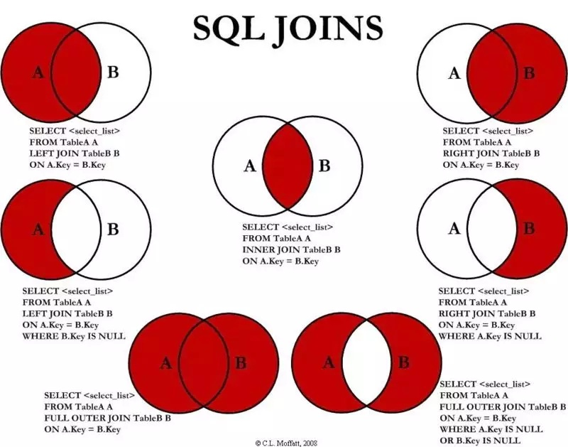

# MySQL

## 阅读说明

- 本文所有代码片段中的 `[]` 同 MySQL 官方文档，都代表可选的意思

## 底层原理

- 连接层

  最上层是一些客户端和连接服务。主要完成一些类似与连接处理、授权认证、及相关的安全方案。在该层上引入线程池的概念，为通过认证安全接入的客户端提供线程。在该层上引入了线程池的概念，为通过认证安全接入的客户端提供线程。同样在该层上可以实现基于SSL的安全链接。服务器也会为安全接入的每个客户端验证它所具有的操作权限

- 服务层

  第二层服务层，主要完成大部分的核心服务功能，包括查询解析、分析、优化、缓存、以及所有的内置函数，所有跨存储的功能也都在这一层实现，包括触发器、存储过程、试图等

- 引擎层

  第三层存储引擎，存储引擎真正的负责了MySQL中数据的存储和提取，服务器通过API与存储引擎进行通信。不同的存储引擎具有的功能不同，这样我们可以根据自己的实际需要进行选取

- 存储层

  第四层为数据存储层，主要是将数据存储在运行于该设备的文件系统之上，并完成与存储引擎的交互

## SQL 类型

结构化查询语言(Structured Query Language)，是一种特殊目的的编程语言，是一种数据库查询和程序设计语言，用于存取数据以及查询、更新和管理关系数据库系统；同时也是数据库脚本文件的扩展名。

- 数据定义语言 `DDL`（Data Definition Language）

  在数据库中创建新表或删除表；为表加入索引等

- 数据操纵语言 `DML`（Data Manipulation Language）

  INSERT、UPDATE、DELETE。也称动作查询语言

- 数据查询语言 `DQL`（Data Query Language）

- 数据控制语言 `DCL`（Data Control Language）

  GRANT

## 存储引擎

- 查看支持的

  `SHOW ENGINES;`

- 查看默认的

  `SHOW VARIABLES LIKE 'storage_engine';`

- 查看表的

  `SHOW CREATE TABLE 'TABLEname';`
  `SHOW TABLE status like 'TABLEname';`
  `SHOW TABLE status from database where name="TABLEname";`

- 修改表的

  `ALTER TABLE t ENGINE = InnoDB;`

- 修改默认的

  `SET default_storage_engine=NDBCLUSTER;`（还可以通过修改配置文件）

### INNODB 和 MYISAM

- 事务

  InnoDB 支持事务，MyISAM 不支持事务。这是 MySQL 将默认存储引擎从 MyISAM 变成 InnoDB 的重要原因之一

- 外键

  InnoDB 支持外键，而 MyISAM 不支持。对一个包含外键的 InnoDB 表转为 MYISAM 会失败

- 索引

  InnoDB 是聚簇索引，MyISAM 是非聚簇索引。聚簇索引的文件存放在主键索引的叶子节点上，因此 InnoDB  必须要有主键，通过主键索引效率很高。但是辅助索引需要两次查询，先查询到主键，然后再通过主键查询到数据。因此，主键不应该过大，因为主键太大，其他索引也都会很大。而 MyISAM 是非聚集索引，数据文件是分离的，索引保存的是数据文件的指针。主键索引和辅助索引是独立的

- 锁

  InnoDB 最小的锁粒度是行锁，MyISAM 最小的锁粒度是表锁。一个更新语句会锁住整张表，导致其他查询和更新都会被阻塞，因此并发访问受限。这也是 MySQL 将默认存储引擎从 MyISAM 变成 InnoDB 的重要原因之一

- 数据总行数
  - 在 MyISAM 存储引擎中，把表的总行数存储在磁盘上，当执行 `select count(*) from t` 时，直接返回总数据
  - 在 InnoDB 存储引擎中，跟 MyISAM 不一样，没有将总行数存储在磁盘上，当执行 select count(*) from t 时，会先把数据读出来，一行一行的累加，最后返回总数
  - InnoDB 中 count(*) 语句是在执行的时候，全表扫描统计总数量，所以当数据越来越大时，语句就越来越耗时了，为什么 InnoDB 引擎不像  MyISAM 引擎一样，将总行数存储到磁盘上？这跟 InnoDB 的事务特性有关，由于多版本并发控制（MVCC）的原因，InnoDB  表“应该返回多少行”也是不确定的

- 文件存储
  - **查看数据文件目录**

    `SHOW VARIABLES LIKE 'data%'`

  - **.frm** 

    与表相关的元数据信息都存放在frm文件，包括表结构的定义信息等

  - **.ibd** 或 **.ibdata**

    ​	这两种文件都是存放 InnoDB 数据的文件，之所以有两种文件形式存放 InnoDB 的数据，是因为 InnoDB 的数据存储方式能够通过配置来决定是使用**共享表空间**存放存储数据，还是用**独享表空间**存放存储数据。

    ​	独享表空间存储方式使用`.ibd`文件，并且每个表一个`.ibd`文件 共享表空间存储方式使用`.ibdata`文件，所有表共同使用一个`.ibdata`文件（或多个，可自己配置）

## 数据库

- 增

  ```MySQL
  CREATE DATABASE `数据库名` CHARACTER SET 'utf8' COLLATE 'utf8_unicode_ci';
  ```

- 删

  ```MySQL
  DROP DATABASE `数据库名`;
  ```

- 改编码

  ```MySQL
  ALTER DATABASE `数据库名` CHARACTER SET 'utf8mb4' COLLATE 'utf8mb4_unicode_ci';
  ```

- 查所有数据库

  ```MySql
  SHOW DATABASES;
  ```

- 查看当前数据库

  ```MySQL
  SELECT DATABASE();
  ```

- 查看建库语句

  ```MySQL
  SHOW CREATE DATABASE `数据库名`;
  ```

## 数据表

> 官网：https://dev.mysql.com/doc/refman/8.0/en/create-table.html

- 查看表的数量

  ```MySQL
  SELECT COUNT(表名) FROM information_schema.TABLES WHERE TABLE_SCHEMA='数据库名';
  ```

- 创建语法（字段类型、备注、约束、主键）

  > 1、默认值 和 是否为空 语法上没有顺序讲究
  >
  > 2、更新时间如果设置为 NOT NULL，那么你就要给一个默认值，但是 DATETIME 数据类型又不能接收没有意义的空串，所以合理的只有当前时间戳了
  >
  > 3、ON UPDATE：只有 UPDATE 场景下，ON UPDATE 才会触发；同插入数据场景的字段默认值机制，如果主动设置了字段值，ON UPDATE 策略也不会执行

  ```MySQL
  CREATE TABLE [IF NOT EXISTS] `数据库名`.`数据表名` (
    `id`			                 BIGINT UNSIGNED AUTO_INCREMENT NOT NULL COMMENT '主键id',
    `xxx_name`                     VARCHAR(32) [CHARACTER SET = utf8 COLLATE = utf8_general_ci] COMMENT 'xxx名字',
    `xxx_time`                     DATETIME NOT NULL COMMENT 'xxx时间',
    `create_time`                  DATETIME NOT NULL DEFAULT CURRENT_TIMESTAMP COMMENT '创建时间',
    `update_time`                  DATETIME DEFAULT CURRENT_TIMESTAMP NOT NULL ON UPDATE CURRENT_TIMESTAMP COMMENT '更新时间',
    `is_deleted`                   TINYINT UNSIGNED DEFAULT 0 COMMENT '删除标识（0=正常，1=删除）',
    [CONSTRAINT [`pk_id`]] PRIMARY KEY (`id`) [COMMENT '注释'],
    [CONSTRAINT [`uq_唯一索引字段名`]] UNIQUE [INDEX | KEY] (`字段名`, ...) [COMMENT '注释']
  ) [ENGINE = InnoDB] [AUTO_INCREMENT = 1] [CHARACTER SET = utf8 COLLATE = utf8_general_ci] COMMENT = 'XXX表'
  ```

- 样例

  ```MySQL
  CREATE TABLE `数据库名`.`attachment` (
    `id`                           BIGINT UNSIGNED AUTO_INCREMENT NOT NULL,
    `target_id`                    BIGINT UNSIGNED COMMENT '关联表id',
    `attachment_type_id`           BIGINT UNSIGNED COMMENT '附件类型id',
    `original_filename`            VARCHAR(255) COMMENT '文件名',
    `extension`                    VARCHAR(255) COMMENT '文件拓展名',
    `url`                          VARCHAR(255) NOT NULL COMMENT '访问url',
    `create_time`                  DATETIME NOT NULL DEFAULT CURRENT_TIMESTAMP,
    `update_time`                  DATETIME NOT NULL DEFAULT CURRENT_TIMESTAMP ON UPDATE CURRENT_TIMESTAMP,
    `is_deleted`                   TINYINT UNSIGNED NOT NULL DEFAULT 0,
    CONSTRAINT pk_id PRIMARY KEY (id),
    CONSTRAINT uq_attachment_uri UNIQUE (url)
  ) COMMENT '附件表';
  ```

  ```MySQL
  CREATE TABLE `数据库名`.`attachment_type` (
    `id`                           BIGINT UNSIGNED AUTO_INCREMENT NOT NULL [PRIMARY] KEY,
    `status`                       INTEGER NOT NULL COMMENT '状态',
    `name`                         VARCHAR(12) NOT NULL UNIQUE [KEY] COMMENT '名称',
    `category`                     INTEGER NOT NULL COMMENT '类别',
    `create_time`                  DATETIME NOT NULL DEFAULT CURRENT_TIMESTAMP,
    `update_time`                  DATETIME NOT NULL DEFAULT CURRENT_TIMESTAMP ON UPDATE CURRENT_TIMESTAMP,
    `is_deleted`                   TINYINT UNSIGNED NOT NULL DEFAULT 0
  ) COMMENT = '附件类型表';
  ```

- 删除

  ```MySQL
  DROP TABLE [IF EXISTS] tbl_name [, tbl_name] ... [RESTRICT | CASCADE];
  ```

- 重命名

  ```MySQL
  RENAME TABLE `旧表名` TO `新表名`;
  ```

- 修改字符集

  ```MySQL
  ALTER TABLE `表名` CHARACTER SET 'utf8';
  ```

- 修改表、字段字符集

  ```MySQL
  ALTER TABLE `表名` CONVERT TO CHARACTER SET 'utf8';
  ```

- 获取修改库中所有表字符集的语句

  ```MySQL
  SELECT
  	CONCAT( 'ALTER TABLE `', table_name_list.table_name, '` CONVERT TO CHARACTER SET utf8mb4;' ) 
  FROM
  	( SELECT table_name FROM information_schema.`TABLES` WHERE TABLE_SCHEMA = '数据库名' ) table_name_list;
  ```

- 查看表名

  ```MySQL
  SHOW TABLES;
  ```

- 查看表结构

  ```MySQL
  DESC `表名`;
  ```

- 查看建表语句

  ```MySQL
  SHOW CREATE TABLE `表名`;
  ```

## 数据列

- 增

  ```MySQL
  ALTER TABLE `表名` ADD [COLUMN] `列名` VARCHAR(10) NOT NULL UNIQUE DEFAULT 'XXX' COMMENT 'XXX' [AFTER `列名`] | [FIRST];
  ```

- 改（全改）

  ```MySQL
  ALTER TABLE `表名` CHANGE [COLUMN] `旧列名` `新列名` VARCHAR(10) CHARACTER SET 'utf8mb4' COLLATE 'utf8mb4_unicode_ci' DEFAULT 'XXX' COMMENT 'XXX' [AFTER `列名`] | [FIRST];
  ```

- 改（全改 - 除列名）

  ```MySQL
  ALTER TABLE `表名` MODIFY [COLUMN] `列名` VARCHAR(10) CHARACTER SET 'utf8mb4' COLLATE 'utf8mb4_unicode_ci' NOT NULL DEFAULT 'XXX' COMMENT 'XXX' [AFTER `列名`] | [FIRST];
  ```

  ```MySQL
  ALTER TABLE `表名` MODIFY [COLUMN] `列名` VARCHAR(10) UNIQUE NOT NULL DEFAULT 'XXX' COMMENT 'XXX' [AFTER `列名`] | [FIRST];
  ```

- 改（默认值）

  ```MySQL
  ALTER TABLE `表名` ALTER [COLUMN] `列名` SET DEFAULT 'xxx';
  ```

- 改（删除默认值）

  ```mysql
  ALTER TABLE `表名` ALTER [COLUMN] `列名` DROP DEFAULT;
  ```

- 删

  ```MySQL
  ALTER TABLE `表名` DROP [COLUMN] `列名`;
  ```

## 数据行

- 增

  ```MySQL
  指定列值插入：INSERT [INTO] `表名` (`列名1`, `列名2`, `列名3`…) VALUES(值1, 值2, 值3…), ...;
  ```

  ```MySQL
  全值插入（需要严格按照字段顺序）：INSERT [INTO] `表名` VALUES(值1, 值2, 值3…), ...;
  ```

  注意：值如果是字符串或者日期需要加引号‘ ’（一般是单引号）

- 改

  ```MySQL
  UPDATE `表名` SET `字段名` = 值, `字段名` = 值, … WHERE …;
  ```

  注意：多个字段之间是采用**逗号**隔开的，而不是**AND**关键字

- 删

  ```MySQL
  DELETE FROM `表名` WHERE …;
  ```

  ```MySQL
  TRUNCATE TABLE `表名`;
  ```

  注意：`TRUNCATE`会删除表中所有数据、`AUTO_INCREMENT`置为`0`、删除的数据不能恢复

## 字段

### 类型

#### 整型

TINYINT

INT

BIGINT

#### 浮点型

DECIMAL(总长度, 小数位长度)

#### 字符串

VARCHAR

CHAR

TEXT

#### JSON

这是个比较特殊的数据类型了，讲道理用 MySQL 存存还行，要是逻辑操作，就像存储过程对数据库层面有那么多逻辑操作，个人还是不太能接收的。一个是，这样要是到达了性能瓶颈，整个服务应用还有数据库就要大重构了，这个叫没有对未来，没有对流量做拓展，对于该数据类型操作，直接结合官网看如下实例

- DDL

  ```mysql
  CREATE TABLE `test_json_field` (
      `id`    BIGINT UNSIGNED     KEY AUTO_INCREMENT,
      `name`  VARCHAR(10)         NOT NULL,
      `extra` JSON
  ) COMMENT '测试学习 MySQL 中的 JSON 操作';
  ```
  
- 插入

  ```mysql
  -- 插入 JSON 数据
  -- 1、JSON_OBJECT 中 重复的键名，后面的覆盖前面的
  -- 2、JSON_OBJECT 中 奇数个参数，执行报错
  -- INSERT test_json_field (name, extra) VALUES
  -- ('小红', JSON_OBJECT('age', 1, 'age', 2, 'address', '马哥'))
  
  INSERT test_json_field (name, extra) VALUES
  ('BOX', JSON_ARRAY("壹", "贰", "三"))
  ```

- 查询

  ```mysql
  -- 一、查询 JSON 数据中某个字段的值
  -- 方式1、column->path 查询结果带引号
  SELECT extra -> '$.address' FROM test_json_field WHERE id = 2
  -- 方式2、column->>path
  SELECT extra ->> '$.address' FROM test_json_field WHERE id = 2
  -- 方式3、JSON_EXTRACT(column, path) 查询结果带引号
  SELECT JSON_EXTRACT(extra, '$.address') FROM test_json_field WHERE id = 2
  
  -- 二、查询 JSON 数据中数组中指定下标的值
  -- 超出数组下标，返回 Null
  SELECT extra->>'$[4]' FROM test_json_field WHERE id = 4
  
  -- 总结：取值表达式就是 $打头，后边就是键值
  
  -- 特殊的 JSON 数组范围取值
  SELECT JSON_EXTRACT('[1, 2, 3, 4, 5]', '$[1 to 3]');
  SELECT JSON_EXTRACT('[1, 2, 3, 4, 5]', '$[last-3 to last-1]');
  ```

- 操作函数

  
  JSON 对象之间是可以比较的，这里就不展开说了
  
  |                |                                                              |
  | -------------- | ------------------------------------------------------------ |
  | JSON_OBJECT    | 创建 JSON 对象                                               |
  | JSON_OBJECTAGG | AGG 是 Aggregate（ 聚合） 的缩写，都是配合 GROUP BY 将一键对应的多值拼装成一整个 JSON 数据用的 |
  | JSON_ARRAY     | 创建 JSON 数组                                               |
  | JSON_ARRAYAGG  |                                                              |
  | JSON_UNQUOTE   | 通过该函数解查询 JSON 字段结果中引号                         |
  | JSON_SET       | 修改 JSON 对应键的值，不存在就添加                           |
  | JSON_INSERT    | 向 JSON 中指定的位置插入值，如果指定位置已存在值则什么也不做 |
  | JSON_REPLACE   | 修改 JSON 指定位置的值                                       |
  | JSON_REMOVE    | 删除 JSON 指定位置的值                                       |

### 长度

对于字符类型：

- CHAR 决定每列存储字符个数，不足补空字符，超出截掉后面

- VARCHAR 决定了每列能存储的最大字符个数，同上，超出截取
- TEXT 

对于数字类型的字段：

- TINYINT、SMALLINT、DEDIUMINT、INT、BIGINT 类型的字段长度并不影响每列存储的大小，都是固定的。此时，字段长度的含义是 *显示位宽*，这个显示仅针对特定客户端输出时才有显示效果，目前仅发现使用MySQL Shell才有显示效果，其他客户端连接时均无，这里给一个应用场景：sum int(5) unsigned ZEROFILL DEFAULT NULL（要使用该特性，需要加上 ZEROFILL 关键字修饰），假如存的是 123，那么会输出 00123，这个格式化就只有补零。对存储环节没有任何帮助，仅改变输出显示环节。而“格式化显示”一般在前端或者后端的应用层操作就可以了，无需在数据库中输出时操作，所以说，这个功能是多么的鸡肋。很多 ORM 框架映射的数字类型字段的长度都是 0，直接无视，这也是从侧面体现出这点

### 编码排序规则

先说一下编码规则，什么 MySQL UTF8 的坑等，就不展开说，编码规则是针对 MySQL 中的字符数据类型来说的，CHAR、VARCHAR、TEXT 等

**utf8mb4_unicode_ci 和 utf8mb4_general_ci**（以下说法来自微信公众号的一篇文章）

字符除了存储，还需要排序或者比较，这个操作与编码字符集有关，称为 `collation`，与 `utf8mb4` 对应的是 `utf8mb4_unicode_ci` 和 `utf8mb4_general_ci` 这两个collation

- 准确性

  `utf8mb4_unicode_ci` 是基于标准Unicode来进行排序比较的，能保持在各个语言之间的精确排序；

  `utf8mb4_general_ci` 并不基于Unicode排序规则，因此在某些特殊语言或者字符上的排序结果可能不是所期望的。

- 性能

  `utf8mb4_general_ci` 在比较和排序时更快，因为其实现了一些性能更好的操作，但是在现代服务器上，这种性能提升几乎可以忽略不计。

  `utf8mb4_unicode_ci` 使用Unicode的规则进行排序和比较，其排序规则为了处理一些特殊字符，实现更加复杂。

  现在基本没有理由继续使用 `utf8mb4_general_ci` 了，因为其带来的性能差异很小，远不如更好的数据设计，比如使用索引等等。

### 索引

- 普通索引

  ```mysql
  CREATE INDEX `idx_字段名` ON `表名` (字段名) [COMMENT '注释'];
  ```

- 唯一索引

  ```mysql
  CREATE UNIQUE INDEX `uk_字段名` ON `表名` (字段名) [COMMENT '注释'];
  ```

### 外键

- 概念

  创建外键关系, 会默认创建一个对应的索引

- 语法

  ```mysql
  -- 建表和改表都是这个语法
  [CONSTRAINT [symbol]] FOREIGN KEY
      [index_name] (col_name, ...)
      REFERENCES tbl_name (col_name,...)
      [ON DELETE RESTRICT]
      [ON UPDATE RESTRICT]
  ```

- 样例

  ```mysql
  ALTER TABLE `attachment` ADD CONSTRAINT fk_attachment_attachment_type_id FOREIGN KEY (attachment_type_id) REFERENCES `attachment_type` (id) [ON DELETE RESTRICT] [ON UPDATE RESTRICT];
  ```

- 其他

  存在外键关系的表，在插入更新数据时，会检查相应的外键关系，如果在大数据量且确定数据是正确的情况下，可以暂时关闭这个检查以提高性能

  ```mysql
  SET FOREIGN_KEY_CHECKS = 0;
  ```

## 触发器

- 语法

  ```mysql
  CREATE
      [DEFINER = user]
      TRIGGER trigger_name
      trigger_time trigger_event
      ON tbl_name FOR EACH ROW
      [trigger_order]
      trigger_body
  
  trigger_time: { BEFORE | AFTER }
  
  trigger_event: { INSERT | UPDATE | DELETE }
  
  trigger_order: { FOLLOWS | PRECEDES } other_trigger_name
  
  -- 自定义的规范
  trigger_name：tri_${trigger_time}_${trigger_event}_表名
  ```

- 样例

  ```mysql
  -- NEW 是关键字
  CREATE TRIGGER trig_ranking_type_ord_no
  BEFORE INSERT ON 表
      FOR EACH ROW
      IF (NEW.字段N IS NULL OR NEW.字段N = 0) THEN
          SET NEW.字段N = (SELECT ifnull(max(字段N), 0) + 1 FROM 表 WHERE pid = NEW.pid);
      END IF
  ;
  ```

## 存储过程

**简介**

​	Stored Procedure 是一种在数据库存储复杂程序，以便外部程序发调用的一种数据库对象，MySQL 5.0 开始支持。其实本质上就是为了完成特定功能的 SQL 语句集，经编译创建并保存在数据库中，用户可通过指定存储过程的名字并给定参数来调用执行。其实，存储过程，就是数据库层面的代码封装和重用

**优点**：存储过程可以封装并隐藏复杂的商业逻辑；可以回传值，接收参数，就像调用函数方法一样

**缺点**：存储过程往往定制化于特定的数据库上，因为支持的编程语言不同，切换其他厂商的数据库系统时，需要重写原有的存储过程；存储过程的性能调校，受限于各种数据库系统

**创建**

```mysql
-- 修改默认的语句结束符号（默认是分号“;”）
-- 这样过程体中使用的分号被直接传递到服务器，而不会被客户端（如mysql）解释
delimiter $$
```

```mysql
CREATE
	-- 标注（非必须）：标记作者，后面的“@`%`”也没有特殊含义，顺带把连接权限标注了
    DEFINER = 用户名@`%`
    -- 存储过程名：存储过程命名推荐采用“小写下划线隔开”的风格
    -- 参数详解（非必须）：[IN|OUT|INOUT] 参数名 类型
    PROCEDURE 存储过程名(参数)
    RETURN 类型
    COMMENT '备注'

-- 存储过程体定义
BEGIN
　　-- 声明变量：DECLARE 变量名 类型 DEFAULT 默认值;
　　-- 定义 CTE：WITH xxx AS (SELECT ... FROM ...), xxx2 AS (SELECT ... FROM ...), ...
END 第一条语句声明的结束符号


-- 拓展：
-- 存储过程体的 BEGIN...END 是可以嵌套的，举一个三层的例子
-- 每个嵌套块及其中的每条语句，必须以分号结束；表示过程体结束的则不需要
-- DECLARE 声明的变量只在声明所在的 BEGIN...END 层中有效
label1: BEGIN
　　label2: BEGIN
　　　　label3: BEGIN
　　　　　　statements;
　　　　END label3;
　　END label2;
END label1
```

```mysql
-- 恢复默认的语句结束符号
delimiter ;
```

默认情况下，存储过程和默认数据库相关联，如果想要希望存储过程创建在指定的数据库下，存储过程的名字应该以数据库名作前缀

**调用**

```mysql
-- 方括号代表非必须
CALL 存储过程名[(参数1, 参数2, ...)]
```

**参数**

- 入参 IN

  ```mysql
  mysql> delimiter $$
  mysql> create procedure in_param(in p_in int)
      -> begin
      -> 　　select p_in; -- ①1
      -> 　　set p_in=2;
      -> 　　select P_in; -- ②2
      -> end$$
  mysql> delimiter ;
  
  mysql> set @p_in=1;
  mysql> call in_param(@p_in);
  mysql> select @p_in; -- ③1
  ```

  ③值没改，因为上例中存储过程的变量是局部变量，@p_yin 则是全局变量

- 出参 OUT

  ```mysql
  mysql> delimiter //
  mysql> create procedure out_param(out p_out int)
      ->   begin
      ->     select p_out; -- ①NULL
      ->     set p_out=2;
      ->     select p_out; -- ②2
      ->   end
      -> //
  mysql> delimiter ;
   
  mysql> set @p_out=1;
  mysql> call out_param(@p_out);
  mysql> select @p_out; -- ③2
  ```

  ②值为NULL，是因为 out 类型是向调用者输出参数，不接收输入的参数，只用作将结果携带出去

- 兼备 INOUT（不推荐使用）

  ```mysql
  mysql> delimiter $$
  mysql> create procedure inout_param(inout p_inout int)
      ->   begin
      ->     select p_inout; -- ①1
      ->     set p_inout=2;
      ->     select p_inout; -- ②2
      ->   end
      -> $$
  mysql> delimiter ;
  
  mysql> set @p_inout=1;
  mysql> call inout_param(@p_inout);
  mysql> select @p_inout; -- ③2
  ```

  调用了inout_param存储过程，接受了输入的参数，也输出参数，改变了变量

**操作**

- 查

  ```mysql
  -- 方式一
  SELECT routine_name FROM information_schema.routines WHERE routine_schema='数据库名';
  -- 方式二
  SHOW PROCEDURE STATUS WHERE db='数据库名';
  ```

  ```mysql
  -- 详情
  SHOW CREATE PROCEDURE `数据库`.`存储过程名`;
  ```

## 语法

### NULL

​	对 `NULL` 进行任何操作返回的都是 `NULL`，作为判定条件的话也等同于`FALSE`，所以基本操作如：`!=`、`=`、`IN`、`NOT IN` 都会过滤掉 `NULL` 的值

​	确定要对字段的 NULL 进行比较筛选，应该使用 `IS NULL` 和 `IS NOT NULL`

### NOT

```mysql
SELECT NOT -1 → 0
SELECT NOT 0 → 1
SELECT NOT 1 → 0
```

### IF

```mysql
-- example1
if var=0 then 
	insert into t values(17);
end if;

-- example2
if parameter=0 then 
	update t set s1=s1+1;
else 
	update t set s1=s1+2;
end if;

-- example3
if parameter=0 then 
	update t set s1=s1+1;
elseif parameter=1 then
	update t set s1=s1+2;
else
	update t set s1=s1+3;
end if;
```

### CASE WHEN

```MySQL
-- 作为普通查询语句中的查询字段
CASE 字段名
  WHEN '字段值/布尔表达式' THEN 语句
  WHEN '字段值/布尔表达式' THEN 语句
  ...
  [ELSE 语句]
END
  
-- 作为存储过程中的逻辑结构
CASE 字段名
  WHEN '字段值/布尔表达式' THEN 语句;
  WHEN '字段值/布尔表达式' THEN 语句;
  ...
  [ELSE 语句;]
END CASE;
```

1. 根据不同的条件统计数量，`SUM(CASE … THEN 1 ELSE 0)`
2. `CASE WHEN`本质上就是根据条件将返回的字段或者值拼接回 sql 语句，所以不仅是查询中，update等语句都可以使用
3. 使用简单Case函数，想要对字段空和非空判断，不能在WHEN后面的‘字段值’不能是 `NULL` 或是 `NOT NULL`，虽然语法上没错，但是`WHEN NULL`和`WHEN NOT NULL`总是返回 `unknow`，所以正确的方式应该是采用Case搜索函数的 `字段 IS NULL` 或 `字段 IS NOT NULL`

### WHILE

```mysql
while 条件表达式 do
	语句;
end while;
```

### REPEAT

```mysql
repeat
	语句;
until 条件表达式
end repeat;
```

### LOOP

```mysql
标签名:loop
	语句;
  if 条件表达式 then 
    leave 标签名;
end loop;
```

### ITERATE

```mysql
标签名:loop

  if 条件表达式 then 
      ITERATE 标签名;
  end if;

  if 条件表达式 then 
      leave 标签名;
  end if;

end loop;
```

### CTE

Common Table Expression

**语法**

```mysql
-- RECURSIVE 关键字：A CTE can refer to itself to define a recursive CTE. Common applications of recursive CTEs include series generation and traversal of hierarchical or tree-structured data.
-- 翻译：CTE可以引用自身来定义递归CTE。递归CTE的常见应用包括 序列生成 和 遍历分层或树状数据。
-- 注意：REVURSIVE CTE 中一定要包含 UNION 关键字 
with_clause:
    WITH [RECURSIVE]
        cte_name [(col_name [, col_name] ...)] AS (subquery)
        [, cte_name [(col_name [, col_name] ...)] AS (subquery)] ...
```

**样例**

```mysql
-- 定义
WITH xxx1 AS (
    select * from table1 where ...
),
xxx2 AS (
	SELECT * FROM table2
),
...
xxxn AS (
	SELECT * FROM tablen
)

-- 执行（只有执行了，CTE 中的 sql 才会执行）
SELECT xxx1.a, xxx2.b, xxx3.c....
```

**实例**

> 参见官方 https://dev.mysql.com/doc/refman/8.0/en/with.html#common-table-expressions-recursive-examples

```mysql
-- 定义递归 CTE，实现每次插入 2 的 n 次幂的数据
WITH RECURSIVE `cte` AS
(
  SELECT 1 AS id, 1 AS sum
  UNION ALL
  SELECT id + 1, sum + sum FROM `cte` WHERE id < 10
)

SELECT * FROM cte;
```

## 连接

**参考**

> MySQL 中每一种连接的详解：https://www.w3resource.com/mysql/advance-query-in-mysql/mysql-joins.php

> MySQL 中几种连接的区别：https://www.zhihu.com/question/34559578

**大图**



​	上图是 SQL 标准定义的，我会把其作为参考和概念说明，来介绍在 MySQL 中是怎样的。MySQL 中并没有 FULL OUTER JOIN 的概念，但是通过提供的 OUTER JOIN 也完全可以实现相同的效果

### CROSS JOIN

> 在 SQL 规范，以及笛卡尔积的学术理论上来说，CROSS JOIN 不应该支持 ON 语法，因为它代表全笛卡尔积

在 MySQL 中，CROSS JOIN 和 INNER JOIN 是完全等价的，如果后面没有跟 ON 的条件，都是完整的笛卡尔积的意思，下面是[官方文档](https://dev.mysql.com/doc/refman/8.0/en/join.html)的说法

```
In MySQL, JOIN, CROSS JOIN, and INNER JOIN are syntactic equivalents (they can replace each other). In standard SQL, they are not equivalent. INNER JOIN is used with an ON clause, CROSS JOIN is used otherwise. 
```

放一张特别形象，有助于理解 SQL 标准全笛卡尔积的图（在 MySQL 中，就是没有连接条件的内连接）


### INNER JOIN


INNER 可以省略，通常写作 JOIN

### OUTER JOIN

首先得到单边展开的笛卡尔集，然后，ON 对另一侧表的记录进行过滤，将满足ON条件的记录，与展开的那侧表的每行记录进行匹配

对于关注表的行中，如果补充表中没有匹配行，则行仍然显示在结果集中，其中关注表的列保留原值，补充表列中显示NULL，因此结果集中，一定会显示关注表的所有行

这种从左到右的展开，与阅读习惯一致，且左连接和右连接的对称性，一般不使用右连接

#### LEFT JOIN


​	LEFT OUTER JOIN，OUTER 可以省略，所以通常写做 LEFT JOIN

​	表示关注的是 LEFT 左边的表，右表信息，是对左表的补充

#### RIGHT JOIN


​	RIGHT OUTER JOIN，OUTER 可以省略，通常写作 RIGHT JOIN

​	表示关注的是 RIGHT 右边的表，右表信息，是对左表的补充

### ON 和 WHERE

> 下边拿左连接来举例

多表 `LEFT JOIN` 会生成一张临时表

`ON` 条件是对`LEFT JOIN`的右表进行条件过滤，返回左表的所有行，右表中没有的补为`NULL`

`ON` 条件中如果有对左表的限制条件，无论条件真假，依然返回左表的所有行，但是会影响右表的匹配值也就是说 `ON` 中左表的限制条件只影响右表的匹配内容，不影响返回行数

`WHERE` 条件是针对最后生成的这张临时表进行过滤，过滤掉不符合`WHERE`条件的记录，是真正的不符合就过滤掉

`WHERE` 条件中对左表限制，不能放到`ON`后面

`WHERE` 条件中对右表限制，放到`ON`后面，会有数据行数差异，比原来行数要多

### 其他

多表查询，如果遵从 SQL 规范来写，也就是下面两个查询的效果是一样的

```mysql
SELECT *
FROM a
INNER JOIN b ON a.b_id = b.id
```

```mysql
SELECT *
FROM a, b
WHERE a.b_id = b.id
```

## 事务

### 简介

- 事务只是一个改变，是一些操作的集合；用专业的术语来讲，它就是一个程序的执行单元；事务本身其实并不包含这4个特性，我们需要通过某些手段，尽可能的让这个执行单元满足这4个特性，那么，我们就可以称它为一个事务，或者说是一个正确的事务，完美的事务

- 不要被其他的事务状态（创建、开始、关闭、挂起）名词所迷惑，事务的三个真实存在的方法，它们分别是：conn.setAutoCommit()、conn.commit()、conn.rollback()

### 四特性

- 原子性：满足原子操作单元，对数据的操作，要么全部执行，要么全部失败
- 一致性：事务开始和完成，数据保持一致
- 隔离性：事务之间是相互独立的，中间状态对外不可见
- 持久性：数据的修改是持久的，即使数据库发生故障也不应该对其有任何影响

### 隔离级别

>  可以通过`SELECT @@tx_isolation;`命令查看数据库当前的事务隔离级别

#### 并发下的事务问题

- 脏读：A事务还未提交，B事务就读到了A事务的结果（破坏了隔离性）
- 不可重复读：A事务在本次事务中，对自己未操作过的数据，进行了多次读取，结果出现了不一致或记录不存在的情况（破坏了一致性，update）
- 幻读：A事务在本次事务中，对自己操作过的数据，进行了多次读取，第一次读取时，记录不存在，第二次读取时，记录出现了（破坏了一致性，insert和delete）

#### 解决-制定标准

> 为了权衡[隔离]和[并发]的矛盾，ISO定义了四个事务级别，每个级别的隔离程度不同，允许出现的副作用也不同

- 读未提交（read-uncommitted）：最低级别，只能保证持久性
- 读已提交（read-committed）：
- 可重复读（repeatable-read）：
- 串行化（serializable）：最高级别，事务与事务完全串行化，毫无并发可言，性能极低

| 事务隔离级别                 | 脏读 | 不可重复读 | 幻读 |
| ---------------------------- | ---- | ---------- | ---- |
| 读未提交（read-uncommitted） |      |            |      |
| 读已提交（read-committed）   | 解决 |            |      |
| 可重复读（repeatable-read）  | 解决 | 解决       |      |
| 串行化（serializable）       | 解决 | 解决       | 解决 |

注意：这四个界别只是一个标准，各个数据库厂商，并不是完全按照这个标准来做的

#### 实现

- 锁机制：阻止其他事务对数据进行操作，各个隔离级别主要体现在读取数据时加的锁，和释放时机

  | 事务隔离级别                 | 原理                                                         |
  | ---------------------------- | ------------------------------------------------------------ |
  | 读未提交（read-uncommitted） | 事务读取的时候，不加锁                                       |
  | 读已提交（read-committed）   | 事务读取的时候，加行级共享锁（读到才加锁），一旦读完，立即释放（不是事务结束） |
  | 可重复读（repeatable-read）  | 事务读取的时候，加行级共享锁，直到事务结束才释放             |
  | 串行化（serializable）       | 事务读取的时候，加表级共享锁，直到事务结束才释放             |

- MVCC机制：生成一个数据块找，并用这个快照来提供一定级别的一致性的读取，也成为了多版本数据控制

  - CAS版本控制和读写分离的思想
  - 主要作用由于读已提交和可重复读

## 变量

### 用户变量

​	滥用用户变量会导致程序难以理解及管理

- 设置

  ```mysql
  -- 方式1
  SET @变量名 = "变量值";
  -- 方式2
  SELECT '变量值' INTO @变量名;
  -- 方式3
  SELECT @变量名 := '变量值';
  ```

- 实例

  ```mysql
  SELECT
      result.orderId,
      result.productName,
      result.type,
      result.sugar,
      result.machineAddress,
  
      IF (@previous_date IS NULL, NULL, CONVERT(UNIX_TIMESTAMP(result.createDate) - UNIX_TIMESTAMP(@previous_date), UNSIGNED)) AS intervalSecond,
      DATE_FORMAT(@previous_date := result.createDate, '%Y-%m-%d %H:%i:%s') AS createDate
  FROM (
      SELECT
              o.id AS orderId,
              op.product_name AS productName,
              pt.type AS `type`,
              pt.sugar AS sugar,
              ma.street AS machineAddress,
              o.create_date AS createDate
      FROM
              order_detail o
      INNER JOIN
              (SELECT machine_code, street FROM machine_address) ma ON ma.machine_code = o.machine_code
      INNER JOIN
              (SELECT order_id, product_taste_id, product_name FROM order_product) op ON op.order_id = o.id
      INNER JOIN
              (SELECT id, type, sugar FROM product_taste) pt ON pt.id = op.product_taste_id
      WHERE
              o.customer_id = #{customerId}
              AND o.type = '0'
              AND o.status = '3'
              AND o.del_flag = '0'
      ORDER BY
              o.create_date ASC
  ) result, (SELECT @previous_date := NULL) tmp
  ```

### 系统变量-会话

> 官方文档：https://dev.mysql.com/doc/refman/8.0/en/

- 查

  （不显式指定`SESSION`，将优先显示会话级系统变量；如果不存在，将显示全局级系统变量）

  `SELECT @@变量名;`

  `SELECT @@SESSION.变量名;`

  `SELECT @@LOCAL.变量名;`

  `SHOW VARIABLES LIKE '变量名';`

  `SHOW SESSION VARIABLES LIKE '变量名';`

  `SHOW LOCAL VARIABLES LIKE '变量名';`

  

  `SHOW [SESSION] VARIABLES;`（查所有）

- 改

  （LOCAL也是会话级别的意思）

  `SET 变量名=变量值`

  `SET @@变量名=变量值`

  `SET SESSION 变量名=变量值`

  `SET @@SESSION.变量名=变量值`

  `SET LOCAL 变量名=变量值`

  `SET @@LOCAL.变量名=变量值`

### 系统变量-全局

- 查

  `SELECT @@GLOBAL.变量名;`
  `SHOW GLOBAL VARIABLES LIKE '变量名';`

  

  `SHOW GLOBAL VARIABLES;`（查所有）

- 改

  `SET GLOBAL 变量名=变量值;`

  `SET @@GLOBAL.变量名=变量值;`

### 注

- `SELECT @@...` 的形式相较于`SHOW ...`  具有实时性
- 有些变量是只读的，无法修改，比如`system_time_zone`

- 修改全局变量，如果采用直接修改配置文件 `my.cnf`，并重启mysql服务的方式，过于生硬，线上重启无论如何都应该尽可能避免。一般的做法是先修改系统变量，再到配置文件中做同样的配置修改，下次MySQL服务重启就不会又退回到默认值了

## 函数

### 聚合函数

- SUM（求和）
  	The SUM() and AVG() functions return a DECIMAL value for exact-value arguments (integer or DECIMAL), and a DOUBLE value for approximate-value arguments (FLOAT or DOUBLE). (Before MySQL 5.0.3, SUM() and AVG() return DOUBLE for all numeric arguments.)

- AVG（平均值）

- MAX（最大值）

- MIN（最小值）

- COUNT（计数）

### 时间函数

#### 格式字符含义表

| 格式 | 含义                                           |
| ---- | ---------------------------------------------- |
| %a   | 缩写星期名                                     |
| %b   | 缩写月名                                       |
| %c   | 月，数值                                       |
| %D   | 带有英文前缀的月中的天                         |
| %d   | 月的天，数值(00-31)                            |
| %e   | 月的天，数值(0-31)                             |
| %f   | 微秒                                           |
| %H   | 小时 (00-23)                                   |
| %h   | 小时 (01-12)                                   |
| %I   | 小时 (01-12)                                   |
| %i   | 分钟，数值(00-59)                              |
| %j   | 年的天 (001-366)                               |
| %k   | 小时 (0-23)                                    |
| %l   | 小时 (1-12)                                    |
| %M   | 月名                                           |
| %m   | 月，数值(00-12)                                |
| %p   | AM 或 PM                                       |
| %r   | 时间，12-小时（hh:mm:ss AM 或 PM）             |
| %S   | 秒(00-59)                                      |
| %s   | 秒(00-59)                                      |
| %T   | 时间, 24-小时 (hh:mm:ss)                       |
| %U   | 周 (00-53) 星期日是一周的第一天                |
| %u   | 周 (00-53) 星期一是一周的第一天                |
| %V   | 周 (01-53) 星期日是一周的第一天，与 %X 使用    |
| %v   | 周 (01-53) 星期一是一周的第一天，与 %x 使用    |
| %W   | 星期名                                         |
| %w   | 周的天 （0=星期日, 6=星期六）                  |
| %X   | 年，其中的星期日是周的第一天，4 位，与 %V 使用 |
| %x   | 年，其中的星期一是周的第一天，4 位，与 %v 使用 |
| %Y   | 年，4 位                                       |
| %y   | 年，2 位                                       |

**日期+时间**

​	SELECT NOW(), CURRENT_TIMESTAMP,  CURRENT_TIMESTAMP()

​	CURRENT_TIMESTAMP 可以作为时间类型的字段设置默认值

**日期**

​	SELECT CURDATE(),  CURRENT_DATE(),  CURRENT_DATE

**时间**

​	SELECT CURTIME(),  CURRENT_TIME(),  CURRENT_TIME

**列表**

| 函数                    | 作用                                                         |
| ----------------------- | ------------------------------------------------------------ |
| UNIX_TIMESTAMP          | 返回的是自1970年以来的秒数                                   |
| TIMEDIFF(date, date)    | 返回两个时间相差的时分秒                                     |
| DATEDIFF(data, data)    | 返回两个时间相差的天数                                       |
| TIME_TO_SEC("HH:mm:ss") | 时间转秒数                                                   |
| SEC_TO_TIME(‘60’)       | 秒数转时间                                                   |
| YEARWEEK(date)          | 返回年份以及日期参数在当年的第几周                           |
| YEARWEEK(date[,mode])   | mode：参数代表一周的第一天是周几，默认是0代表上周日。假如你想用这个函数作为条件查询时间条件为本周的数据，不加参数默认上周日，即该条件相当于：上周日、本周一、……、本周六，所以如果想查出从本周一开始的本周数据，将mode修改为 1 即可 |
| WEEKOFYEAR(date)        | 相当于`YEARWEEK(date, 1)`且不返回年份，但是涉及跨年问题，那最好的解决方式还是YEARWEEK |
|                         |                                                              |
|                         |                                                              |

**DATE_FORMAT**

- `DATE_FORMAT(date, '%Y-%m-%d %T')`（相当于java的yyyy-MM-dd HH:mm:ss）

- `DATE_FORMAT(date, '%Y-%m-%d %H:%i:%s')` （1等同于2）

- `DATE_FORMAT(date, '%W')`（返回星期，完整的英文星期）

  Monday、Tuesday、Wednesday、Thursday、Friday、Saturday、Sunday

- `DATE_FORMAT(date, '%a')`（返回星期，缩写的英文星期）
  Mon、Tues、Wed、Thur、Fri、Sat、Sun

### 类型转换

**CONVERT**

- 执行如下函数的调用，得到的 Java 的数据类型如下：

  | 函数调用                           | Mybatis映射的Java类型 |
  | ---------------------------------- | --------------------- |
  | Convert('5.000', UNSIGNED INTEGER) | BigInteger            |
  | Convert('5.000', UNSIGNED int)     | BigInteger            |
  | Convert('5.000', UNSIGNED)         | BigInteger            |
  | Convert('5.000', SIGNED)           | Long                  |

- 整型的每一种都分有无符号（unsigned）和有符号（signed）两种类型（float和double总是带符号的），在默认情况下声明的整型变量都是有符号的类型（char有点特别），如果需声明无符号类型的话就需要在类型前加上unsigned。无符号版本和有符号版本的区别就是无符号类型能保存2倍于有符号类型的正整数数据，比如16位系统中一个int能存储的数据的范围为-32768~32767，而unsigned能存储的数据范围则是0~65535。由于在计算机中,整数是以补码形式存放的。根据最高位的不同，如果是1,有符号数的话就是负数；如果是无符号数,则都解释为正数。另外，unsigned若省略后一个关键字，大多数编译器都会认为是`unsigned int`

- mysql说是“UNSIGNED/SIGNED”查询返回的都是一个64位的整数，好像因为无符号扩大，又或者是mybatis bug...

- 转编码（放在WHERE条件的等号后边，可以避免因编码不同的隐式转换带来的索引失效问题）

  CONVERT('xxx', USING utf8mb4)

### 字符串函数

| 函数                                                        | 作用                 |
| ----------------------------------------------------------- | -------------------- |
| SELECT CONCAT('a', 'b', 'c')                                | 得到 abc             |
| SELECT UPPER('abc')                                         | 得到 ABC             |
| SELECT LOWER('ABC')                                         | 得到 abc             |
| SUBSTR(...)                                                 | 裁剪，有很多重载方法 |
| SELECT TRIM('  abc  ') \| SELECT TRIM('-' from '---abc---') | 都得到 abc           |
| SELECT LPAD('abc', 6, '0')                                  | 得到 000abc          |
| SELECT RPAD('abc', 6, '0')                                  | 得到 abc000          |
| SELECT REPLACE('123defg', '123', 'abc')                     | 得到 abcdefg         |
|                                                             |                      |
|                                                             |                      |

### 数学函数

| 函数                                    | 作用            |
| --------------------------------------- | --------------- |
| SELECT round(1.5) \| SELECT round(-1.5) | 2 \| -2         |
| SELECT CEIL(1.5) \| SELECT CEIL(-1.5)   | 2 \| -1         |
| SELECT FLOOR(1.5) \| SELECT FLOOR(-1.5) | 1 \| -2         |
| SELECT TRUNCATE(3.1415926, 2)           | 截断，得到 3.14 |
| SELECT MOD(10, 3)                       | 1               |
|                                         |                 |
|                                         |                 |

### 其他函数

| 函数                       | 作用                                                        |
| -------------------------- | ----------------------------------------------------------- |
| IFNULL(param1, param2)     | 第一个参数如果不为空或0就返回第一个参数，否则返回第二个参数 |
| IF(param1, param2, param3) | 第一个参数如果不为空或0就返回第二个参数，否则返回第三个参数 |
|                            |                                                             |
|                            |                                                             |

## 锁

### 查看锁

```mysql
SHOW STATUS LIKE 'innodb_row_lock%'
```

将得到如下结果

| Variable_name                 | 说明                |
| ----------------------------- | ------------------- |
| Innodb_row_lock_current_waits | 有多少sql正在等待锁 |
| Innodb_row_lock_time          | 总共锁住的时间      |
| Innodb_row_lock_time_avg      | 平均锁住的时间      |
| Innodb_row_lock_time_max      | 最大锁住的时间      |
| Innodb_row_lock_waits         | 锁住的次数          |

### 排他锁

​	执行 SELECT ... WHERE `id`= 1 FOR UPDATE，就是一个简单的条件查询并加上了排他锁（就是锁本质上就是锁索引）

​	针对这个锁的级别是行锁还是表锁是取决于查询条件的列上是否有索引，有则行级别的锁，无则表锁（可以通过开启多个会话同时对一张表继续操作，观察阻塞现象来验证）

## 其他

### 连接参数

[官方文档]: https://dev.mysql.com/doc/connector-j/8.0/en/connector-j-reference-configuration-properties.html

常用的参数如下：

| 参数名                  | 取值                             | 作用                                                         |
| ----------------------- | -------------------------------- | ------------------------------------------------------------ |
| useSSL                  | false                            |                                                              |
| useUnicode              | true                             | 是否使用Unicode字符集，如果参数characterEncoding设置为gb2312或gbk，本参数值必须设置为true |
| characterEncoding       | utf-8/utf8                       | -                                                            |
| zeroDateTimeBehavior    | convertToNull                    | What should happen when the driver encounters DATETIME values that are composed entirely of zeros |
| transformedBitIsBoolean | true                             | If the driver converts TINYINT(1) to a different type, should it use BOOLEAN instead of BIT for future compatibility with MySQL-5.0, as MySQL-5.0 has a BIT type?（默认值：false） |
| serverTimezone          | GMT%2B8  \| CTT \| Asia/Shanghai | Override detection/mapping of time zone. Used when time zone from server doesn't map to Java time zone<br />（无论是properties还是xml的配置文件中，+ 都要写成 %2B） |
| nullCatalogMeansCurrent | true                             | https://www.jianshu.com/p/dbeeac29ff27<br />http://mybatis.org/generator/usage/mysql.html |
| allowPublicKeyRetrieval | true                             | Allows special handshake roundtrip to get server RSA public key directly from server（默认值：false） |

### SQL_MODE

| 可用参数                   | 含义                                                         |
| -------------------------- | ------------------------------------------------------------ |
| ONLY_FULL_GROUP_BY         | 对于GROUP BY聚合操作，如果在SELECT中的列，没有在GROUP BY中出现，那么将认为这个SQL是不合法的，因为列不在GROUP BY从句中 |
| STRICT_TRANS_TABLES        | 在该模式下，如果一个值不能插入到一个事务表中，则中断当前的操作，对非事务表不做任何限制 |
| NO_ZERO_IN_DATE            | 在严格模式，不接受月或日部分为0的日期。如果使用IGNORE选项，我们为类似的日期插入'0000-00-00'。在非严格模式，可以接受该日期，但会生成警告 |
| NO_ZERO_DATE               | 在严格模式，不要将 '0000-00-00'做为合法日期。你仍然可以用IGNORE选项插入零日期。在非严格模式，可以接受该日期，但会生成警告 |
| ERROR_FOR_DIVISION_BY_ZERO | 在严格模式，在INSERT或UPDATE过程中，如果被零除(或MOD(X，0))，则产生错误(否则为警告)。如果未给出该模式，被零除时MySQL返回NULL。如果用到INSERT IGNORE或UPDATE IGNORE中，MySQL生成被零除警告，但操作结果为NULL |
| NO_AUTO_CREATE_USER        | 防止GRANT自动创建新用户，除非还指定了密码                    |
| NO_ENGINE_SUBSTITUTION     | 如果需要的存储引擎被禁用或未编译，那么抛出错误。不设置此值时，用默认的存储引擎替代，并抛出一个异常 |

- 查看该值的命令

  方式1：`SELECT @@sql_mode;`

  方式2：`SHOW VARIABLES LIKE 'sql_mode%';`

  （命令可以直接使用，不需要 `use mysql;`）

- 说明

  自己最初开始了解这个，是因为从`5.6`版本转`8.0`版本，一个一直运行没问题的SQL报错了，就是因为`ONLY_FULL_GROUP_BY` 策略导致的

- 修改改值

  **重启后失效**

  `set @@sql_mode = 你希望的模式;`

  **永久生效**

  1. 在`mysql`的配置文件的`[mysqld]`下面指定该值`sql_mode="STRICT_TRANS_TABLES,NO_ZERO_IN_DATE,NO_ZERO_DATE,ERROR_FOR_DIVISION_BY_ZERO,NO_ENGINE_SUBSTITUTION"`

2. 重启mysql服务


> https://blog.csdn.net/ccccalculator/article/details/70432123

因`ONLY_FULL_GROUP_BY`导致如下sql报错

```MySQL
SELECT
    COUNT(*) AS dayCount,
    DATE_FORMAT(date_time, '%W') AS weekDay
FROM (
    SELECT
        COUNT(*) AS num,
        CREATE_date AS date_time
    FROM
        order_detail
    WHERE
        `status` = 3
        AND (pay_type = 1 OR pay_type = 2)
        AND (`type` = 0 OR `type` = 5)
        AND customer_id IN (SELECT id FROM customer WHERE IFNULL(customer_label_id, '') != '0001')
        AND YEARWEEK(CREATE_date, 1) = YEARWEEK(#{date}, 1)
    GROUP BY
        customer_id
) o
GROUP BY
    weekDay
```

### 查看执行的sql

- 临时设置（重启 MySQL 服务后失效）
  
  | 命令                                                    | 说明                                                |
  | ------------------------------------------------------- | --------------------------------------------------- |
  | mysql> SET GLOBAL general_log = 'ON';                   |                                                     |
  | mysql> SET GLOBAL general_log_file = 'general_sql.log'; | 不知道什么原因，不能保存“:”符号，所以无法自定义路径 |
  | SHOW VARIABLES LIKE "general_log%";                     |                                                     |
  |                                                         |                                                     |
  |                                                         |                                                     |
  
- 永久设置（在配置文件中添加）
  `general_log = 1`
  `general_log_file = general_sql.log`
  （D:\Learning-Program\mysql-5.6.41-winx64\data\general_sql.log）

### 慢查询日志

- 临时开启慢查询日志（如果需要长时间开启，需要修改mysql的配置）
  `SET GLOBAL slow_query_log = on;`
- 临时定义慢查询的时间，单位秒（如果需要长时间开启，需要修改mysql的配置）
  `SET long_query_time = 1;`
- 设置存储慢查询日志的方式
  `SET GLOBAL log_output;`
- 查看上述设置
  `SHOW VARIABLES LIKE '%quer%';`
- 查看慢日志中最慢的10条查询语句
  `mysqldumpslow -t 10 /data/mysql/mysql-slow.log;`

### 导入导出

- 导出数据库（表结构和数据）

  - `mysqldump -uroot -p --databases --column-statistics=0 数据库名 [表名] > xxx.sql;`

    例：`mysqldump -uroot -p -P8090 --databases --column-statistics=0 shangtang order > d:/shangtang.sql;`

    | 参数                  | 作用                                             |
    | --------------------- | ------------------------------------------------ |
    | `--column-statistics` | `5.6`版本不能带上参数，`8.0`版本一定要带上该参数 |
    | `-d`或者`--no-data`   | 只导出表结构                                     |

  **压缩**：

  `mysqldump -uroot -p 数据库名 [表名] | gzip > 文件名.sql.gz;`

  **GUI导出**

  使用“Navicat Premium 12”右键数据库，导出结构和数据，少了使用数据库的语句（use xxx;）

- 查询语句导出

  查询语句最后添加`INTO OUTFILE 'D:/xxx.sql';`

  - 前提：`SHOW VARIABLES LIKE '%secure_file_priv%';` 结果为`null`时，不允许；结果为指定的文件夹时，只能导出到指定的文件夹
  - 解决：在`my.ini`的`[mysqld]`下添加`secure_file_priv=`，重启mysql服务

- 导入

  `mysql -uroot -p 数据库名 < xxx.sql;`

- 执行

  `mysql> source xxx.sql`

### 远程或者局域网连接

`use mysql;`

`update user set host='%' where user='root'`

`flush privileges;`

### 时区问题

1. 客户端发送的时间存进数据库时，被减了8小时

   解决：参照 [连接参数](#连接参数) 的 `serverTimezone`

2. `SELECT CURRENT_TIMESTAMP` ，返回的时间比实际少了 8个小时

   执行命令：`SHOW variables like '%time_zone%';`（本地 Windows10 下的 Docker容器中的MySQL8）

   | 字段名           | 字段值 |
   | ---------------- | ------ |
   | system_time_zone | UTC    |
   | time_zone        | SYSTEM |

   解决1（MySQL配置层面）

   ```mysql
   set global time_zone = '+8:00';
   
   ```

set global time_zone = 'Asia/Shanghai';
   ```

   > 注意，之后新开启的会话（Navicat 上就是要开启新的查询），配置才是更新生效的
   
   解决2（Linux系统层面）：
   
   ```shell
cp /usr/share/zoneinfo/Asia/Shanghai /etc/localtime
   
systemctl restart mysql
   ```

   通过指令查看时间：`date -R`

   正确的时间显示：`Wed, 29 Jul 2020 10:06:25 +0800`

   **注：该方法谨慎使用未尝试过**