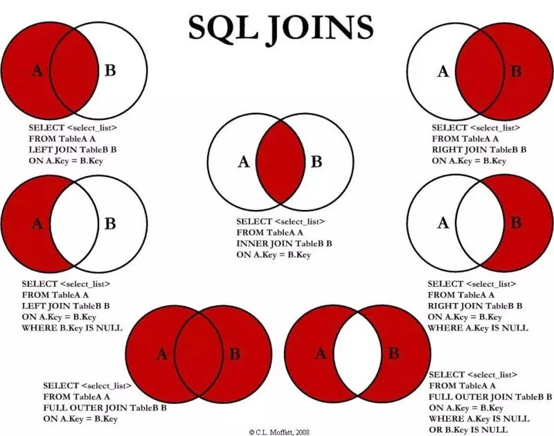

# MySQL

## 概念

### 分层

- 连接层

  最上层是一些客户端和连接服务。主要完成一些类似与连接处理、授权认证、及相关的安全方案。在该层上引入线程池的概念，为通过认证安全接入的客户端提供线程。在该层上引入了线程池的概念，为通过认证安全接入的客户端提供线程。同样在该层上可以实现基于SSL的安全链接。服务器也会为安全接入的每个客户端验证它所具有的操作权限

- 服务层

  第二层服务层，主要完成大部分的核心服务功能，包括查询解析、分析、优化、缓存、以及所有的内置函数，所有跨存储的功能也都在这一层实现，包括触发器、存储过程、试图等

- 引擎层

  第三层存储引擎，存储引擎真正的负责了MySQL中数据的存储和提取，服务器通过API与存储引擎进行通信。不同的存储引擎具有的功能不同，这样我们可以根据自己的实际需要进行选取

- 存储层

  第四层为数据存储层，主要是将数据存储在运行于该设备的文件系统之上，并完成与存储引擎的交互

### SQL

结构化查询语言(Structured Query Language)，是一种特殊目的的编程语言，是一种数据库查询和程序设计语言，用于存取数据以及查询、更新和管理关系数据库系统；同时也是数据库脚本文件的扩展名。

- 数据定义语言 `DDL`（Data Definition Language）

  在数据库中创建新表或删除表；为表加入索引等

- 数据操纵语言 `DML`（Data Manipulation Language）

  INSERT、UPDATE、DELETE。也称动作查询语言

- 数据查询语言 `DQL`（Data Query Language）

- 数据控制语言 `DCL`（Data Control Language）

  GRANT

### 编码排序规则

**utf8mb4_unicode_ci 和 utf8mb4_general_ci**

字符除了存储，还需要排序或者比较，这个操作与编码字符集有关，称为collation，与utf8mb4对应的是utf8mb4_unicode_ci 和 utf8mb4_general_ci这两个collation

- 准确性

  utf8mb4_unicode_ci 是基于标准Unicode来进行排序比较的，能保持在各个语言之间的精确排序；

  utf8mb4_general_ci 并不基于Unicode排序规则，因此在某些特殊语言或者字符上的排序结果可能不是所期望的。

- 性能

  utf8mb4_general_ci 在比较和排序时更快，因为其实现了一些性能更好的操作，但是在现代服务器上，这种性能提升几乎可以忽略不计。

  utf8mb4_unicode_ci 使用Unicode的规则进行排序和比较，其排序规则为了处理一些特殊字符，实现更加复杂。

  现在基本没有理由继续使用utf8mb4_general_ci了，因为其带来的性能差异很小，远不如更好的数据设计，比如使用索引等等。

### 存储引擎

- 查看支持的

  `SHOW ENGINES;`

- 查看默认的

  `SHOW VARIABLES LIKE 'storage_engine';`

- 查看表的

  `SHOW CREATE TABLE 'TABLEname';`
  `SHOW TABLE status like 'TABLEname';`
  `SHOW TABLE status from database where name="TABLEname";`

- 修改表的

  `ALTER TABLE t ENGINE = InnoDB;`

- 修改默认的

  `SET default_storage_engine=NDBCLUSTER;`（还可以通过修改配置文件）

#### INNODB和MYISAM

- 事务

  InnoDB 支持事务，MyISAM 不支持事务。这是 MySQL 将默认存储引擎从 MyISAM 变成 InnoDB 的重要原因之一

- 外键

  InnoDB 支持外键，而 MyISAM 不支持。对一个包含外键的 InnoDB 表转为 MYISAM 会失败

- 索引

  InnoDB 是聚簇索引，MyISAM 是非聚簇索引。聚簇索引的文件存放在主键索引的叶子节点上，因此 InnoDB  必须要有主键，通过主键索引效率很高。但是辅助索引需要两次查询，先查询到主键，然后再通过主键查询到数据。因此，主键不应该过大，因为主键太大，其他索引也都会很大。而 MyISAM 是非聚集索引，数据文件是分离的，索引保存的是数据文件的指针。主键索引和辅助索引是独立的

- 锁

  InnoDB 最小的锁粒度是行锁，MyISAM 最小的锁粒度是表锁。一个更新语句会锁住整张表，导致其他查询和更新都会被阻塞，因此并发访问受限。这也是 MySQL 将默认存储引擎从 MyISAM 变成 InnoDB 的重要原因之一

- 数据总行数
  - 在 MyISAM 存储引擎中，把表的总行数存储在磁盘上，当执行 `select count(*) from t` 时，直接返回总数据
  - 在 InnoDB 存储引擎中，跟 MyISAM 不一样，没有将总行数存储在磁盘上，当执行 select count(*) from t 时，会先把数据读出来，一行一行的累加，最后返回总数
  - InnoDB 中 count(*) 语句是在执行的时候，全表扫描统计总数量，所以当数据越来越大时，语句就越来越耗时了，为什么 InnoDB 引擎不像  MyISAM 引擎一样，将总行数存储到磁盘上？这跟 InnoDB 的事务特性有关，由于多版本并发控制（MVCC）的原因，InnoDB  表“应该返回多少行”也是不确定的

- 文件存储
  - 查看数据文件目录

    SHOW VARIABLES LIKE 'data%'

  - `.frm` 

    与表相关的元数据信息都存放在frm文件，包括表结构的定义信息等

  - `.ibd` 或 `.ibdata` 

    ​	这两种文件都是存放 InnoDB 数据的文件，之所以有两种文件形式存放 InnoDB 的数据，是因为 InnoDB 的数据存储方式能够通过配置来决定是使用**共享表空间**存放存储数据，还是用**独享表空间**存放存储数据。

    ​	独享表空间存储方式使用`.ibd`文件，并且每个表一个`.ibd`文件 共享表空间存储方式使用`.ibdata`文件，所有表共同使用一个`.ibdata`文件（或多个，可自己配置）

## 关键字

### NULL

- `SELECT NULL IN (1)` // 返回null
- 对`NULL`进行任何操作返回的都是`NULL`（`NULL`作为判定条件等同于`FALSE`），所以基本操作如：`!=`、`=`、`IN`、`NOT IN` 都会过滤掉`NULL`的值

### CASE WHEN

- 语法

  ```MySQL
  CASE 字段名
    WHEN '字段值/布尔表达式' THEN 'xxx'
    WHEN '字段值/布尔表达式' THEN 'xxx'
    …
  ELSE ‘xxx’ END
  (ELSE是可以没有的，等同于ELSE NULL)
  ```

- 说明

1. 根据不同的条件统计数量，`SUM(CASE … THEN 1 ELSE 0)`
2. `CASE WHEN`本质上就是根据条件将返回的字段或者值拼接回sql语句，所以不仅是查询中，update等语句都可以使用
3. 使用简单Case函数，想要对字段空和非空判断，不能在WHEN后面的‘字段值’不能是`NULL`或是`NOT NULL`，虽然语法上没错，但是`WHEN NULL`和`WHEN NOT NULL`总是返回`unknow`，所以正确的方式应该是采用Case搜索函数的`字段 IS NULL`或`字段 IS NOT NULL`
4. 

### JOIN



- `LEFT JOIN`、`INNER JOIN（JOIN）`
  首先根据`ON`后面的字段的值，分组，组中有特定值的左边数据和右表数据

- `LEFT JOIN`：左表所有的记录数量 * 右表符合条件的记录数量（没有改行的所有字段都为`NULL`）

- `INNER JOIN`：左边符合条件的数量 * LEAST(1, 右表符合条件的数量)
  （`INNER JOIN`本质上等同于多表的`WHERE`条件）

- `ON`

  1. 多表`LEFT JOIN`会生成一张临时表

  2. `ON`条件是对`LEFT JOIN`的右表进行条件过滤，返回左表的所有行，右表中没有的补为`NULL`

  3. `ON`条件中如果有对左表的限制条件，无论条件真假，依然返回左表的所有行，但是会影响右表的匹配值也就是说`ON`中左表的限制条件只影响右表的匹配内容，不影响返回行数

- `WHERE`

  1. `WHERE`条件是针对最后生成的这张临时表进行过滤，过滤掉不符合`WHERE`条件的记录，是真正的不符合就过滤掉
  2. `WHERE`条件中对左表限制，不能放到`ON`后面
  3. `WHERE`条件中对右表限制，放到`ON`后面，会有数据行数差异，比原来行数要多

## 操作

### 数据库

- 增

  ```MySQL
  CREATE DATABASE `数据库名` CHARACTER SET 'utf8' COLLATE 'utf8_unicode_ci';
  ```

- 删

  ```MySQL
  DROP DATABASE `数据库名`;
  ```

- 改编码

  ```MySQL
  ALTER DATABASE `数据库名` CHARACTER SET 'utf8mb4' COLLATE 'utf8mb4_unicode_ci';
  ```

- 查所有数据库

  ```MySql
  SHOW DATABASES;
  ```

- 查看当前数据库

  ```MySQL
  SELECT DATABASE();
  ```

- 查看建库语句

  ```MySQL
  SHOW CREATE DATABASE `数据库名`;
  ```

### 数据表

- 查看表的数量

  ```MySQL
  SELECT COUNT(表名) FROM information_schema.TABLES WHERE TABLE_SCHEMA='数据库名';
  ```

- 创建（字段类型、备注、约束、主键）

  ```MySQL
  CREATE TABLE `数据库名`.`数据表名` (
    `id`			                 bigint UNSIGNED AUTO_INCREMENT NOT NULL COMMENT '主键',
    `xxx_name`                     varchar(32) <CHARACTER SET = utf8 COLLATE = utf8_general_ci> COMMENT 'xxx名字',
    `gmt_xxx`                      datetime|datetime(0) NOT NULL DEFAULT CURRENT_TIMESTAMP COMMENT 'xxx时间',
    `gmt_create`                   datetime(6) NOT NULL COMMENT '创建时间',
    `gmt_modified`                 datetime(6) NOT NULL COMMENT '更新时间',
    CONSTRAINT pk_数据表名 PRIMARY KEY (id)
  ) <ENGINE = InnoDB> <AUTO_INCREMENT = 1> <CHARACTER SET = utf8 COLLATE = utf8_general_ci> COMMENT = 'XXX表'
  ```

  ```MySQL
  CREATE TABLE `数据库名`.`attachment` (
    `id`                           bigint UNSIGNED AUTO_INCREMENT NOT NULL COMMENT '主键',
    `target_id`                    bigint UNSIGNED COMMENT '关联表id',
    `attachment_type_id`           bigint UNSIGNED COMMENT '附件类型id',
    `original_filename`            varchar(255) COMMENT '文件名',
    `extension`                    varchar(255) COMMENT '文件拓展名',
    `url`                          varchar(255) NOT NULL COMMENT '访问url',
    `gmt_create`                   datetime(6) NOT NULL COMMENT '创建时间',
    `gmt_modified`                 datetime(6) NOT NULL COMMENT '更新时间',
    CONSTRAINT uq_attachment_uri UNIQUE (uri),
    CONSTRAINT pk_attachment PRIMARY KEY (id)
  ) COMMENT '附件表';
  ```

  ```MySQL
  CREATE TABLE `数据库名`.`attachment_type` (
    `id`                           bigint AUTO_INCREMENT NOT NULL COMMENT '主键',
    `status`                       integer NOT NULL COMMENT '状态',
    `name`                         varchar(12) NOT NULL COMMENT '名称',
    `category`                     integer NOT NULL COMMENT '类别',
    `gmt_create`                   datetime(6) NOT NULL COMMENT '创建时间',
    `gmt_modified`                 datetime(6) NOT NULL COMMENT '修改时间',
    `delete_flag`                  tinyint(1) default 0 NOT NULL COMMENT '删除标识',
    CONSTRAINT uq_attachment_type_name UNIQUE (name),
    CONSTRAINT pk_attachment_type PRIMARY KEY (id)
  ) ENGINE = InnoDB AUTO_INCREMENT = 1 CHARACTER SET = utf8 COLLATE = utf8_general_ci COMMENT = '附件类型表';
  ```

- 删除

  ```mysql
  DROP TABLE `表名`;
  ```

- 普通索引

  ```MySQL
  CREATE INDEX ix_attachment_type_name ON `attachment_type` (name);
  ```

- 外键

  ```MySQL
  ALTER TABLE `attachment` ADD CONSTRAINT fk_attachment_attachment_type_id FOREIGN KEY (attachment_type_id) REFERENCES `attachment_type` (id) <ON DELETE RESTRICT> <ON UPDATE RESTRICT>;
  ```

  创建外键关系, 会默认创建一个对应的索引

- 删除

  ```MySQL
  DROP TABLE `表名`;
  ```

- 重命名

  ```MySQL
  RENAME TABLE `旧表名` TO `新表名`;
  ```

- 修改字符集

  ```MySQL
  ALTER TABLE `表名` CHARACTER SET 'utf8';
  ```

- 修改表、字段字符集

  ```MySQL
  ALTER TABLE `表名` CONVERT TO CHARACTER SET 'utf8';
  ```

- 获取修改库中所有表字符集的语句

  ```MySQL
  SELECT CONCAT('ALTER TABLE ', TABLENameList.TABLE_name,' convert to character set utf8mb4;')
  FROM (
  SELECT TABLE_name FROM information_schema.`TABLES` 
  WHERE TABLE_SCHEMA = '数据库名'
  ) TABLENameList;
  ```

- 查看表名

  ```MySQL
  SHOW TABLES;
  ```

- 查看表结构

  ```MySQL
  DESC `表名`;
  ```

- 查看建表语句

  ```MySQL
  SHOW CREATE TABLE `表名`;
  ```

### 数据列

- 增

  ```MySQL
  ALTER TABLE `表名` ADD <COLUMN> `列名` VARCHAR(10) NOT NULL UNIQUE DEFAULT 'XXX' COMMENT 'XXX' <AFTER `列名`> | <FIRST>;
  ```

- 改（全改）

  ```MySQL
  ALTER TABLE `表名` CHANGE <COLUMN> `旧列名` `新列名` VARCHAR(10) CHARACTER SET 'utf8mb4' COLLATE 'utf8mb4_unicode_ci' DEFAULT 'XXX' COMMENT 'XXX' <AFTER `列名`> | <FIRST>;
  ```

- 改（全改 - 除列名）

  ```MySQL
  ALTER TABLE `表名` MODIFY <COLUMN> `列名` VARCHAR(10) CHARACTER SET 'utf8mb4' COLLATE 'utf8mb4_unicode_ci' DEFAULT 'XXX' COMMENT 'XXX' <AFTER `列名`> | <FIRST>;
  ```

  ```MySQL
  ALTER TABLE `表名` MODIFY <COLUMN> `列名` VARCHAR(10) UNIQUE NOT NULL DEFAULT 'XXX' COMMENT 'XXX' <AFTER `列名`> | <FIRST>;
  ```

- 改（默认值）

  ```MySQL
  ALTER TABLE `表名` ALTER <COLUMN> `列名` SET DEFAULT 'xxx';
  ```

- 改（删除默认值）

  ```mysql
  ALTER TABLE `表名` ALTER <COLUMN> `列名` DROP DEFAULT;
  ```
  
- 删

  ```MySQL
  ALTER TABLE `表名` DROP <COLUMN> `列名`;
  ```

### 数据行

- 增

  ```MySQL
  指定列值插入：INSERT <INTO> `表名` (`列名1`, `列名2`, `列名3`…) VALUES(值1, 值2, 值3…);
  ```

  ```MySQL
  全值插入（需要严格按照字段顺序）：INSERT <INTO> `表名` VALUES(值1, 值2, 值3…);
  ```

  注意：值如果是字符串或者日期需要加引号‘ ’（一般是单引号）

- 改

  ```MySQL
  UPDATE `表名` SET `字段名` = 值, `字段名` = 值, … WHERE …;
  ```

  注意：多个字段之间是采用**逗号**隔开的，而不是**AND**关键字

- 删

  ```MySQL
  DELETE FROM `表名` WHERE …;
  ```

  ```MySQL
  TRUNCATE TABLE `表名`;
  ```

  注意：`TRUNCATE`会删除表中所有数据、`AUTO_INCREMENT`置为`0`、删除的数据不能恢复

### 分组（待补充）

### 分页（待补充）

### 变量

- 语法：@xxx:=

## 事务

### 简介

- 事务只是一个改变，是一些操作的集合；用专业的术语来讲，它就是一个程序的执行单元；事务本身其实并不包含这4个特性，我们需要通过某些手段，尽可能的让这个执行单元满足这4个特性，那么，我们就可以称它为一个事务，或者说是一个正确的事务，完美的事务

- 不要被其他的事务状态（创建、开始、关闭、挂起）名词所迷惑，事务的三个真实存在的方法，它们分别是：conn.setAutoCommit()、conn.commit()、conn.rollback()

### 四特性

- 原子性：满足原子操作单元，对数据的操作，要么全部执行，要么全部失败
- 一致性：事务开始和完成，数据保持一致
- 隔离性：事务之间是相互独立的，中间状态对外不可见
- 持久性：数据的修改是持久的，即使数据库发生故障也不应该对其有任何影响

### 隔离级别

>  可以通过`SELECT @@tx_isolation;`命令查看数据库当前的事务隔离级别

#### 并发情况下事务引发的问题

- 脏读：A事务还未提交，B事务就读到了A事务的结果（破坏了隔离性）
- 不可重复读：A事务在本次事务中，对自己未操作过的数据，进行了多次读取，结果出现了不一致或记录不存在的情况（破坏了一致性，update）
- 幻读：A事务在本次事务中，对自己操作过的数据，进行了多次读取，第一次读取时，记录不存在，第二次读取时，记录出现了（破坏了一致性，insert和delete）

#### 解决-制定标准

> 为了权衡[隔离]和[并发]的矛盾，ISO定义了四个事务级别，每个级别的隔离程度不同，允许出现的副作用也不同

- 读未提交（read-uncommitted）：最低级别，只能保证持久性
- 读已提交（read-committed）：
- 可重复读（repeatable-read）：
- 串行化（serializable）：最高级别，事务与事务完全串行化，毫无并发可言，性能极低

| 事务隔离级别                 | 脏读 | 不可重复读 | 幻读 |
| ---------------------------- | ---- | ---------- | ---- |
| 读未提交（read-uncommitted） |      |            |      |
| 读已提交（read-committed）   | 解决 |            |      |
| 可重复读（repeatable-read）  | 解决 | 解决       |      |
| 串行化（serializable）       | 解决 | 解决       | 解决 |

注意：这四个界别只是一个标准，各个数据库厂商，并不是完全按照这个标准来做的

#### 实现

- 锁机制：阻止其他事务对数据进行操作，各个隔离级别主要体现在读取数据时加的锁，和释放时机

  | 事务隔离级别                 | 原理                                                         |
  | ---------------------------- | ------------------------------------------------------------ |
  | 读未提交（read-uncommitted） | 事务读取的时候，不加锁                                       |
  | 读已提交（read-committed）   | 事务读取的时候，加行级共享锁（读到才加锁），一旦读完，立即释放（不是事务结束） |
  | 可重复读（repeatable-read）  | 事务读取的时候，加行级共享锁，直到事务结束才释放             |
  | 串行化（serializable）       | 事务读取的时候，加表级共享锁，直到事务结束才释放             |

- MVCC机制：生成一个数据块找，并用这个快照来提供一定级别的一致性的读取，也成为了多版本数据控制

  - CAS版本控制和读写分离的思想
  - 主要作用由于读已提交和可重复读

#### PS

​	与SQL标准不同的地方在于InnoDB存储引擎在`REPAETABLE`事务隔离级别使用的是`Next-Key Lock`锁算法，因此可以避免幻读的产生，这和其他数据库（如SQL Server）是不同的。隔离级别越低，需要请求的锁越少，或者越轻量，所以大多数据库的隔离级别都是`READ-COMMITTED`

## 数据库设计

### 字段

- 必备字段 id、create_time、update_time
- 虽然违背 3NF，但是实际中，字段允许适当冗余，以提高查询性能，但必须考虑数据一致。频繁修改、唯一索引、大字段不允许冗余

**编码**

- 因国际化需要，所有的字符存储与表示，均采用utf8字符集，那么字符计数方法需要注意

  说明： SELECT LENGTH("轻松工作")； 返回为12 SELECT CHARACTER_LENGTH("轻松工作")； 返回为4

  如果需要存储表情，那么选择utf8mb4来进行存储，注意它与utf8编码的区别

**类型**

- 任何非负数的字段，必须是 unsigned

- 尽可能将所有列定义为 not null

  不要使用count(列名)或count(常量)来替代count(\*)，count(\*)是SQL92定义的标准统计行数的语法，跟数据库无关，跟NULL和非NULL无关。 说明：count(\*)会统计值为NULL的行，而count(列名)不会统计此列为NULL值的行

  count(distinct col) 计算该列除NULL之外的不重复行数，注意 count(distinct col1, col2) 如果其中一列全为NULL，那么即使另一列有不同的值，也返回为0

  当某一列的值全是NULL时，count(col)的返回结果为0，但sum(col)的返回结果为NULL，因此使用sum()时需注意NPE问题。 正例：可以使用如下方式来避免sum的NPE问题：SELECT IFNULL(SUM(column), 0) FROM table

  使用ISNULL()来判断是否为NULL值。 说明：如果在null前换行，影响可读性；从性能数据上分析，`ISNULL(column)`执行效率更快一些

- 如果存储的字符串长度几乎相等，使用char定长字符串类型

- varchar 类型的字段如果存储长度超过 5000，定义字段类型为 text 需要独立出来一张表，避免影响其他字段索引效率

**命名**

- 库名与应用名称尽量一致

- 表名不使用大写字母，表名不使用复数名词
- 表的命名最好是遵循“业务名称_表的作用”。 正例：alipay_task / force_project / trade_config

- 不使用保留字

- 表达是与否概念的字段，必须使用is_xxx的方式命名，数据类型是unsigned tinyint（1表示是，0表示否），例如：is_deleted

  注意：POJO类中的任何布尔类型的变量，都不要加is前缀，所以，需要在<resultMap>设置从is_xxx到Xxx的映射关系。数据库表示是与否的值，使用tinyint类型，坚持is_xxx的命名方式是为了明确其取值含义与取值范围

### 外键

​	不得使用外键与级联，一切外键概念必须在应用层解决

### 索引

**命名**

​	pk\_字段名、uk\_字段名、idx\_字段名

**varchar**

​	在varchar字段上建立索引时，必须指定索引长度，没必要对全字段建立索引，根据实际文本区分度决定索引长度
​	说明：索引的长度与区分度是一对矛盾体，一般对字符串类型数据，长度为20的索引，区分度会高达90%以上，可以使用 `count(distinct left(列名, 索引长度))/count(*)` 的区分度来确定

#### 主键索引

​	在 innodb 存储引擎中又叫聚簇索引

#### 唯一索引

​	业务上具有唯一特性的字段，即使是组合字段，也必须建成唯一索引。 说明：不要以为唯一索引影响了insert速度，这个速度损耗可以忽略，但提高查找速度是明显的；另外，即使在应用层做了非常完善的校验控制，只要没有唯一索引，根据墨菲定律，必然有脏数据产生

#### 组合索引

​	建组合索引的时候，区分度最高的在最左边。 正例：如果where a=? and b=?，a列的几乎接近于唯一值，那么只需要单建idx_a索引即可。 说明：存在非等号和等号混合判断条件时，在建索引时，请把等号条件的列前置。如：where c>? and d=? 那么即使c的区分度更高，也必须把d放在索引的最前列，即建立组合索引 idx_d_c

#### 覆盖索引

​	利用覆盖索引来进行查询操作，避免回表。索引的分类就上面三种，覆盖索引只是一种查询的一种效果，用explain的结果，extra列会出现：using index

## SQL

### 规范

- 数据订正（特别是删除或修改记录操作）时，要先select，避免出现误删除，确认无误才能执行更新语句

- 对于数据库中表记录的查询和变更，只要涉及多个表，都需要在列名前加表的别名（或表名）进行限定

  说明：对多表进行查询记录、更新记录、删除记录时，如果对操作列没有限定表的别名（或表名），并且操作列在多个表中存在时，就会抛异常。 

  正例：select t1.name from table_first as t1 , table_second as t2 where t1.id=t2.id; 

  反例：在某业务中，由于多表关联查询语句没有加表的别名（或表名）的限制，正常运行两年后，最近在某个表中增加一个同名字段，在预发布环境做数据库变更后，线上查询语句出现出1052异常：Column 'name' in field list is ambiguous

- SQL语句中表的别名前加as，并且以t1、t2、t3、...的顺序依次命名。 说明：

  1）别名可以是表的简称，或者是依照表在SQL语句中出现的顺序，以t1、t2、t3的方式命名

  2）别名前加as使别名更容易识别。 

  正例：select t1.name from table_first as t1, table_second as t2 where t1.id=t2.id;

- in操作能避免则避免，若实在避免不了，需要仔细评估in后边的集合元素数量，控制在1000个之内

- 在表查询中，一律不要使用 * 作为查询的字段列表，需要哪些字段必须明确写明。 说明：

  1）增加查询分析器解析成本

  2）增减字段容易与resultMap配置不一致

  3）无用字段增加网络消耗，尤其是text类型的字段

### 较高级优化方法

- 1.**查看优化器状态**

  ```mysql
  SHOW VARIABLES LIKE 'optimizer_trace';
  ```

- 2.**会话级别临时开启**

  ```mysql
  SET session optimizer_trace="endable=on", end_marks_in_json=on;
  ```

- 3.**设置优化器追踪的内存大小**

  ```mysql
  SET OPTIMIZER_TRACE_MAX_MEM_SIZE=1000000;
  ```

- 4.**执行自己的sql**

  ```mysql
  SELECT * FROM XXX WHERE XXX = XXX
  ```

- 5.**Information_schema.optimizer_trace表**

  ```mysql
  SELECT trace FROM information_schema.OPTIMIZER_TRACE;
  ```

- 6.**导入到一个命名为xx.trace的文件，然后用JSON阅读器来查看**（如果没有控制台权限，或直接交由运维，让他把该trace文件，输出给你就行了）

  ```mysql
  SELECT TARCE INTO DUMPFILE "E:\\test.trace" FROM INFORMATION_SCHEMA.OPTIMIZER_TRACE;
  ```

- 7.**查看文件**

  注意 `rows_estimation` 和 `considered_execution_plans`

- **注意**

  如果不设置优化器最大容量的话，可能导致优化器返回的结果不全

### SQL性能优化目标

​	至少要达到 range 级别，要求是ref级别，如果可以是consts最好。说明：

​	1） consts 单表中最多只有一个匹配行（主键或者唯一索引），在优化阶段即可读取到数据

​	2） ref 指的是使用普通的索引（normal index）

​	3） range 对索引进行范围检索

​	4） index 索引物理文件全扫描，速度非常慢，与全表扫描是小巫见大巫

### Mybatis结果集

- 不要用resultClass当返回参数，即使所有类属性名与数据库字段一一对应，也需要定义<resultMap>；反过来，每一个表也必然有一个<resultMap>与之对应。 说明：配置映射关系，使字段与DO类解耦，方便维护
- 不允许直接拿HashMap与Hashtable作为查询结果集的输出。 反例：某同学为避免写一个<resultMap>xxx</resultMap>，直接使用HashTable来接收数据库返回结果，结果出现日常是把bigint转成Long值，而线上由于数据库版本不一样，解析成BigInteger，导致线上问题

### 索引失效

#### 查询条件（待完善）

**核心**：不符合最左原则

- 表达式计算：... WHERE `id` + 1 = 2

- 函数计算：... WHERE xxx(id) = 1

- 隐式转换：数据表字段的编码是 utf8mb4，查询条件的字段值编码是 utf8
- or
- in、not in
- is null、is not null

#### 组合索引

​	注意查询条件字段的顺序、排序条件的字段的规则得相同（要不都升序、要不都降序）

#### 排序

- 如果GROUP BY的字段上如果有索引，因为索引默认有序，可以避免排序行为。所以如果你的分组对排序没有要求，且字段没有对应索引，一定要显示指定不排序，例：`GROUP BY xxx ORDER BY NULL`

- 注意利用索引的有序性。order by 最后的字段是组合索引的一部分，并且放在索引组合顺序的最后，避免出现file_sort的情况，影响查询性能。

  正例：where a=? and b=? order by c; 索引：a_b_c 反例：索引如果存在范围查询，那么索引有序性无法利用，如：WHERE a>10 ORDER BY b; 索引a_b无法排序

#### 索引提示

​	当MySQL确实因为某些原因，采用了错误的执行计划（没有使用预期的索引），可以采用使用 FORCE INDEX 手动指定的方式，让MySQL去使用指定的索引进行查询。但是，这仅作为一种应急预案，不推荐采用该方式，因为数据库迁移可能就不支持了（拓展性不好），还要重新做一个代码发布。首先MySQL关于优化器的设计是复杂且优秀的，我们应该尽量做到以提示的方式，而不是强制的

​	1） 从SQL语句的角度：相同目的，不同的SQL

​	2） 索引统计信息有问题：`analyze table` 一下

​		简单说一下原理就是，MySQL的Optimizer（优化器），采用随机取样来估计（即不是一个一定准确的值）指定列数据的散列层面（区分度），并估计包括回表等IO次数等成本，会决定是否采用相关索引或是全表扫描。有时优化器可能会因为数据

​	3） 删除误导MySQL的索引，这个确实是一条在实际中，确实挺常用的技巧

```mysql
IGNORE INDEX(index1, index2, ...)
FORCE INDEX(index1, index2, ...)
```

### 场景

#### JOIN

1. 代替子查询
2. 阿里规范规定

- 超过三个表禁止join

- 需要join的字段，数据类型保持绝对一致

  多表关联查询时，保证被关联的字段需要有索引

- 即使双表join也要注意表索引、SQL性能

#### UNION（待补充）

​	union 是将 union all 后的结果镜像一次distinct，去除重复的记录后的结果，如果对数据的重复方面没有要求，则应该使用 union all

#### 大批量分页

> 代码中写分页查询逻辑时，若count为0应直接返回，避免执行后面的分页语句

利用延迟关联或者子查询优化超多分页场景。 说明：MySQL并不是跳过 offset 行，而是取 offset+N 行，然后返回放弃前 offset 行，返回 N 行，那当 offset 特别大的时候，效率就非常的低下，要么控制返回的总页数，要么对超过特定阈值的页数进行 SQL 改写。实际应当参照如下方式进行优化，编写 SQL语句

```mysql
SELECT 
	t1.* 
FROM 
	表1 
AS t1, (select id from 表1 where 条件 LIMIT 100000, 20) AS t2 
WHERE 
	t1.id = t2.id
```

#### 大批量插入（待补充）

#### 大批量更新（待补充）

## 变量

### 用户变量

- 设置

  方式1：SET @变量名 = "变量值";
  方式2：SELECT '变量值' INTO @变量名;
  方式3：SELECT @变量名 := '变量值';

- 实例

  ```mysql
  SELECT
      result.orderId,
      result.productName,
      result.type,
      result.sugar,
      result.machineAddress,
  
      IF (@previous_date IS NULL, NULL, CONVERT(UNIX_TIMESTAMP(result.createDate) - UNIX_TIMESTAMP(@previous_date), UNSIGNED)) AS intervalSecond,
      DATE_FORMAT(@previous_date := result.createDate, '%Y-%m-%d %H:%i:%s') AS createDate
  FROM (
      SELECT
              o.id AS orderId,
              op.product_name AS productName,
              pt.type AS `type`,
              pt.sugar AS sugar,
              ma.street AS machineAddress,
              o.create_date AS createDate
      FROM
              order_detail o
      INNER JOIN
              (SELECT machine_code, street FROM machine_address) ma ON ma.machine_code = o.machine_code
      INNER JOIN
              (SELECT order_id, product_taste_id, product_name FROM order_product) op ON op.order_id = o.id
      INNER JOIN
              (SELECT id, type, sugar FROM product_taste) pt ON pt.id = op.product_taste_id
      WHERE
              o.customer_id = #{customerId}
              AND o.type = '0'
              AND o.status = '3'
              AND o.del_flag = '0'
      ORDER BY
              o.create_date ASC
  ) result, (SELECT @previous_date := NULL) tmp
  ```

### 系统变量-会话

> 官方文档：https://dev.mysql.com/doc/refman/8.0/en/

- 查

  （不显式指定`SESSION`，将优先显示会话级系统变量；如果不存在，将显示全局级系统变量）

  `SELECT @@变量名;`

  `SELECT @@SESSION.变量名;`

  `SELECT @@LOCAL.变量名;`

  `SHOW VARIABLES LIKE '变量名';`

  `SHOW SESSION VARIABLES LIKE '变量名';`

  `SHOW LOCAL VARIABLES LIKE '变量名';`

  

  `SHOW <SESSION> VARIABLES;`（查所有）

- 改

  （LOCAL也是会话级别的意思）

  `SET 变量名=变量值`

  `SET @@变量名=变量值`

  `SET SESSION 变量名=变量值`

  `SET @@SESSION.变量名=变量值`

  `SET LOCAL 变量名=变量值`

  `SET @@LOCAL.变量名=变量值`

### 系统变量-全局

- 查

  `SELECT @@GLOBAL.变量名;`
  `SHOW GLOBAL VARIABLES LIKE '变量名';`

  

  `SHOW GLOBAL VARIABLES;`（查所有）

- 改

  `SET GLOBAL 变量名=变量值;`

  `SET @@GLOBAL.变量名=变量值;`

### 注

- `SELECT @@...` 的形式相较于`SHOW ...`  具有实时性
- 有些变量是只读的，无法修改，比如`system_time_zone`

- 修改全局变量，如果采用直接修改配置文件 `my.cnf`，并重启mysql服务的方式，过于生硬，线上重启无论如何都应该尽可能避免。一般的做法是先修改系统变量，再到配置文件中做同样的配置修改，下次MySQL服务重启就不会又退回到默认值了

## 函数

### 格式字符含义表

| 格式 | 含义                                           |
| ---- | ---------------------------------------------- |
| %a   | 缩写星期名                                     |
| %b   | 缩写月名                                       |
| %c   | 月，数值                                       |
| %D   | 带有英文前缀的月中的天                         |
| %d   | 月的天，数值(00-31)                            |
| %e   | 月的天，数值(0-31)                             |
| %f   | 微秒                                           |
| %H   | 小时 (00-23)                                   |
| %h   | 小时 (01-12)                                   |
| %I   | 小时 (01-12)                                   |
| %i   | 分钟，数值(00-59)                              |
| %j   | 年的天 (001-366)                               |
| %k   | 小时 (0-23)                                    |
| %l   | 小时 (1-12)                                    |
| %M   | 月名                                           |
| %m   | 月，数值(00-12)                                |
| %p   | AM 或 PM                                       |
| %r   | 时间，12-小时（hh:mm:ss AM 或 PM）             |
| %S   | 秒(00-59)                                      |
| %s   | 秒(00-59)                                      |
| %T   | 时间, 24-小时 (hh:mm:ss)                       |
| %U   | 周 (00-53) 星期日是一周的第一天                |
| %u   | 周 (00-53) 星期一是一周的第一天                |
| %V   | 周 (01-53) 星期日是一周的第一天，与 %X 使用    |
| %v   | 周 (01-53) 星期一是一周的第一天，与 %x 使用    |
| %W   | 星期名                                         |
| %w   | 周的天 （0=星期日, 6=星期六）                  |
| %X   | 年，其中的星期日是周的第一天，4 位，与 %V 使用 |
| %x   | 年，其中的星期一是周的第一天，4 位，与 %v 使用 |
| %Y   | 年，4 位                                       |
| %y   | 年，2 位                                       |

### 聚合函数

**SUM（求和）**

- 没有什么好说的，但是返回的数据类型注意
  The SUM() and AVG() functions return a DECIMAL value for exact-value arguments (integer or DECIMAL), and a DOUBLE value for approximate-value arguments (FLOAT or DOUBLE). (Before MySQL 5.0.3, SUM() and AVG() return DOUBLE for all numeric arguments.)

**AVG（平均值）**

**MAX（最大值）**

**MIN（最小值）**

**COUNT（计数）**

### 其他函数

**日期+时间**

​	SELECT CURRENT_TIMESTAMP, CURRENT_TIMESTAMP();

​	PS：CURRENT_TIMESTAMP 可以作为时间类型的字段设置默认值

**日期**

​	SELECT CURDATE(), CURRENT_DATE(), CURRENT_DATE;

**时间**

​	SELECT CURTIME(), CURRENT_TIME(), CURRENT_TIME;

**CONVERT**

- 执行如下函数的调用，得到的java的数据类型如下：

  | 函数调用                           | Mybatis映射的Java类型 |
  | ---------------------------------- | --------------------- |
  | Convert('5.000', UNSIGNED INTEGER) | BigInteger            |
  | Convert('5.000', UNSIGNED int)     | BigInteger            |
  | Convert('5.000', UNSIGNED)         | BigInteger            |
  | Convert('5.000', SIGNED)           | Long                  |

- 坑

  mysql说是“UNSIGNED/SIGNED”查询返回的都是一个64位的整数，好像因为无符号扩大，又或者是mybatis bug...

- 说明

  整型的每一种都分有无符号（unsigned）和有符号（signed）两种类型（float和double总是带符号的），在默认情况下声明的整型变量都是有符号的类型（char有点特别），如果需声明无符号类型的话就需要在类型前加上unsigned。无符号版本和有符号版本的区别就是无符号类型能保存2倍于有符号类型的正整数数据，比如16位系统中一个int能存储的数据的范围为-32768~32767，而unsigned能存储的数据范围则是0~65535。由于在计算机中,整数是以补码形式存放的。根据最高位的不同，如果是1,有符号数的话就是负数；如果是无符号数,则都解释为正数。另外，unsigned若省略后一个关键字，大多数编译器都会认为是`unsigned int`

- 转编码（放在WHERE条件的等号后边，可以避免因编码不同的隐式转换带来的索引失效问题）

  CONVERT('xxx', USING utf8mb4)

**DATE_FORMAT**

- `DATE_FORMAT(date, '%Y-%m-%d %T')`（相当于java的yyyy-MM-dd HH:mm:ss）

- `DATE_FORMAT(date, '%Y-%m-%d %H:%i:%s')` （1等同于2）

- `DATE_FORMAT(date, '%W')`（返回星期，完整的英文星期）

  Monday、Tuesday、Wednesday、Thursday、Friday、Saturday、Sunday

- `DATE_FORMAT(date, '%a')`（返回星期，缩写的英文星期）
  Mon、Tues、Wed、Thur、Fri、Sat、Sun

**UNIX_TIMESTAMP**

返回的是自1970年以来的秒数

**TIMEDIFF(date, date)**

返回两个时间相差的时分秒

**TIME_TO_SEC("HH:mm:ss")**

时间转秒数

**SEC_TO_TIME(‘60’)**

秒数转时间

**YEARWEEK(date)**

返回年份以及日期参数在当年的第几周

**YEARWEEK(date[,mode])**

- mode：参数代表一周的第一天是周几，默认是0代表上周日

- 说明：假如你想用这个函数作为条件查询时间条件为本周的数据，不加参数默认上周日，即该条件相当于：上周日、本周一、……、本周六，所以如果想查出从本周一开始的本周数据，将mode修改为1即可

**WEEKOFYEAR(date)**

相当于`YEARWEEK(date, 1)`且不返回年份，但是涉及跨年问题，那最好的解决方式还是YEARWEEK

**IF(expression, expr_true, expr_false)**

逻辑表达式

**CAST**（待补充）

## 锁

### 查看锁

```mysql
SHOW STATUS LIKE 'innodb_row_lock%'
```

将得到如下结果

| Variable_name                 | 说明                |
| ----------------------------- | ------------------- |
| Innodb_row_lock_current_waits | 有多少sql正在等待锁 |
| Innodb_row_lock_time          | 总共锁住的时间      |
| Innodb_row_lock_time_avg      | 平均锁住的时间      |
| Innodb_row_lock_time_max      | 最大锁住的时间      |
| Innodb_row_lock_waits         | 锁住的次数          |

### 排他锁

​	执行 SELECT ... WHERE `id`= 1 FOR UPDATE，就是一个简单的条件查询并加上了排他锁（就是锁本质上就是锁索引）

​	针对这个锁的级别是行锁还是表锁是取决于查询条件的列上是否有索引，有则行级别的锁，无则表锁（可以通过开启多个会话同时对一张表继续操作，观察阻塞现象来验证）

## 其他

### 查看执行的sql

- 临时设置（重启MySQL服务后失效）
  `mysql> SET GLOBAL general_log = 'ON';`
  `mysql> SET GLOBAL general_log_file = 'general_sql.log';`
  （不知道什么原因，不能保存“:”符号，所以无法自定义路径）
  SHOW VARIABLES LIKE "general_log%";
- 永久设置（在配置文件中添加）
  `general_log = 1`
  `general_log_file = general_sql.log`
  （D:\Learning-Program\mysql-5.6.41-winx64\data\general_sql.log）

### 查看慢查询日志

- 临时开启慢查询日志（如果需要长时间开启，需要修改mysql的配置）
  `SET GLOBAL slow_query_log = on;`
- 临时定义慢查询的时间，单位秒（如果需要长时间开启，需要修改mysql的配置）
  `SET long_query_time = 1;`
- 设置存储慢查询日志的方式
  `SET GLOBAL log_output;`
- 查看上述设置
  `SHOW VARIABLES LIKE '%quer%';`
- 查看慢日志中最慢的10条查询语句
  `mysqldumpslow -t 10 /data/mysql/mysql-slow.log;`

### SQL_MODE

| 可用参数                   | 含义                                                         |
| -------------------------- | ------------------------------------------------------------ |
| ONLY_FULL_GROUP_BY         | 对于GROUP BY聚合操作，如果在SELECT中的列，没有在GROUP BY中出现，那么将认为这个SQL是不合法的，因为列不在GROUP BY从句中 |
| STRICT_TRANS_TABLES        | 在该模式下，如果一个值不能插入到一个事务表中，则中断当前的操作，对非事务表不做任何限制 |
| NO_ZERO_IN_DATE            | 在严格模式，不接受月或日部分为0的日期。如果使用IGNORE选项，我们为类似的日期插入'0000-00-00'。在非严格模式，可以接受该日期，但会生成警告 |
| NO_ZERO_DATE               | 在严格模式，不要将 '0000-00-00'做为合法日期。你仍然可以用IGNORE选项插入零日期。在非严格模式，可以接受该日期，但会生成警告 |
| ERROR_FOR_DIVISION_BY_ZERO | 在严格模式，在INSERT或UPDATE过程中，如果被零除(或MOD(X，0))，则产生错误(否则为警告)。如果未给出该模式，被零除时MySQL返回NULL。如果用到INSERT IGNORE或UPDATE IGNORE中，MySQL生成被零除警告，但操作结果为NULL |
| NO_AUTO_CREATE_USER        | 防止GRANT自动创建新用户，除非还指定了密码                    |
| NO_ENGINE_SUBSTITUTION     | 如果需要的存储引擎被禁用或未编译，那么抛出错误。不设置此值时，用默认的存储引擎替代，并抛出一个异常 |

- 查看该值的命令

  方式1：`SELECT @@sql_mode;`

  方式2：`SHOW VARIABLES LIKE 'sql_mode%';`

  （命令可以直接使用，不需要`use mysql;`）

- 说明

  自己最初开始了解这个，是因为从`5.6`版本转`8.0`版本，一个一直运行没问题的SQL报错了，就是因为`ONLY_FULL_GROUP_BY`策略导致的

- 修改改值

  **重启后失效**

  `set @@sql_mode = <你希望的模式>;`

  **永久生效**

  1. 在`mysql`的配置文件的`[mysqld]`下面指定该值`sql_mode="STRICT_TRANS_TABLES,NO_ZERO_IN_DATE,NO_ZERO_DATE,ERROR_FOR_DIVISION_BY_ZERO,NO_ENGINE_SUBSTITUTION"`

  2. 重启mysql服务

- 参考：https://blog.csdn.net/ccccalculator/article/details/70432123

---

因`ONLY_FULL_GROUP_BY`导致如下sql报错

```MySQL
SELECT
    COUNT(*) AS dayCount,
    DATE_FORMAT(date_time, '%W') AS weekDay
FROM (
    SELECT
        COUNT(*) AS num,
        CREATE_date AS date_time
    FROM
        order_detail
    WHERE
        `status` = 3
        AND (pay_type = 1 OR pay_type = 2)
        AND (`type` = 0 OR `type` = 5)
        AND customer_id IN (SELECT id FROM customer WHERE IFNULL(customer_label_id, '') != '0001')
        AND YEARWEEK(CREATE_date, 1) = YEARWEEK(#{date}, 1)
    GROUP BY
        customer_id
) o
GROUP BY
    weekDay
```

### 连接参数

[官方文档]: https://dev.mysql.com/doc/connector-j/8.0/en/connector-j-reference-configuration-properties.html

常用的参数如下：

| 参数名                  | 取值                                | 作用                                                         |
| ----------------------- | ----------------------------------- | ------------------------------------------------------------ |
| useSSL                  | false                               |                                                              |
| useUnicode              | true                                | 是否使用Unicode字符集，如果参数characterEncoding设置为gb2312或gbk，本参数值必须设置为true |
| characterEncoding       | utf-8/utf8                          | -                                                            |
| zeroDateTimeBehavior    | convertToNull                       | What should happen when the driver encounters DATETIME values that are composed entirely of zeros |
| transformedBitIsBoolean | true                                | If the driver converts TINYINT(1) to a different type, should it use BOOLEAN instead of BIT for future compatibility with MySQL-5.0, as MySQL-5.0 has a BIT type?（默认值：false） |
| serverTimezone          | GMT%2B8<br />CTT<br />Asia/Shanghai | Override detection/mapping of time zone. Used when time zone from server doesn't map to Java time zone<br />（无论是properties还是xml的配置文件中，+ 都要写成 %2B） |
| nullCatalogMeansCurrent | true                                | https://www.jianshu.com/p/dbeeac29ff27<br />http://mybatis.org/generator/usage/mysql.html |
| allowPublicKeyRetrieval | true                                | Allows special handshake roundtrip to get server RSA public key directly from server（默认值：false） |

### 分布式主键ID生成策略

1. UUID

   **优点**

   - 生成足够简单，本地生成无网络消耗，具有唯一性

   **缺点**

   - 无序的字符串，不具备趋势自增特性
   - 没有具体的业务含义
   - 长度过长16 字节128位，36位长度的字符串，存储以及查询对MySQL的性能消耗较大，MySQL官方明确建议主键要尽量越短越好，作为数据库主键 `UUID` 的无序性会导致数据位置频繁变动，严重影响性能。

2. 数据库自增ID

   **优点**

   - 实现简单，ID单调自增，数值类型查询速度快

   **缺点**

   - DB单点存在宕机风险，无法扛住高并发场景

3. 数据库自增ID（集群模式）

   ```MySQL
   -- 数据库1
   set @@AUTO_INCREMENT_offset = 1;     -- 起始值
   set @@AUTO_INCREMENT_increment = 2;  -- 步长
   -- 数据库2
   set @@AUTO_INCREMENT_offset = 2;     -- 起始值
   set @@AUTO_INCREMENT_increment = 2;  -- 步长
   ```

   **优点**

   - 解决DB单点问题

   **缺点**

   - 不利于后续扩容，而且实际上单个数据库自身压力还是大，依旧无法满足高并发场景

4. 数据库的号段模式

   - 号段模式是当下分布式ID生成器的主流实现方式之一，号段模式可以理解为从数据库批量的获取自增ID，每次从数据库取出一个号段范围，例如 (1,1000] 代表1000个ID，具体的业务服务将本号段，生成1~1000的自增ID并加载到内存

   - 号段表核心字段

     biz_type ：代表不同业务类型

     max_id ：当前最大的可用id

     step ：代表号段的长度

     version ：是一个乐观锁，每次都更新version，保证并发时数据的正确性

   - 当一批id用完了

     ```MySQL
     update id_generator set max_id = #{max_id+step}, version = version + 1 where version = # {version} and biz_type = XXX
     ```

   - 由于多业务端可能同时操作，所以采用版本号`version`乐观锁方式更新，这种`分布式ID`生成方式不强依赖于数据库，不会频繁的访问数据库，对数据库的压力小很多

5. Redis

   - 利用其`incr`命令实现ID的原子性自增

   - 注意持久化

     ​	`RDB`会定时打一个快照进行持久化，假如连续自增但`redis`没及时持久化，而这会Redis挂掉了，重启Redis后会出现ID重复的情况。

     ​	`AOF`会对每条写命令进行持久化，即使`Redis`挂掉了也不会出现ID重复的情况，但由于incr命令的特殊性，会导致`Redis`重启恢复的数据时间过长。

6. Snowflake

   - twitter公司内部分布式项目采用的ID生成算法，开源后广受国内大厂的好评，在该算法影响下各大公司相继开发出各具特色的分布式生成器

   - `Snowflake`生成的是Long类型的ID，一个Long类型占8个字节，每个字节占8比特，也就是说一个Long类型占64个比特

   - Snowflake ID组成结构：`正数位`（占1比特）+ `时间戳`（占41比特）+ `机器ID`（占5比特）+ `数据中心`（占5比特）+ `自增值`（占12比特），总共64比特组成的一个Long类型
     - 第一个bit位（1bit）：Java中long的最高位是符号位代表正负，正数是0，负数是1，一般生成ID都为正数，所以默认为0
     - 时间戳部分（41bit）：毫秒级的时间，不建议存当前时间戳，而是用（当前时间戳 - 固定开始时间戳）的差值，可以使产生的ID从更小的值开始；41位的时间戳可以使用69年，(1L << 41) / (1000L * 60 * 60 * 24 * 365) = 69年
     - 工作机器id（10bit）：也被叫做`workId`，这个可以灵活配置，机房或者机器号组合都可以
     - 序列号部分（12bit）：自增值支持同一毫秒内同一个节点可以生成4096个ID
   - 具体实现：https://github.com/beyondfengyu/SnowFlake

7. Uid-generator - 百度

   - 具体实现：https://github.com/baidu/uid-generator/blob/master/README.zh_cn.md

8. Leaf - 美团

   - 同时支持号段模式和雪花模式

   - 具体实现：https://github.com/Meituan-Dianping/Leaf

9. Tinyid - 滴滴

   - 具体实现：https://github.com/didi/tinyid

[微信公众号]: https://mp.weixin.qq.com/s?__biz=MzU5NTgzMDYyMA==&amp;mid=2247488761&amp;idx=1&amp;sn=4909fe1220c6d3cdf762e09766561905&amp;chksm=fe6aa6cac91d2fdcb6a2d61aa0ea8927d3348fb1b29c9356502ec343a8fcaab370a015791582&amp;scene=126&amp;sessionid=1591504903&amp;key=55850329b0c39edb7b515cbb9a50a69bfaf44cacfa71990fad565f4e35dec28d696581116eb0a79974a4fbc1b40d85349f8362f928dc365b8ab6fa8d0f5526488dee15ef8a0b8578fc26dfb5adbde067&amp;ascene=1&amp;uin=MjQzMjg2NTAzMA%3D%3D&amp;devicetype=Windows+10+x64&amp;version=62090070&amp;lang=zh_CN&amp;exportkey=AVO8s81eVVWpDJbHZ5x7YDs%3D&amp;pass_ticket=tSWfkndbTMJy7UxUdd2J66UIpvpKQOW8oIRIcNYmXmcBRwagb%2BJTdjMmaw5wKjWp	"Java 专栏"

### 导入导出

- 导出数据库（表结构和数据）

  - `mysqldump -uroot -p --databases --column-statistics=0 数据库名 [表名] > xxx.sql;`

    例：`mysqldump -uroot -p -P8090 --databases --column-statistics=0 shangtang order > d:/shangtang.sql;`

    | 参数                  | 作用                                             |
    | --------------------- | ------------------------------------------------ |
    | `--column-statistics` | `5.6`版本不能带上参数，`8.0`版本一定要带上该参数 |
    | `-d`或者`--no-data`   | 只导出表结构                                     |

  **压缩**：

  `mysqldump -uroot -p 数据库名 [表名] | gzip > 文件名.sql.gz;`

  **GUI导出**

  使用“Navicat Premium 12”右键数据库，导出结构和数据，少了使用数据库的语句（use xxx;）

- 查询语句导出

  查询语句最后添加`INTO OUTFILE 'D:/xxx.sql';`

  - 前提：`SHOW VARIABLES LIKE '%secure_file_priv%';` 结果为`null`时，不允许；结果为指定的文件夹时，只能导出到指定的文件夹
  - 解决：在`my.ini`的`[mysqld]`下添加`secure_file_priv=`，重启mysql服务

- 导入

  `mysql -uroot -p 数据库名 < xxx.sql;`

- 执行

  `mysql> source xxx.sql`

### 远程或者局域网连接

`use mysql;`

`update user set host='%' where user='root'`

`flush privileges;`

### 时区问题

1. 客户端发送的时间存进数据库时，被减了8小时

   解决：参照 [连接参数](#连接参数) 的 `serverTimezone`

2. 执行 `CURRENT_TIMESTAMP` 函数，返回的时间比实际少了8个小时

   执行命令：`SHOW variables like '%time_zone%';`（本地Windows10下的Docker下的MySQL8）

   | 字段名           | 字段值 |
   | ---------------- | ------ |
   | system_time_zone | UTC    |
   | time_zone        | SYSTEM |

   解决1（MySQL配置层面）：将 `time_zone` 的值修改为 `+8:00`

   ```
   set global time_zone = '+8:00';
   ```

   解决2（Linux系统层面）：

   ```
   cp /usr/share/zoneinfo/Asia/Shanghai /etc/localtime
   
   systemctl restart mysql
   ```

   通过指令查看时间：`date -R`

   正确的时间显示：`Wed, 29 Jul 2020 10:06:25 +0800`

   **注：该方法谨慎使用未尝试过**