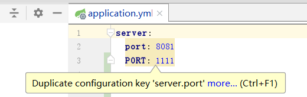

# YAML

## 简介

​	**YAML**（/ˈjæməl/，尾音类似*camel*骆驼）是一个可读性高，用来表达数据`序列化`的格式。YAML参考了其他多种语言，包括：C语言、Python、Perl，并从XML、电子邮件的数据格式（RFC 2822）中获得灵感。Clark Evans在2001年首次发表了这种语言，另外Ingy döt Net与Oren Ben-Kiki也是这语言的共同设计者。当前已经有数种编程语言或脚本语言支持（或者说解析）这种语言

​	*YAML*是"YAML Ain't a Markup Language"（YAML不是一种[标记语言](https://baike.baidu.com/item/标记语言)）的[递归缩写](https://baike.baidu.com/item/递归缩写)。在开发的这种语言时，*YAML* 的意思其实是："Yet Another Markup Language"（仍是一种[标记语言](https://baike.baidu.com/item/标记语言)），但为了强调这种语言以数据做为中心，而不是以标记语言为重点，而用反向缩略语重命名

## 语法

### 大小写敏感



​	这个不是大小写不敏感的意思，警告是告诉你最好你不要定义重复的单词

### 缩进

​	缩进标识层级关系

​	缩进的空格数据不重要，相同层级的元素左边对齐即可

​	不允许使用 Tab 键，只允许使用空格

```
org.yaml.snakeyaml.scanner.ScannerException: while scanning for the next token
found character '\t(TAB)' that cannot start any token. (Do not use \t(TAB) for indentation)
```

### 特殊符号

- 注释符

  `#`

- 分隔符

​	`---`

​	分隔符上下相当于两个配置文件，配合 `spring.profiles: xxx` 使用

​	`...`

​	和上面的符号成对匹配使用，作为结束符，可以没有

- 文本块

  `|` `|+` `|-`

- 引号

  `'`  `"`

  引号用于修饰字符串类型的数据，引号中的特殊字符会被当成字符串处理

  单引号：会转译字符串中的特殊字符，例如 `\n` 得到 `\n`

  双引号：不会转译字符串中的特殊字符，例如 `\n` 得到 `回车符`

### 强转

**简介**

​	类型强制转换

**样例**

​	`!!str` 表示强制转换为字符串

```yaml
# "true"
str !!str true
```

​	`!!int` 表示强制转换为整型

​	`!!float` 表示强制转换为浮点类型

​	`!!bool` 表示强制转换为布尔类型

​	`!!null` 空值

​	`!!set` 集合

​	`!!omap` / `!!pairs` 键值列表 / 对象列表

## 引用

**概念**

​	`&`：建立锚点，并指定描点名称

​	`<<`：引用锚点

​	`*`：指定具体要引用的锚点名称

例1

```yaml
xiaoming1: &xiaoming
    name: xxx
    age: xxx
xiaoming2:
    <<: *xiaoming
```

例2

```yaml
money: &sum 11
how-much: *sum
```

例3

```yaml
basic: 
  - &NAME {name: xiaoming}
  - &AGE {age: 11}
person1: 
  << *NAME
  height: 180
person2:
  << : [*NAME, *AGE]
  job: programmer

等同：
person1: {name: xiaoming, height: 180}
person2: {name: xiaoming, age:11, job: programmer}
```

## 数据类型

### 简介

​	又叫 纯量，是最基本的、不可再分的值

### 空值

​	`null`、`~`

### 字符串

- `|`、`|-`、`|+`

  上面 3 种符号，后边的字符串必须另起一行

例1、换行符会被转换为空格

```yaml
# "hello world"
str: hello
 world
# 注意"world"前边有一个空格，否则不符合 YAML 的语法
```

例2、希望保留换行符

```yaml
# "hello\n\nworld\n"
str: |
  hello
  
  world
```

例3、不希望保留结尾的换行符

```yaml
# "hello\n\nworld"
str: |-
  hello
  
  world
```

例4、希望保留结尾的换行

```yaml
# "hello\n\nworld\n"
str: |+
  hello
  
  world
```

- `>`

例1、标记的文本内容缩进表示的块，将块中的换行替换为空格（但是字符串最开始和最末尾如果有回车的话，将不会替换为空格，保留的依然是回车，并且两个回车会作为一个回车来表示）

```yaml
# hello\nworld\n
str: >
  hello
  
  world
```

### 布尔值

​	true、TRUE、false、FALSE

> spring boot 的默认 yaml 解析类库是 snakeyaml，这个类库对布尔类型的值定义的比较广，详见 org.yaml.snakeyaml.resolver.Resolver

### 浮点数

​	6.8523015e+5

​	（可以使用科学计数法整数）

### 时间

​	2018-02-17

​	（日期必须使用ISO 8601格式，即 yyyy-MM-dd）

### 日期

​	2018-02-17T15:02:31+08:00

​	（时间使用ISO 8601格式，时间和日期之间使用T连接，最后使用+代表时区）

## 数据结构

### 数组

- 一般形式

  ```
  key:
  - xxx1
  - xxx2
  ...
  ```

- 行内形式

  ```
  key: [xxx1, xxx2, ...]
  ```

### 复杂数据结构

**Java POJO**

```java
public class Person {
    String name;
    Integer age;
}
```

- 一般形式

  ```yaml
  person:
    name: xxx
    age: xxx
  
  persons:
    -
      name: xxx
      age: xxx
    -
      name: xxx
      age: xxx
  ```

- 流式（flow）

  ```yaml
  person: {name: xxx, age: xxx}
  
  persons: [{name: xxx1, age: xxx1}, {name: xxx2, age: xxx2}]
  ```

## Spring Boot 配置

- 文件后缀名为`YAML`或者`YML`都视为该种类型的文件
- 使用`org.yaml.snakeyaml`解析`YAML`

- 坑

  不要使用true|false、on|off、yes|no（首字母大小写、全部大写）作为键值

  - 否则报错

    `Boolean`不能转成`String`

  - 原因

    - 通过跟踪`snakeyaml`的源码发现，本该是{"on": true}的键值对，变成了{true: true}

    - 发生这个错误的核心在于构建的map是错的，而构建map是由“org.yaml.snakeyaml.Yaml”构建的，而map中的数据，是根据节点构建来的，而构建节点的很重要的规则：
      	1、构建节点的tag，核心见下（org.yaml.snakeyaml.Resolver.resolve）
        	2、根据节点构建map中的数据，核心
      （org.yaml.snakeyaml.constructor.SafeConstructor.ConstructYamlMap.construct）
      最终回到“org.yaml.snakeyaml.constructor.BaseConstructor.constructObjectNoCheck()”,202根据布尔tag的节点拿到了“ConstructYamlBool”值解析构造器，这个解析器将"on" -> true 了

    - 为了利于调试，在主配置文件的顶部添加了“on: true”，进而一步步查看“snake”包解析yml的源码发现：map是从解析yml的node得到，而node分keynode和valuenode...，关键是node最终封装到map的类型是由Node中的“Tag”决定

    - 最终定位到：“org.yaml.snakeyaml.resolver”的“103行”的“public Tag resolve(NodeId kind, String value, boolean implicit)”方法处

      ```java
      其中有一个“protected Map<Character, List<ResolverTuple>> yamlImplicitResolvers”，这个解析器会根据值的首字母得到对应的tag，其中如下的的首字母会得到布尔类型的tag
      首字母大小写（2种）、全字母大写（1种）
      yes、no
      true、false
      on、off
      
      即：当value值为“on”时，最终返回的Tag是bool类型的
      ```

    

### 多环境配置

- 标准环境

  dev：application-dev.yml 本地开发环境

  test：application-test.yml 测试环境

  pre：application-pre.yml 预生产环境

  prod：application-prod.yml 生产环境

- 环境生效的配置

  spring.profiles.active=xxx（激活式）

  spring.profiles.include=xxx（引入式）

### 配置文件加载顺序

> 越靠后加载实际生效的优先级越高

1. 项目根目录/config/application.properties
2. 项目根目录/application.properties
3. resources/config/application.properties
4. resources/application.properties

### 获取配置文件中的配置

- @Value("${spel}")

  该注解不仅可以修饰成员变量（不是属性，不要求 Setter），还可以修饰方法形参

  注意表达式要和配置文件中写的一模一样（不存在驼峰和-命名的自动转换）

- environment.getProperty("${spel}")

- @ConfigurationProperties(prefix="xxx")

  使用注意：

  ​	想要使用该特性需要在配置类上添加核心注解 @EnableConfigurationProperties

  ​	除了通过 @Configuration 或者 @Component 将 @ConfigurationProperties 修饰的类交给 spring 容器管理，使得该配置类能够读取到配置文件的数据。还可以通过 @ConfigurationPropertiesScan 注解，查看该注解的源码，你会发现里边有核心注解

  例：

  ```yaml
  a: 
    nameA: aa
    b:
      nameB: bb
      c:
        nameC: cc
  ```

  @ConfigurationProperties 注解加在类上，能够为该类中 nameA 属性（要求 Setter）注入“aa”，nameB 和 nameC 都不行
  @ConfigurationProperties(prefix = b"") 注解加在类上，能够为该类中的 nameB 属性注入“bb”，nameA 和 nameC 都不行