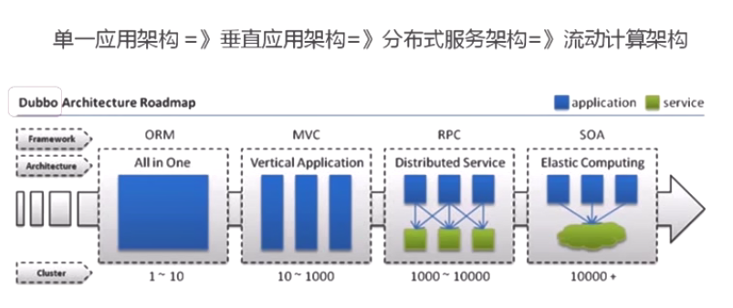
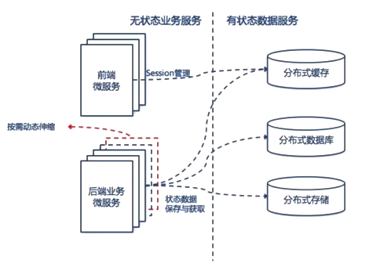

# SpringCloud

## 说明

### 相关版本号

​	`Spring Boot 2.0.0.M3`

​	`Spring Cloud Finchley.M2`

​	`Rancher 2.0`

尽管视频中说一定要保证自己搭建的版本要和视频中保持一致，但是自己为了多踩坑，使用的是 `Hoxton.SR1`

### 代码

​	相关代码见搭建用于学习的 `springcloud` 项目

## 架构



### 单体架构

**优点**

​	容易测试

​	容易部署

**缺点**

​	开发效率低：提交代码等待、冲突

​	代码维护难：所有业务代码都在一个项目中，新人懵逼

​	部署不灵活：构建时间长，任何小修改需要重新构建整个项目

​	稳定性不高：可能因为局部的一个小问题让整个系统崩溃

​	扩展性不够：无法满足高并发下的业务需求

### 分布式

```
定义：旨在支持应用程序和服务的开发，可以利用物理架构，由多个自治的处理元素，不共享主内存，但通过网络发送消息合作 -- Leslie Lamport
```

微服务必然是分布式的，分布式是多节点的，集群是多节点的

## 微服务

### 简单架构图


### 概念

​	一系列微小的服务

​	跑在自己的进程里

​	每个服务为独立的业务开发

​	独立部署

​	分布式的管理

### 异构

​	异构是微服务的特点，不同服务之间可以使用不同语言开发，可以使用不同的数据库

### 康威定律

```
Organizations which design systems are constrained to produce desing which are copies of the communication structures of these organizations
任何组织在设计一套系统（广义概念上的系统）时，所交付的设计方案在结构上都与该组织的沟通结构保持一致
```

### 重点

**掌握如何使用，更要理解分布式、架构的特点**

## 体系

### Dubbo（阿里系）

​	RPC框架，相比其他RPC框架，在服务治理功能集成上可谓非常完善，不仅提供了服务注册发现、负载均衡、路由等面向分布式集群的基础能力，还设计了面向开发测试阶段的Mock、泛化调用等机制，同时也提供了服务治理和监控可视化的平台

​	Spring Cloud 没有出来之前，在国内应用非常广泛

​	重启维护后，Dubbo 官方表示积极寻求适配到 Spring Cloud 生态的方式，如，作为 Spring Cloud 的二进制通信方案，来发挥 Dubbo 的新能优势，或者通过模块化，以及对 http 的支持，适配到 Spring Cloud，当下还不是很兼容

### Spring Cloud

Spring Cloud 是一个开发工具集，包含了多个子项目，微服务架构下一站式解决方案

- 利用 Spring Boot 的开发便利
- 主要是基于对 Netflix 开源组件的进一步封装
- 简化了分布式开发

## 服务拆分

### 不适合拆分的场景

- 系统中包含很多强事务场景的
- 业务相对稳定，迭代周期长
- 访问压力不大，可用性要求不高

### 起点

​	如果系统架构已经是 SOA 服务化的话，有一个说法，微服务和 SOA 之间只差一个 ESB（企业服务总线），这个时候可以聚焦于怎么弄 ESB；这里边和单体架构升级到微服务聚焦的重点是不一样的

​	现在的系统架构，Java 语言占据多少部分，是否已经包含了服务发现、负载均衡的组件，是弃用还是保留，如果以最小的代价切换

### 终点

​	好的架构不是涉及出来的，而是进化而来的，并且一直在演进

### 方法论

> 遵从《可拓展的艺术》里的 扩展立方模型（Scale Cube）

​	X轴 水平复制，也就是同样的多实例

​	Z轴 数据分区，每个服务器负责一个数据子集，运行的代码是一样的

​	Y轴 功能解耦，不同职责的模块，分成不同的服务

**拆"功能"**

- 单一职责，高内聚、低耦合

  单一职责：每个服务只负责业务一个单独的部分

  高内聚：服务相关的行为只在一个服务内，而不是分散在不同的服务中

  低耦合：修改一个服务，不会导致别的服务也跟着修改

- 关注点分离

  职责：例如，订单、商品、网站的前端服务，app的服务接口可以划分成边缘服务

  通用性：一些基础组件，和业务无关的，例如，消息服务、用户服务，把公共的通用服务拆分成相对独立的原子服务层

  粒度：初始的订单服务，之后变大，拆分成订单服务和支付服务

- 服务和数据之间的关系

  先考虑业务功能，再考虑数据

  无状态服务，要将有状态的服务改变为无状态的服务，例如，在本地建立的内存缓存、session 缓存，到了微服务架构中，就应该把这些数据迁移到分布式缓存中，让业务服务变为一个无状态的计算节点，这样后端服务就可以做到按需动态伸缩，在运行时动态增删节点，无需考虑缓存数据的同步问题

**什么是无状态**



**拆”数据“**

- 每个微服务都有单独的数据存储
- 依据服务特点选择不同结构的数据库类型
- 难点在确定边界
- 针对边界设计API
- 依据边界权衡数据冗余

### 结论

​	好的架构是演进而来的，不要妄图一步到位，演进是一直持续的。应该快速出一个微服务，微服务应该做到低成本、低风险的渐进式演进，不应该一直看，一直设计，不要害怕失败，快速的放到生产环境中去面对真实的问题

​	应该，快速选定几个有联系的服务，确定场景要解决的问题，以及要达到的效果，快速开发，快速试错，不要企图一步将服务划分正确，这就是一个逐步权衡取舍的过程，例如，典型电商项目中的商品和订单

## 应用间通信


## 核心组件

### 1. 注册中心

**简介**

​	也可以叫做服务注册发现，这里以 Spring Cloud Eureka 为重点进行讲解，Spring Cloud Eureka 是基于 Netflix Eureka 做了二次封装

#### Eureka Server

**简介**

​	 注册中心

**实际操作**

1. 不手动引入依赖，通过 IntelliJ IDEA 的 Spring Initializr 创建项目，勾选上 `Spring Cloud Discovery` 分类下的中 `Eureka Server`

   ```markdown
   插曲：我们称注册中心组件、配置中心组件等为组件，正是凸显出作为一个单独的模块，同时他们也是可以替换的，IDEA 的 Spring Initializr 很好的体现了这个
   ```

2. 启动类上添加核心注解 `@EnableEurekaServer` 

   ```markdown
   插曲1：视频中解释一个服务端就是一个客户端只要从核心注解的源码中看到包含了 `@EnableDiscoveryClient` 的角度解释，就很清楚了，但是自己搭的 `Hoxton.SR1` 版本中的核心注解定义并不包含该注解
   
   插曲2：通过查看该注解的用法，查看到了为 Spring Cloud 提供的一个聚合注解 `@SpringCloudApplication`
   ```

**分布式系统中的注册中心**

​	分布式系统中，服务注册中心是最重要的基础部分，时时刻刻都应该处于提供服务的状态。无论是否使用 Eureka，承担分布式该职责的组件都应该是高可用的，也都是基本采用集群的解决方案

​	当某个类型服务有多个实例时，服务调用者如何决定调用哪一个，有两种方式

 1. **客户端发现**

    描述：调用者主动从注册中心挑选一个可用的服务进行调用

    优点：简单、直接，同时客户端是知道所有可用的服务地址的

    缺点：每个调用者都需要实现挑选服务的逻辑

    举例：Eureka（没有代理嘛）

 2. **服务端发现**

    描述：调用者请求代理，由代理决定挑选一个可用的服务

    举例：Nginx（反向代理服务器、服务发现的负载均衡器）、Zookeeper（Dubbo + Zookeeper）、Kubernates（每个节点都运行一个代理）

#### Eureka Client

**简介**

​	服务注册

**实际操作**

1. 不手动引入依赖，通过 IntelliJ IDEA 的 Spring Initializr 创建项目，勾选上 `Spring Cloud Discovery` 分类下的中 `Eureka Discovery Client`

2. 启动类上添加核心注解 `@EnableEurekaClient` 或 `@EnableDiscoveryClient`

   ```markdown
   插曲：两个注解的区别，见作者在 Stack Overflow 上的回答https://stackoverflow.com/questions/31976236/whats-the-difference-between-enableeurekaclient-and-enablediscoveryclient
   ```

**Eureka 高可用**

​	在多个机器上，启动多个 Eureka Server 节点（一般来说，至少3个）

**服务发现机制**

​	Eureka Client 启动后，会主动向 Eureka Server 发送消息，进行服务注册，并在成功注册后，与 Eureka Server 通过心跳机制，借此来保证服务是否可用

### 2. 服务调用

​	微服务特点：轻量级的通信。例如，REST 或 RPC。Spring Cloud 采取了前者，所以 Eureka Server 提供了完善的 Restful Api，Eureka 也支持将非 Java 语言实现的服务纳入到自己的服务治理体系中，其他语言只要实现了客户端程序即可，例如 NodeJS 的 eureka-js-client

​	Spring Cloud 中服务之间的 restful 调用方式

- **RestTemplate**
- **Feign**

### 3. 服务网关

**简介**

​	又叫 `Api Gateway`、`Service Gateway`

​	作为连接内部的大门，屏蔽内部细节，将外部请求反向路由到内部具体的服务

​	所有外部请求都会经过网关，所以可以做到：监控、日志、安全性（校验、授权、反爬虫）、流量限制等，隐藏在API网关后面的业务系统就可以专注于创建和管理服务，无需关心这些策略性的请求

​	一般公司系统好不好，只要看服务网关就可以了

**四大职能**

- 请求接入：作为所有 API 接口服务请求的接入点，管理所有接入请求
- 业务聚合：所有后端业务服务的聚合点，所有的业务服务都可以在这里被调用
- 中介策略：实现安全、验证、路由、过滤、流控、缓存等策略，进行一些必要的中介处理
- 统一管理：提供配置管理工具，对所有API服务的调用生命周期和相应的中介策略进行统一管理

#### 主流服务网关

|                      | 语言        | 限流                                                         | 鉴权                                   | 监控                                                         | 易用性                                           | 可维护性                               | 成熟度             |
| -------------------- | ----------- | ------------------------------------------------------------ | -------------------------------------- | ------------------------------------------------------------ | ------------------------------------------------ | -------------------------------------- | ------------------ |
| Spring Cloud Gateway | Java        | 可以通过IP，用户，集群限流，提供了响应的接口进行拓展         | 普通鉴权、OAuth2.0                     | Gateway、Mettries、Filter                                    | 简单易用                                         | Spring系列可拓展性强，易配置可维护性好 | Spring社区成熟     |
| Zuul 2               | Java        | 可以通过配置文件配置集群限流和服务限流，也可通过 Filter 实现限流拓展 | Filter 中实现                          | Filter中实现                                                 | 参考资料少                                       | 可维护性差                             | 开源不久，资源少   |
| OpenResty            | Nginx + Lua | 需要 Lua 开发                                                | 需要 Lua 开发                          | 需要开发                                                     | 简单易用，但是需要Lua开发                        | 可维护性差，需要大量lua脚本库          | 成熟，资料多       |
| Kong                 | Nginx + Lua | 根据秒、分、时、天、月、年，根据用户进行限流。可在源码的基础上进行开发 | 普通鉴权、Key Auth鉴权、HMAC、OAuth2.0 | Kong可以上报datalog记录请求数量、请求数据量、应答数据量、接收与发送的时间间隔、状态码数量、Kong内运行时间 | 简单易用，API转发通过管理员接口配置，开发需要Lua | 可维护性差，需要大量lua脚本库          | 相对成熟，插件开源 |

还是那句话，每种框架、技术选型，都应该向着适合业务的角度去考虑，没有绝对的好坏

### 4. 配置中心

**Config Server**

**Config Client**

**Spring Cloud Bus（结合 RabbitMQ）**

**自动刷新**

**步骤**

1. 创建一个 Eureka Server，配置文件配置好，启动注解加载启动类上，实现了自己注册到自己身上
2. 创建一个 Eureka Client，配置文件配置好

**高可用**

Eureka Server 相互注册，他们的信息是共享的，在他们各自的页面都可以看到所有 Client，以及其他的 Server

### 5. 负载均衡

​	服务通信相关：RestTemplate、Feign、Ribbon

### 6. 限流熔断

**Hystrix Dashboar**

**熔断**

### 7. 服务追踪

Sleuth + Zipkin

### 8. 后端通用服务（业务）

又叫，中间层服务（Middle Tier Service）

启动时，将服务信息注册到服务注册表中

### 9. 前端服务（业务）

又叫 边缘服务（Edge Service）

查询注册表，即可发现并调用后端服务

主要是对后端服务做必要的`聚合`和裁剪后`暴露`给外部不同的设备

**聚合**

例如，查询订单信息以及订单对应的用户信息，需要调用两个接口，前端服务就可以做一个聚合，将这两个接口的功能合二为一，作为一个接口暴露出去，这样客户端只要调用前端服务的一个接口就可以了

**裁剪**

和上面正好相反，例如根据不同的情况返回不同的数据，例如，都是查询商品信息的接口，如果是PC端的请求，就尽可能返回的详细一些，如果是手机端信息可能就没有那么详细；又例如，PC端需要返回的是html，而手机端需要返回的是json数据